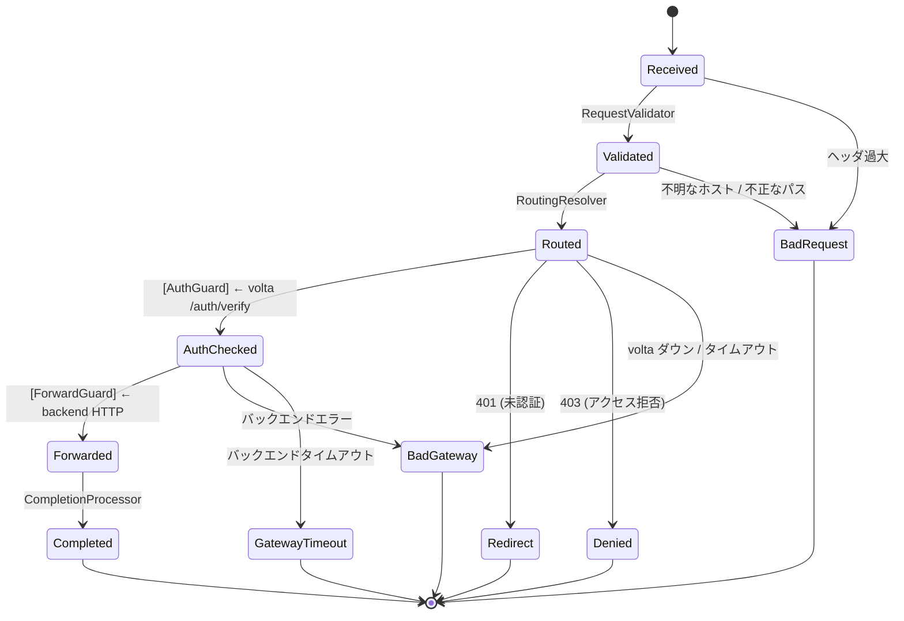

[English version](README.md)

# volta-gateway

中小規模 SaaS 向け、ステートマシン駆動の認証対応リバースプロキシ。

**全てのリクエストはレールの上を走る** — ステートマシンが有効な遷移だけを許可する。リクエストスマグリングなし。認証チェック忘れなし。見えない障害なし。

> **大規模 (50+ サービス, Kubernetes, Canary):** [Traefik](https://traefik.io/) + [volta-auth-proxy](https://github.com/opaopa6969/volta-auth-proxy) の ForwardAuth を推奨。Traefik のエコシステムはオーケストレーションで無敵。
>
> **中小規模 SaaS (5-20 サービス, 認証レイテンシ重視):** volta-gateway なら認証チェック 5-10倍速、ステップ別可視化、YAML 1ファイル設定。

## 仕組み

```
Client → Cloudflare (TLS) → volta-gateway (HTTP:8080) → volta-auth-proxy (認証チェック)
                                                       → バックエンド App

リクエストライフサイクル（ステートマシン）:
  RECEIVED → VALIDATED → ROUTED → [認証] → AUTH_CHECKED → [転送] → FORWARDED → COMPLETED
                                            ├── REDIRECT (ログインへ)
                                            ├── DENIED (403)
                                            └── BAD_GATEWAY (volta ダウン)
```

### 状態遷移図



この図はエンジンが実行するのと**同じ `FlowDefinition`** から生成される。コード = 図。常に同期。

全ての状態遷移がログに残る。**どこで時間がかかったか**が一目瞭然:

```json
{
  "transitions": [
    {"from": "RECEIVED", "to": "VALIDATED", "duration_us": 5},
    {"from": "VALIDATED", "to": "ROUTED", "duration_us": 2},
    {"from": "ROUTED", "to": "AUTH_CHECKED", "duration_us": 850},
    {"from": "AUTH_CHECKED", "to": "FORWARDED", "duration_us": 12500}
  ],
  "total_us": 13360
}
```

## クイックスタート

```bash
# 1. クローン
git clone https://github.com/opaopa6969/volta-gateway
cd volta-gateway

# 2. 設定（routing を自分のバックエンドに合わせる）
cp volta-gateway.yaml my-config.yaml
# my-config.yaml を編集

# 3. volta-auth-proxy が localhost:7070 で動いていることを確認

# 4. 実行
cargo run -- my-config.yaml
```

## 機能一覧 (v0.2.0)

| 機能 | 詳細 |
|------|------|
| HTTP/1.1 + HTTP/2 | hyper 1.x 自動ネゴシエーション |
| WebSocket tunnel | 双方向 TCP tunnel (1024 接続上限) |
| TLS / Let's Encrypt | rustls-acme, 自動 HTTPS |
| ロードバランシング | 複数 backend でラウンドロビン |
| レート制限 | グローバル + per-IP (設定可能) |
| サーキットブレーカー | 5 failures / 30s recovery, idempotent retry, Retry-After |
| 圧縮 | text/json/xml/js を gzip (1MB 閾値) |
| CORS | per-route origins, セキュア・バイ・デフォルト (暗黙の wildcard なし) |
| カスタムエラーページ | HTML ディレクトリ + JSON fallback |
| ホットリロード | SIGHUP → ゼロダウンタイム設定スワップ (ArcSwap) |
| L4 proxy | TCP/UDP ポートフォワーディング |
| メトリクス | Prometheus /metrics (リクエスト, WS, CB, compression, L4) |

## 設定

最小構成 (`volta-gateway.minimal.yaml` 参照):

```yaml
server:
  port: 8080

auth:
  volta_url: http://localhost:7070   # volta-auth-proxy
  timeout_ms: 500                    # フェイルクローズド: volta ダウン → 502

routing:
  - host: app.example.com
    backend: http://localhost:3000
    app_id: app-wiki
    cors_origins:                    # 明示的 CORS (省略 = CORS ヘッダなし)
      - https://app.example.com

  - host: "*.example.com"           # ワイルドカード対応
    backends:                        # ラウンドロビン LB
      - http://localhost:3000
      - http://localhost:3001
```

全フィールドリファレンス: `volta-gateway.full.yaml`

## セキュリティ

| レイヤー | 防御対象 |
|---------|---------|
| **hyper** (HTTP パーサー) | リクエストスマグリング、ヘッダインジェクション、HTTP/2 違反 |
| **SM VALIDATED state** | Host ヘッダ汚染、パストラバーサル、過大リクエスト |
| **認証チェック** | 未認証アクセス（フェイルクローズド: volta ダウン → 502） |
| **レスポンス strip** | バックエンドの X-Volta-* ヘッダ偽装（レスポンスから除去） |

## アーキテクチャ

```
┌────────────────────────────────────────────┐
│  tower::ServiceBuilder                     │
│    TraceLayer → RateLimitLayer → Timeout   │
├────────────────────────────────────────────┤
│  ProxyService (SM ライフサイクル)             │
│                                            │
│  同期判断:              非同期 I/O:          │
│    RECEIVED → VALIDATED    (なし)           │
│    VALIDATED → ROUTED      (なし)           │
│    ROUTED → [External]     volta HTTP 呼出  │
│    AUTH_CHECKED → [Ext]    backend 転送     │
│    FORWARDED → COMPLETED   (なし)           │
│                                            │
│  SM は同期 (~2μs)。I/O は非同期 (hyper)。    │
│  関心の分離。                                │
├────────────────────────────────────────────┤
│  hyper (HTTP) + tokio (非同期ランタイム)      │
└────────────────────────────────────────────┘
```

SM パターンは [tramli](https://github.com/opaopa6969/tramli) から — 不正な遷移が構造的に存在できない制約付きフローエンジン。

## vs Traefik (実測済み)

同条件ベンチマーク: localhost mock auth + mock backend。Traefik v3.4 (Docker) + ForwardAuth vs volta-gateway (native release)。[詳細結果](benches/e2e_results.md)

| 指標 | volta-gateway | Traefik + ForwardAuth | |
|------|--------------|----------------------|---|
| **p50 レイテンシ** | **0.252 ms** | **1.673 ms** | **6.6倍高速** |
| 平均レイテンシ | 0.395 ms | 1.777 ms | 4.5倍高速 |
| p99 レイテンシ | 1.235 ms | 2.373 ms | 1.9倍高速 |
| SM オーバーヘッド | 1.69 μs | — | 全体の約1% |

| | volta-gateway | Traefik |
|---|---|---|
| 認証モデル | localhost HTTP (コネクションプール) | ForwardAuth ミドルウェア (2ホップ) |
| リクエスト可視性 | ステップ別 SM 遷移 + μs タイミング | 「入って出た」だけ |
| 設定 | 1 YAML ファイル | Docker labels + traefik.yml + middleware chain |
| ルーティング | Host → backend (ワイルドカード, ラウンドロビン) | Labels, file, Consul, etcd, ... |
| CORS | per-route, セキュア・バイ・デフォルト (DD-001) | ミドルウェアチェーン |
| デバッグ | SM state ログで障害点が一目瞭然 | Traefik デバッグログを読む |

## tramli での開発

volta-gateway は [tramli](https://github.com/opaopa6969/tramli)（[crates.io](https://crates.io/crates/tramli) で `tramli = "0.1"`）をステートマシンエンジンとして使用。

### なぜ tramli か？

プロキシのリクエストライフサイクルが **Rust 8行** で定義される:

```rust
Builder::new("proxy")
    .from(Received).auto(Validated, RequestValidator { routing })
    .from(Validated).auto(Routed, RoutingResolver { routing })
    .from(Routed).external(AuthChecked, AuthGuard)
    .from(AuthChecked).external(Forwarded, ForwardGuard)
    .from(Forwarded).auto(Completed, CompletionProcessor)
    .on_any_error(BadGateway)
    .build()  // ← ここで8項目検証
```

`build()` が起動時に検証: 到達可能性、DAG、requires/produces チェーン等。**`build()` が通れば、フローは構造的に正しい。**

### B 方式: sync SM + async I/O

tramli は意図的に同期（リクエストあたり ~2μs）。非同期 I/O はエンジンの外:

```rust
// 1. 同期: SM 判断 (~1μs)
let flow_id = engine.start_flow(&def, &id, initial_data)?;
// 自動連鎖: RECEIVED → VALIDATED → ROUTED（External で停止）

// 2. 非同期: volta 認証チェック (~500μs)
let auth = volta_client.check_auth(&req).await;

// 3. 同期: SM 判断 (~300ns)
engine.resume_and_execute(&flow_id, auth_data)?;

// 4. 非同期: バックエンド転送 (~1-50ms)
let resp = backend.forward(&req).await;

// 5. 同期: SM 判断 (~300ns)
engine.resume_and_execute(&flow_id, resp_data)?;
// FORWARDED → COMPLETED（ターミナル）
```

SM はブロックしない。I/O は SM に入らない。きれいな分離。

### Processor の追加方法

1. `StateProcessor<ProxyState>` を実装する struct を定義
2. `requires()`（入力型）と `produces()`（出力型）を宣言
3. Builder に `.from(X).auto(Y, MyProcessor)` を追加
4. `build()` がチェーン全体を検証 — コンパイルが通り `build()` が通れば動く

詳細は [tramli ドキュメント](https://github.com/opaopa6969/tramli)。このプロキシを作った実体験は[ユーザーレビュー](https://github.com/opaopa6969/tramli/blob/main/docs/review-volta-gateway-ja.md)を参照。

## 要件

- Rust 1.75+ (edition 2021)
- volta-auth-proxy が動作中（認証チェック用）
- バックエンド App が動作中

## ライセンス

MIT
