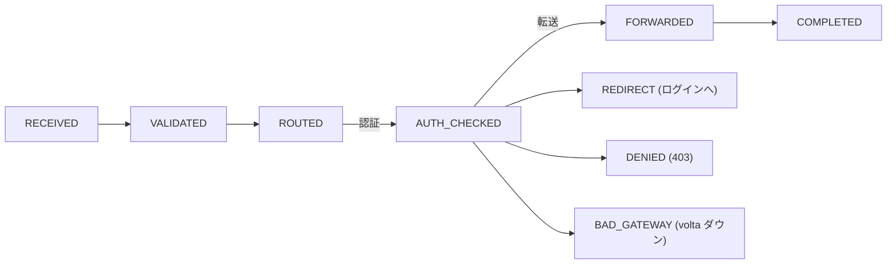
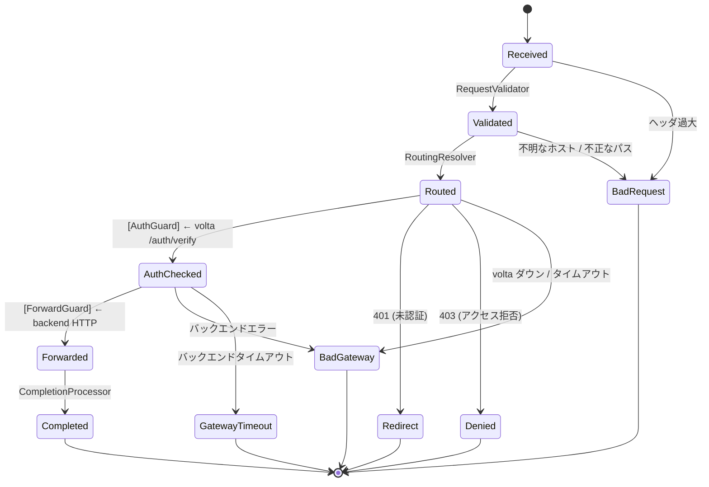
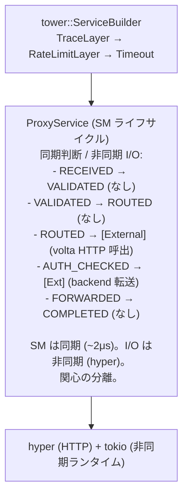

[English version](README.md)

# volta-gateway

ステートマシン ([tramli 3.8](https://github.com/opaopa6969/tramli)) 駆動の
認証対応リバースプロキシ兼ID基盤。サポートする実行構成は
**Rust-only** (`volta-gateway` + 同梱の `volta-auth-server`)。
Java `volta-auth-proxy` と Traefik は目標ランタイム構成には含めない。

**全てのリクエストはレールの上を走る** — ステートマシンが有効な遷移だけを許可する。リクエストスマグリングなし。認証チェック忘れなし。見えない障害なし。

> 現行アーキテクチャと信頼境界の契約:
> [`docs/rust-only-foundation-spec.md`](docs/rust-only-foundation-spec.md)

## 目次

- [仕組み](#仕組み) — リクエスト状態遷移
- [クイックスタート](#クイックスタート)
- [Rust-only 認証サービス](#rust-only-認証サービス)
- [機能一覧](#機能一覧)
- [設定](#設定)
- [セキュリティ](#セキュリティ)
- [アーキテクチャ](#アーキテクチャ)
- [vs Traefik](#vs-traefik-実測済み)
- [tramli での開発](#tramli-での開発)
- [ワークスペース構成](#ワークスペース構成)
- [ドキュメント](#ドキュメント)

---

## 仕組み

```mermaid
flowchart LR
    Client --> CF["Cloudflare (TLS)"]
    CF --> GW["volta-gateway (HTTP:8080)"]
    GW -->|認証チェック| Volta[volta-auth-server (Rust)]
    GW --> Backend["バックエンド App"]
```

**リクエストライフサイクル（ステートマシン）:**


```mermaid
flowchart LR
    RECEIVED --> VALIDATED --> ROUTED
    ROUTED -->|認証| AUTH_CHECKED
    AUTH_CHECKED -->|転送| FORWARDED --> COMPLETED
    AUTH_CHECKED --> REDIRECT["REDIRECT (ログインへ)"]
    AUTH_CHECKED --> DENIED["DENIED (403)"]
    AUTH_CHECKED --> BAD_GATEWAY["BAD_GATEWAY (volta ダウン)"]
```

### 状態遷移図


```mermaid
stateDiagram-v2
    [*] --> Received
    Received --> Validated : RequestValidator
    Validated --> Routed : RoutingResolver
    Routed --> AuthChecked : [AuthGuard] ← volta /auth/verify
    AuthChecked --> Forwarded : [ForwardGuard] ← backend HTTP
    Forwarded --> Completed : CompletionProcessor

    Received --> BadRequest : ヘッダ過大
    Validated --> BadRequest : 不明なホスト / 不正なパス
    Routed --> Redirect : 401 (未認証)
    Routed --> Denied : 403 (アクセス拒否)
    Routed --> BadGateway : volta ダウン / タイムアウト
    AuthChecked --> BadGateway : バックエンドエラー
    AuthChecked --> GatewayTimeout : バックエンドタイムアウト

    Completed --> [*]
    BadRequest --> [*]
    Redirect --> [*]
    Denied --> [*]
    BadGateway --> [*]
    GatewayTimeout --> [*]
```

> **設計上の意図と現行の配線の違い。** 上の図は生成物ではなく、*意図した*
> ステータスマップである。エンジンが実際に実行する `FlowDefinition`
> ([`gateway/src/flow.rs`](gateway/src/flow.rs)) は、ハッピーパスの 5 遷移と
> `.on_any_error(BadGateway)` だけを配線しており、状態機械上のエラーは全て
> `BadGateway` に集約される。`BadRequest` / `Redirect` / `Denied` /
> `GatewayTimeout` は `ProxyState` の値として（各々 `as_status_code()` 付きで）
> 存在するが、フローがそれらの状態へ遷移することはない。400 / 302 / 403 / 504 の
> 振り分けは [`gateway/src/proxy.rs`](gateway/src/proxy.rs) の
> `ProxyService::handle()` が手続き的に行う。したがってコードと図の同期は
> **保証されない**。
>
> **IP アローリスト拒否。** `RequestValidator` は `FlowError("DENIED")` を送出し、
> フローはこれを `Denied` 終端へ遷移させる。そのため、ルートのアローリスト外の
> クライアントには **403 Forbidden** を返す。（図中の 403 は別経路の認証チェック拒否
> — `AuthResult::Denied` — も表しており、こちらも 403 である。）

全ての状態遷移がログに残る。**どこで時間がかかったか**が一目瞭然:

```json
{
  "transitions": [
    {"from": "RECEIVED", "to": "VALIDATED", "duration_us": 5},
    {"from": "VALIDATED", "to": "ROUTED", "duration_us": 2},
    {"from": "ROUTED", "to": "AUTH_CHECKED", "duration_us": 850},
    {"from": "AUTH_CHECKED", "to": "FORWARDED", "duration_us": 12500}
  ],
  "total_us": 13360
}
```

## クイックスタート

```bash
# 1. clone + workspace ビルド (5 crate)
git clone https://github.com/opaopa6969/volta-gateway
cd volta-gateway
cargo build --workspace --release

# 2. 設定
cp volta-gateway.yaml my-config.yaml
# my-config.yaml を編集

# 3a. 最速 smoke 経路 (DB 不要) — mock backend + mock auth
cargo run --release -p volta-gateway --example mock_backend &
cargo run --release -p volta-gateway --example mock_auth &

# 3b. もしくは本物の Rust auth-server を :7070 で起動
#     export DATABASE_URL=... JWT_SECRET=...
cargo run --release -p volta-auth-server &

# 4. gateway 起動
cargo run --release -p volta-gateway -- my-config.yaml

# 5. リクエスト
curl -H "Host: app.localhost" http://localhost:8080/api/hi
```

完全手順: [`docs/getting-started-ja.md`](docs/getting-started-ja.md) ·
[English](docs/getting-started.md)。

## Rust-only 認証サービス

volta-gateway は本ワークスペースに **Rust auth-server** (`auth-server/`) を
同梱し、約 126 エンドポイント (auth / OIDC / SAML / MFA / Passkey /
Magic Link / SCIM 2.0 / Webhook /
Audit / Billing / Policy / GDPR / Admin / JWKS / viz・SSE を提供する。

Javaパリティや移行資料は履歴追跡用として残すが、現行のデプロイ推奨ではない。
新しい本番要件とセキュリティ修正はRust実装を正として反映する。

## 機能一覧

> 最新タグ付きリリース: **0.3.0**（[CHANGELOG](CHANGELOG.md) 参照）。開発中の機能
> — DPoP 送信者制約トークン、OIDC フロント/バックチャネルログアウト、アカウント
> リンク、リスクステップアップ、トークン交換 — は `[Unreleased]` で追跡している。

| 機能 | 詳細 |
|------|------|
| HTTP/1.1 + HTTP/2 | hyper 1.x 自動ネゴシエーション |
| WebSocket tunnel | 双方向 TCP tunnel (1024 接続上限) |
| TLS / Let's Encrypt | rustls-acme, 自動 HTTPS |
| ロードバランシング | ラウンドロビン + 重み付きルーティング (カナリアデプロイ) |
| レート制限 | グローバル + per-IP + per-user (プラグイン) |
| サーキットブレーカー | 5 failures / 30s recovery, idempotent retry, Retry-After |
| 認証キャッシュ | 5秒 TTL cookie ベース — 重複 volta 呼び出しをスキップ |
| 圧縮 | text/json/xml/js を gzip (1MB 閾値) |
| CORS | per-route origins, セキュア・バイ・デフォルト |
| カスタムエラーページ | HTML ディレクトリ + JSON fallback |
| ホットリロード | SIGHUP + HTTP `/admin/reload` — ゼロダウンタイム (ArcSwap) |
| ライブ設定変更＋永続化 | `PATCH /admin/config`（JSON Merge Patch）— オーバーレイファイルに永続化し再起動後も保持、可能な項目は即時反映 |
| パブリックルート | `public: true` で認証スキップ、`auth_bypass_paths` で webhook 対応 |
| パス書き換え | `strip_prefix`, `add_prefix` で API バージョニング |
| ヘッダー操作 | ルートごとにリクエスト/レスポンスヘッダーを追加・削除 |
| トラフィックミラーリング | シャドウ backend (fire-and-forget, sample_rate) |
| 地理アクセス制御 | `geo_allowlist` / `geo_denylist` (CF-IPCountry) |
| ルート別タイムアウト | `timeout_secs` — LLM backend 120秒、高速 API 5秒 |
| Traceparent | W3C Trace Context 伝搬 (OpenTelemetry 互換) |
| レスポンスキャッシュ | ルート別 LRU + TTL (X-Volta-Cache: HIT/MISS) |
| プラグインシステム | Native Rust プラグイン (api-key-auth, rate-limit-by-user) |
| Config Sources | YAML + services.json + Docker labels + HTTP polling |
| Backend ヘルスチェック | dead backend 自動検出・LB スキップ |
| mTLS backend | 内部 zero-trust 用 mutual TLS |
| バックプレッシャー | グローバル最大同時リクエスト数 (Semaphore) |
| Admin API | /admin/routes, /admin/backends, /admin/stats, /admin/config, /admin/reload, /admin/drain — loopback 限定 + Bearer トークン認証 (`admin.token` / `VOLTA_ADMIN_TOKEN`) |
| Config 検証 | `volta-gateway --validate config.yaml` (CI/CD 用) |
| L4 proxy | TCP/UDP ポートフォワーディング |
| メトリクス | Prometheus /metrics + レイテンシヒストグラム (8 bucket) |
| Trusted proxies | CF-Connecting-IP / X-Real-IP で real client IP |

## 設定

最小構成 (`volta-gateway.minimal.yaml` 参照):

```yaml
server:
  port: 8080

auth:
  volta_url: http://localhost:7070   # volta-auth-server
  timeout_ms: 500                    # フェイルクローズド: volta ダウン → 502

admin:
  # /admin/* 用 Bearer トークン (loopback 限定)。環境変数 VOLTA_ADMIN_TOKEN が優先。
  # 未設定時: 読み取りは loopback 限定で許可、書き込み系は 403 で無効化。
  token: REPLACE_WITH_LONG_RANDOM_TOKEN

routing:
  - host: app.example.com
    backend: http://localhost:3000
    app_id: app-wiki
    cors_origins:                    # 明示的 CORS (省略 = CORS ヘッダなし)
      - https://app.example.com

  - host: "*.example.com"           # ワイルドカード対応
    backends:                        # ラウンドロビン LB
      - http://localhost:3000
      - http://localhost:3001
```

全フィールドリファレンス: `volta-gateway.full.yaml`

## セキュリティ

| レイヤー | 防御対象 |
|---------|---------|
| **hyper** (HTTP パーサー) | リクエストスマグリング、ヘッダインジェクション、HTTP/2 違反 |
| **SM VALIDATED state** | Host ヘッダ汚染、パストラバーサル、過大リクエスト |
| **認証チェック** | 未認証アクセス（フェイルクローズド: volta ダウン → 502） |
| **レスポンス strip** | バックエンドの X-Volta-* ヘッダ偽装（レスポンスから除去） |

## アーキテクチャ


```mermaid
flowchart TB
    Tower["tower::ServiceBuilder<br/>TraceLayer → RateLimitLayer → Timeout"]
    Proxy["ProxyService (SM ライフサイクル)<br/>同期判断 / 非同期 I/O:<br/>- RECEIVED → VALIDATED (なし)<br/>- VALIDATED → ROUTED (なし)<br/>- ROUTED → [External] (volta HTTP 呼出)<br/>- AUTH_CHECKED → [Ext] (backend 転送)<br/>- FORWARDED → COMPLETED (なし)<br/><br/>SM は同期 (~2μs)。I/O は非同期 (hyper)。<br/>関心の分離。"]
    Hyper["hyper (HTTP) + tokio (非同期ランタイム)"]
    Tower --> Proxy --> Hyper
```

SM パターンは [tramli](https://github.com/opaopa6969/tramli) から — 不正な遷移が構造的に存在できない制約付きフローエンジン。

## なぜ Docker labels ではなく 1 YAML なのか？

Traefik ユーザーが最初に聞く質問。

**Labels が輝くとき:** 各チームが独立してサービスをデプロイする大規模組織。docker-compose に 3 行追加で OK。

**Labels が辛くなるとき:**
- middleware chain が 20 行超え → 可読性ゼロ
- 全ルートが docker-compose 10 ファイルに散在 → 一覧が見えない
- labels の typo でルーティングが壊れても気づきにくい（検証なし）
- ForwardAuth + CORS + rate limit + path rewrite を全部 labels で書く地獄

**volta-gateway の選択:** 1 YAML ファイル、起動時に検証。全ルート・ミドルウェア・バックエンドが一箇所に。不正な config は起動時に即エラー。

Docker label 検出が必要なチームは Config Sources 機能（[設定](#設定)参照）で services.json / Docker labels / HTTP polling + ライブリロードに対応。

## vs Traefik (実測済み)

同条件ベンチマーク: localhost mock auth + mock backend。Traefik v3.4 (Docker) + ForwardAuth vs volta-gateway (native release)。[詳細結果](gateway/benches/e2e_results.md)

> **計測の出典。** 下表のレイテンシは
> [`e2e_results.md`](gateway/benches/e2e_results.md) の **GW-52 同条件ラン**
> （`oha -n 500 -c 1`、2026-04-07、Linux/WSL2、release ビルド）である。`SM
> オーバーヘッド`（1.69 μs）は SM フルライフサイクル（start + 2× resume）の
> criterion マイクロベンチによる別計測で、同じランの一部ではない。同ファイルには
> より早い proxy+auth ラン（p50 **0.243 ms**、p50 で +40 μs の proxy
> オーバーヘッド）も記録されているが、これは別ランのため 2 つの p50 は直接比較
> できない。

| 指標 | volta-gateway | Traefik + ForwardAuth | |
|------|--------------|----------------------|---|
| **p50 レイテンシ** | **0.252 ms** | **1.673 ms** | **6.6倍高速** |
| 平均レイテンシ | 0.395 ms | 1.777 ms | 4.5倍高速 |
| p99 レイテンシ | 1.235 ms | 2.373 ms | 1.9倍高速 |
| SM オーバーヘッド | 1.69 μs | — | 全体の約1% |

| | volta-gateway | Traefik |
|---|---|---|
| 認証モデル | localhost HTTP (コネクションプール) | ForwardAuth ミドルウェア (2ホップ) |
| リクエスト可視性 | ステップ別 SM 遷移 + μs タイミング | 「入って出た」だけ |
| 設定 | 1 YAML ファイル | Docker labels + traefik.yml + middleware chain |
| ルーティング | Host → backend (ワイルドカード, ラウンドロビン) | Labels, file, Consul, etcd, ... |
| CORS | per-route, セキュア・バイ・デフォルト (DD-001) | ミドルウェアチェーン |
| デバッグ | SM state ログで障害点が一目瞭然 | Traefik デバッグログを読む |

## tramli での開発

volta-gateway は [tramli](https://github.com/opaopa6969/tramli) をステートマシンエンジンとして使用。
ワークスペースでは `gateway/Cargo.toml` と `auth-core/Cargo.toml` の両方で
`tramli = "3.8"` と `tramli-plugins = "3.6.1"` を固定している。3.2 → 3.8 の
全アップグレード経緯と、各マイナーリリースを形作ったフィードバックループは
[`docs/feedback.md`](docs/feedback.md) に記録。

### なぜ tramli か？

プロキシのリクエストライフサイクルが **Rust 8行** で定義される:

```rust
Builder::new("proxy")
    .from(Received).auto(Validated, RequestValidator { routing })
    .from(Validated).auto(Routed, RoutingResolver { routing })
    .from(Routed).external(AuthChecked, AuthGuard)
    .from(AuthChecked).external(Forwarded, ForwardGuard)
    .from(Forwarded).auto(Completed, CompletionProcessor)
    .on_any_error(BadGateway)
    .build()  // ← ここで8項目検証
```

`build()` が起動時に検証: 到達可能性、DAG、requires/produces チェーン等。**`build()` が通れば、フローは構造的に正しい。**

### B 方式: sync SM + async I/O

tramli は意図的に同期（リクエストあたり ~2μs）。非同期 I/O はエンジンの外:

```rust
// 1. 同期: SM 判断 (~1μs)
let flow_id = engine.start_flow(&def, &id, initial_data)?;
// 自動連鎖: RECEIVED → VALIDATED → ROUTED（External で停止）

// 2. 非同期: volta 認証チェック (~500μs)
let auth = volta_client.check_auth(&req).await;

// 3. 同期: SM 判断 (~300ns)
engine.resume_and_execute(&flow_id, auth_data)?;

// 4. 非同期: バックエンド転送 (~1-50ms)
let resp = backend.forward(&req).await;

// 5. 同期: SM 判断 (~300ns)
engine.resume_and_execute(&flow_id, resp_data)?;
// FORWARDED → COMPLETED（ターミナル）
```

SM はブロックしない。I/O は SM に入らない。きれいな分離。

### Processor の追加方法

1. `StateProcessor<ProxyState>` を実装する struct を定義
2. `requires()`（入力型）と `produces()`（出力型）を宣言
3. Builder に `.from(X).auto(Y, MyProcessor)` を追加
4. `build()` がチェーン全体を検証 — コンパイルが通り `build()` が通れば動く

詳細は [tramli ドキュメント](https://github.com/opaopa6969/tramli)。このプロキシを作った実体験は[ユーザーレビュー](https://github.com/opaopa6969/tramli/blob/main/docs/review-volta-gateway-ja.md)を参照。

## ワークスペース構成

```
volta-gateway/
  Cargo.toml              ワークスペースルート (5 crate)
  gateway/                HTTP リバースプロキシ (30+ 機能)
  auth-core/              認証ライブラリ — JWT / セッション / OIDC・MFA・Passkey SM フロー
  auth-server/            Axum 認証 API — 約 126 ルートのRust認証サービス
  volta-bin/              統合バイナリ (gateway + auth-core in-process)
  tools/traefik-to-volta/ 設定変換 CLI
```

### auth-core

in-process 認証ライブラリ。別プロセスの auth-server への HTTP ラウンドトリップ不要。

| モジュール | 用途 |
|-----------|------|
| `jwt` | JWT 検証 + 発行 (HS256, RSA) |
| `session` | Cookie → JWT 検証 → X-Volta-* ヘッダー |
| `store` | DAO trait (User, Tenant, Membership, Invitation, Session, Flow) |
| `store::pg` | PostgreSQL 実装 (sqlx, `postgres` feature) |
| `policy` | RBAC ポリシーエンジン |
| `flow` | tramli SM フロー (OIDC, MFA, Passkey, Invite) |
| `service` | async オーケストレーター (IdP/Store/JWT で SM を駆動) |
| `idp` | OAuth2/OIDC クライアント (Google, GitHub, Microsoft, LinkedIn, Apple) |
| `totp` | MFA 用 TOTP 検証 |
| `passkey` | WebAuthn/Passkey サービス (webauthn-rs, `webauthn` feature) |

```bash
# PostgreSQL サポート付きビルド
cargo build -p volta-auth-core --features postgres

# テスト (ユニット)
cargo test -p volta-auth-core

# インテグレーションテスト (Docker 必要)
cargo test -p volta-auth-core --features postgres -- --ignored
```

## 要件

- Rust 1.75+ (edition 2021)
- PostgreSQL 13+ (auth-core `postgres` feature 使用時)
- Docker (インテグレーションテスト用)
- バックエンド App が動作中

## ドキュメント

- [Getting Started](docs/getting-started-ja.md) · [English](docs/getting-started.md)
- [アーキテクチャ](docs/architecture-ja.md) · [English](docs/architecture.md) — FlowEngine、ルーティング、auth-server 8 マージルータ、プラグイン
- [Rust-only 基盤仕様](docs/rust-only-foundation-spec.md) — 現行の構成・信頼境界・リリース条件
- [Rust ↔ Java パリティ（履歴）](docs/parity-ja.md) · [English](docs/parity.md) — 過去実装とのルート毎対比
- [tramli フィードバックループ](docs/feedback.md) — 3.2 → 3.8 のアップグレード経緯
- [ベンチマーク（履歴比較）](docs/benchmark-article.md) · [Traefik からの移行（履歴）](docs/migration-from-traefik-ja.md) · [English](docs/migration-from-traefik.md)
- [CHANGELOG](CHANGELOG.md)
- [Backlog](docs/backlog.md) · [HANDOFF](docs/HANDOFF.md)

## ライセンス

MIT
