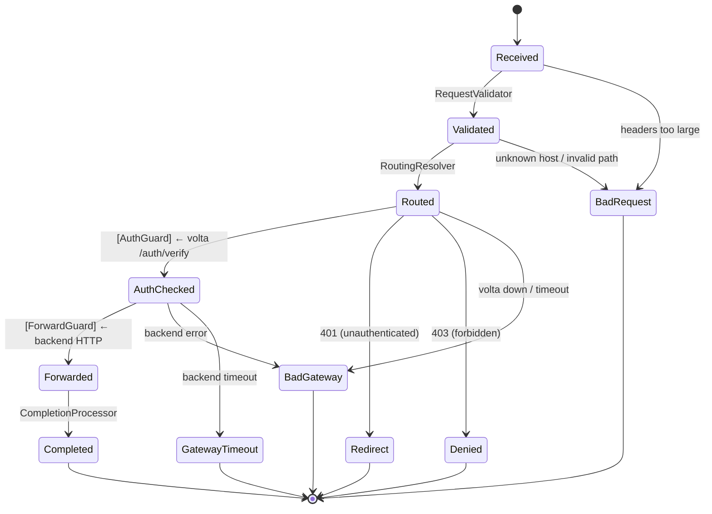

[日本語版はこちら / Japanese](README-ja.md)

# volta-gateway

Auth-aware reverse proxy for small-to-medium SaaS, powered by state machine.

**Every request rides on rails** — the state machine ensures that only valid transitions happen. No request smuggling. No forgotten auth checks. No invisible failures.

> **For large-scale deployments (50+ services, Kubernetes, Canary deploys):** use [Traefik](https://traefik.io/) + [volta-auth-proxy](https://github.com/opaopa6969/volta-auth-proxy) with ForwardAuth. Traefik's ecosystem is unmatched for orchestration.
>
> **For small-to-medium SaaS (5-20 services, auth latency matters):** volta-gateway gives you 5-10x faster auth checks, per-step visibility, and a single YAML config.

## How it works

```
Client → Cloudflare (TLS) → volta-gateway (HTTP:8080) → volta-auth-proxy (auth check)
                                                       → Backend App

Request lifecycle (state machine):
  RECEIVED → VALIDATED → ROUTED → [auth] → AUTH_CHECKED → [forward] → FORWARDED → COMPLETED
                                            ├── REDIRECT (login)
                                            ├── DENIED (403)
                                            └── BAD_GATEWAY (volta down)
```

### State Chart



This diagram is **generated from the same `FlowDefinition`** that the engine executes. Code = diagram. Always in sync.

Every state transition is logged. You can see **exactly** where time was spent:

```json
{
  "transitions": [
    {"from": "RECEIVED", "to": "VALIDATED", "duration_us": 5},
    {"from": "VALIDATED", "to": "ROUTED", "duration_us": 2},
    {"from": "ROUTED", "to": "AUTH_CHECKED", "duration_us": 850},
    {"from": "AUTH_CHECKED", "to": "FORWARDED", "duration_us": 12500}
  ],
  "total_us": 13360
}
```

## Quick Start

```bash
# 1. Clone
git clone https://github.com/opaopa6969/volta-gateway
cd volta-gateway

# 2. Configure (edit routing to match your backends)
cp volta-gateway.yaml my-config.yaml
# Edit my-config.yaml

# 3. Make sure volta-auth-proxy is running on localhost:7070

# 4. Run
cargo run -- my-config.yaml
```

## Features (v0.2.0)

| Feature | Details |
|---------|---------|
| HTTP/1.1 + HTTP/2 | hyper 1.x auto-negotiation |
| WebSocket tunnel | Bidirectional TCP tunnel (1024 connection limit) |
| TLS / Let's Encrypt | rustls-acme, automatic HTTPS |
| Load balancing | Round-robin across multiple backends |
| Rate limiting | Global + per-IP (configurable) |
| Circuit breaker | 5 failures / 30s recovery, idempotent retry, Retry-After |
| Compression | Gzip for text/json/xml/js (1MB threshold) |
| CORS | Per-route origins, secure-by-default (no implicit wildcard) |
| Custom error pages | HTML directory with JSON fallback |
| Hot reload | SIGHUP → zero-downtime config swap (ArcSwap) |
| L4 proxy | TCP/UDP port forwarding |
| Metrics | Prometheus /metrics (requests, WS, circuit breaker, compression, L4) |

## Configuration

Minimal config (see `volta-gateway.minimal.yaml`):

```yaml
server:
  port: 8080

auth:
  volta_url: http://localhost:7070   # volta-auth-proxy
  timeout_ms: 500                    # fail-closed: volta down → 502

routing:
  - host: app.example.com
    backend: http://localhost:3000
    app_id: app-wiki
    cors_origins:                    # explicit CORS (omit = no CORS headers)
      - https://app.example.com

  - host: "*.example.com"           # wildcard support
    backends:                        # round-robin LB
      - http://localhost:3000
      - http://localhost:3001
```

Full config reference: `volta-gateway.full.yaml`

## Security

| Layer | What it protects against |
|-------|------------------------|
| **hyper** (HTTP parser) | Request smuggling, header injection, HTTP/2 violations |
| **SM VALIDATED state** | Host header poisoning, path traversal, oversized requests |
| **Auth check** | Unauthenticated access (fail-closed: volta down → 502) |
| **Response strip** | Backend X-Volta-* header forgery (headers stripped from response) |

## Architecture

```
┌────────────────────────────────────────────┐
│  tower::ServiceBuilder                     │
│    TraceLayer → RateLimitLayer → Timeout   │
├────────────────────────────────────────────┤
│  ProxyService (SM lifecycle)               │
│                                            │
│  Sync judgment:          Async I/O:        │
│    RECEIVED → VALIDATED    (nothing)       │
│    VALIDATED → ROUTED      (nothing)       │
│    ROUTED → [External]     volta HTTP call │
│    AUTH_CHECKED → [Ext]    backend forward │
│    FORWARDED → COMPLETED   (nothing)       │
│                                            │
│  SM is sync (~2μs). I/O is async (hyper).  │
│  Separation of concerns.                   │
├────────────────────────────────────────────┤
│  hyper (HTTP) + tokio (async runtime)      │
└────────────────────────────────────────────┘
```

The SM pattern comes from [tramli](https://github.com/opaopa6969/tramli) — a constrained flow engine where invalid transitions cannot exist.

## Why 1 YAML, not Docker labels?

Traefik users ask this first. Here's why:

**Labels shine when** each team independently deploys services in a large org. 3 lines in docker-compose and you're routed.

**Labels hurt when:**
- Middleware chains grow to 20+ lines per service — unreadable
- All routes scatter across 10 docker-compose files — no overview
- Label typos break routing silently (no validation)
- ForwardAuth + CORS + rate limit + path rewrite in labels = pain

**volta-gateway's choice:** one YAML file, validated at startup. Every route, middleware, and backend in one place. `cargo run -- config.yaml` fails fast on invalid config — no silent misrouting.

For teams that need Docker label discovery: [Config Sources](#config-sources) support services.json, Docker labels, and HTTP polling with live reload.

## vs Traefik (benchmarked)

Same-condition benchmark: localhost mock auth + mock backend. Traefik v3.4 (Docker) + ForwardAuth vs volta-gateway (native release). [Full results](benches/e2e_results.md)

| Metric | volta-gateway | Traefik + ForwardAuth | |
|--------|--------------|----------------------|---|
| **p50 latency** | **0.252 ms** | **1.673 ms** | **6.6x faster** |
| avg latency | 0.395 ms | 1.777 ms | 4.5x faster |
| p99 latency | 1.235 ms | 2.373 ms | 1.9x faster |
| SM overhead | 1.69 μs | — | ~1% of total |

| | volta-gateway | Traefik |
|---|---|---|
| Auth model | localhost HTTP (connection-pooled) | ForwardAuth middleware (2 hops) |
| Request visibility | Per-step SM transitions with μs timing | "request in, response out" |
| Config | 1 YAML file | Docker labels + traefik.yml + middleware chain |
| Routing | Host → backend (wildcard, round-robin) | Labels, file, Consul, etcd, ... |
| CORS | Per-route, secure-by-default (DD-001) | Middleware chain |
| Debug | SM state log shows exact failure point | Traefik debug logs |

## Development with tramli

volta-gateway uses [tramli](https://github.com/opaopa6969/tramli) (`tramli = "0.1"` on [crates.io](https://crates.io/crates/tramli)) as its state machine engine.

### Why tramli?

The proxy's request lifecycle is defined in **8 lines of Rust**:

```rust
Builder::new("proxy")
    .from(Received).auto(Validated, RequestValidator { routing })
    .from(Validated).auto(Routed, RoutingResolver { routing })
    .from(Routed).external(AuthChecked, AuthGuard)
    .from(AuthChecked).external(Forwarded, ForwardGuard)
    .from(Forwarded).auto(Completed, CompletionProcessor)
    .on_any_error(BadGateway)
    .build()  // ← 8-item validation here
```

`build()` validates at startup:
1. All states reachable from initial
2. Path to terminal exists
3. Auto/Branch transitions form a DAG
4. At most 1 External per state
5. All branch targets defined
6. requires/produces chain integrity
7. No transitions from terminal states
8. Initial state exists

**If `build()` passes, the flow is structurally correct.** No runtime state machine bugs.

### The B-pattern: sync SM + async I/O

tramli is intentionally synchronous (~2μs per request). Async I/O happens outside:

```rust
// 1. Sync: SM judgment (~1μs)
let flow_id = engine.start_flow(&def, &id, initial_data)?;
// auto-chains: RECEIVED → VALIDATED → ROUTED (stops at External)

// 2. Async: volta auth check (~500μs)
let auth = volta_client.check_auth(&req).await;

// 3. Sync: SM judgment (~300ns)
engine.resume_and_execute(&flow_id, auth_data)?;
// AUTH_CHECKED (stops at next External)

// 4. Async: backend forward (~1-50ms)
let resp = backend.forward(&req).await;

// 5. Sync: SM judgment (~300ns)
engine.resume_and_execute(&flow_id, resp_data)?;
// FORWARDED → COMPLETED (terminal)
```

SM never blocks. I/O never enters SM. Clean separation.

### Adding a new processor

1. Define a `struct` implementing `StateProcessor<ProxyState>`
2. Declare `requires()` (input types) and `produces()` (output types)
3. Add `.from(X).auto(Y, MyProcessor)` to the Builder
4. `build()` validates the entire chain — if it compiles and `build()` passes, it works

```rust
struct MyRateLimiter;

impl StateProcessor<ProxyState> for MyRateLimiter {
    fn name(&self) -> &str { "RateLimiter" }
    fn requires(&self) -> Vec<TypeId> { vec![TypeId::of::<RequestData>()] }
    fn produces(&self) -> Vec<TypeId> { vec![] }
    fn process(&self, ctx: &mut FlowContext) -> Result<(), FlowError> {
        let req = ctx.get::<RequestData>()?;
        // ... rate limit check ...
        Ok(())
    }
}
```

See [tramli docs](https://github.com/opaopa6969/tramli) for the full API. The [user review](https://github.com/opaopa6969/tramli/blob/main/docs/review-volta-gateway.md) covers real-world experience building this proxy.

## Requirements

- Rust 1.75+ (edition 2021)
- volta-auth-proxy running (for auth checks)
- Backend apps running

## License

MIT
