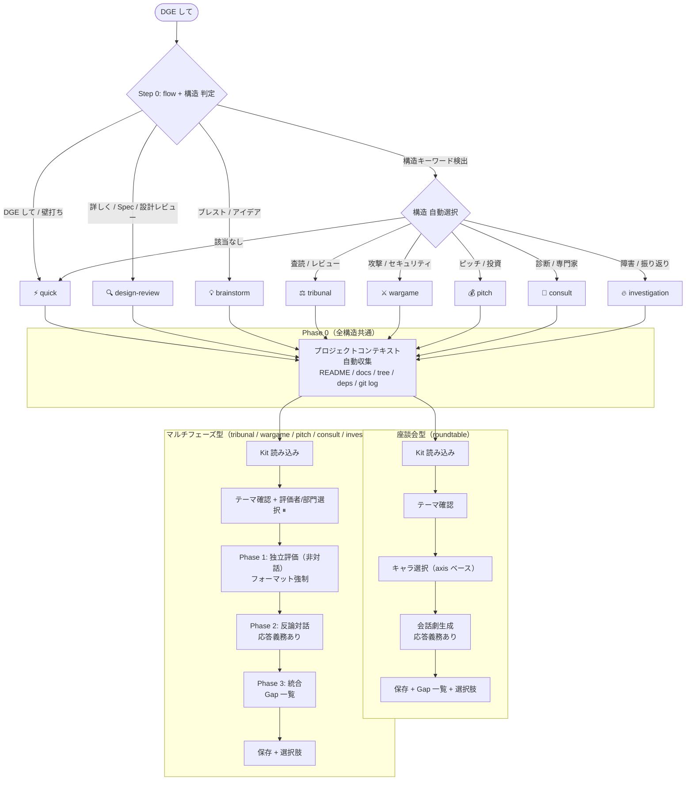
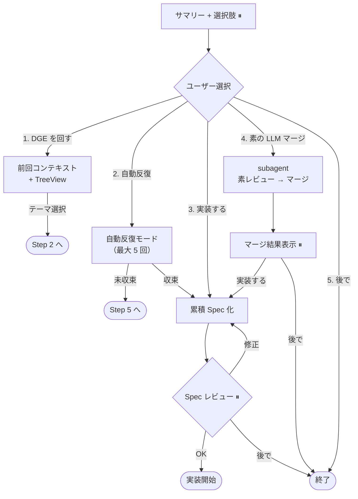
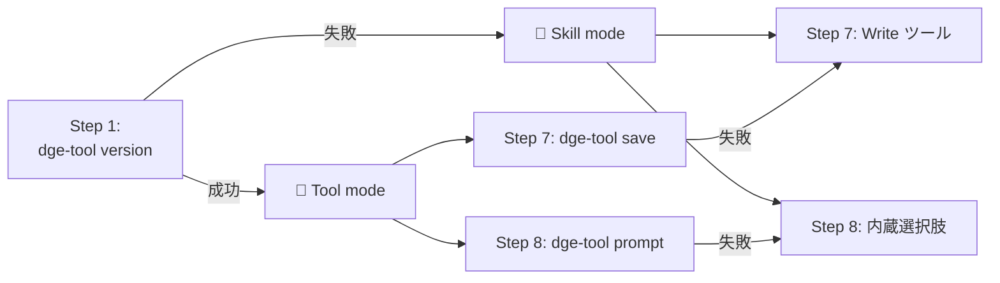
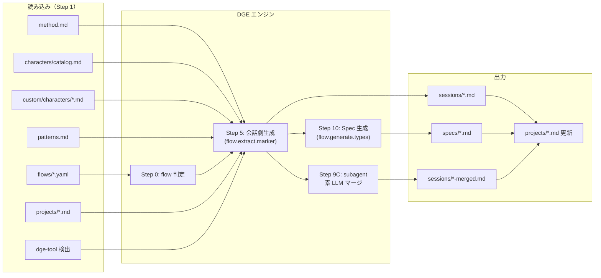
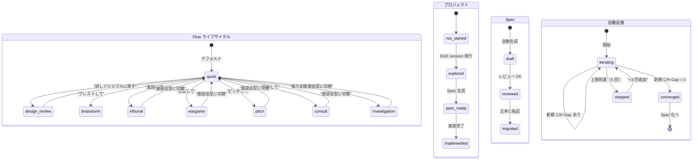

# DGE Internals — 内部構造

DGE toolkit の内部構造。カスタマイズする際の参考に。

## フロー図

### 全体フロー（flow 自動判定 → 分岐）

### 選択肢後の分岐

⏸ = ユーザーの応答を待つポイント

## dge-tool モード

## データフロー図

## ステート図

## flow + 構造の比較

### flow（モード）

| | ⚡ quick | 🔍 design-review | 💡 brainstorm |
|---|---------|------------------|---------------|
| Steps | 5 | 10 | 6 |
| 共通 MUST | 3 | 3 | 3 |
| 固有 MUST | 0 | 4 | 1 |
| テンプレート | スキップ | 選択 | スキップ |
| パターン | 自動 | 選択 | 自動 |
| キャラ確認 | 表示のみ | 確認待ち | 確認待ち |
| 抽出 | Gap | Gap | アイデア |
| Spec 化 | なし | あり | なし |
| 話法 | 標準 | 標準 | Yes-and |

### 構造（structure）

| | 🗣 roundtable | ⚖ tribunal | ⚔ wargame | 💰 pitch | 🏥 consult | 🔥 investigation |
|---|--------------|-----------|----------|---------|-----------|----------------|
| Phase 数 | 1 | 3 | 3 | 3 | 3 | 3 |
| Phase 0 | ✅ | ✅ | ✅ | ✅ | ✅ | ✅ |
| 独立評価 | なし | 査読者 3 人 | Red Team | 起業家ピッチ | 各専門科 | 各部門証言 |
| 応答義務 | キャラ間 | 反論必須 | 防御必須 | 全質問応答 | カンファ統合 | Five Whys |
| フォーマット | 自由 | S/S/W/Q/V | 攻撃計画 | P/S/M/T/A | 所見/リスク/推奨 | 時系列+証言 |
| 最適テーマ | 汎用 | 論文/設計 | セキュリティ | 事業判断 | 多領域設計 | 障害分析 |

## Hook ポイント一覧

| Step | 名前 | Hook | Level | dge-tool |
|------|------|------|-------|----------|
| 0 | flow 判定 | trigger_keywords | 1（YAML） | — |
| 1 | Kit 読み込み | 読み込むファイル一覧 | 2 | version 検出 |
| 2 | テーマ確認 | 掘り下げロジック | 2 | — |
| 3 | テンプレート選択 | テンプレート追加 | 1（templates/） | — |
| 3.5 | パターン選択 | プリセット追加 | 1（patterns.md） | — |
| 4 | キャラ選択 | キャラ追加・推奨 | 1（custom/）/ 2 | — |
| 5 | 会話劇生成 | ナレーション・Scene | 2 | — |
| 6 | 抽出 | マーカー・カテゴリ | 1（YAML extract） | — |
| 7 | 保存 | 保存先・ファイル名 | 1（YAML output_dir） | **save** |
| 8 | 選択肢 | 選択肢構成 | 1（YAML post_actions） | **prompt** |
| 9A | 自動反復 | 収束判定・上限 | 2 | — |
| 9B | コンテキスト | TreeView・テーマ | 2 | — |
| 9C | LLM マージ | subagent 実行 | 2 | — |
| 10 | Spec 生成 | 成果物タイプ | 1（YAML generate） | — |

## ファイルマップ

| ファイル | 役割 | 誰が読む | 誰が書く |
|---------|------|---------|---------|
| method.md | メソッド本体 | Step 1 | toolkit 提供 |
| characters/catalog.md | built-in 19 キャラ | Step 1, 4 | toolkit 提供 |
| custom/characters/*.md | カスタムキャラ | Step 1, 4 | dge-character-create |
| patterns.md | 20 パターン + 9 プリセット | Step 1, 3.5 | toolkit 提供 |
| dialogue-techniques.md | 8 会話技法 | Step 5 | toolkit 提供 |
| flows/*.yaml | フロー定義 | Step 0, 6, 7, 8, 10 | toolkit 提供 or ユーザー |
| sessions/*.md | DGE session 出力 | Step 9B, 10 | Step 7（自動） |
| specs/*.md | Spec ファイル | 実装時 | Step 10（自動） |
| projects/*.md | プロジェクト管理 | Step 9B | Step 7（自動更新） |
| bin/dge-tool.js | MUST 強制 CLI | Step 1, 7, 8 | toolkit 提供 |
| AGENTS.md | Codex/汎用 DGE 指示 | Codex, Cursor | install.sh |
| GEMINI.md | Gemini CLI DGE 指示 | Gemini CLI | install.sh |
| .cursorrules | Cursor DGE 指示 | Cursor | install.sh |
| agents-dge-section.md | DGE 指示テンプレ（ja） | install.sh | toolkit 提供 |
| agents-dge-section.en.md | DGE 指示テンプレ（en） | install.sh | toolkit 提供 |
