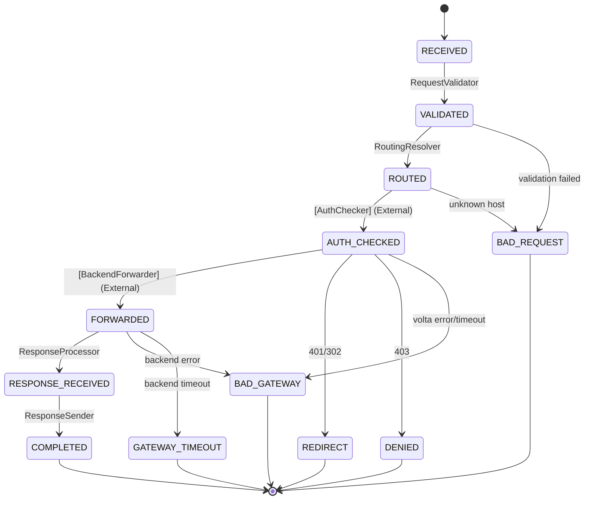

# Spec: volta-gateway — Rust SM Reverse Proxy

> Generated: 2026-04-07
> Source: DGE Sessions — 3 Rounds, 18 Gaps
> Language: Rust
> Dependencies: hyper, tokio, rustls, tower, tramli-rs

---

## 1. Overview

Traefik を置き換える auth-aware reverse proxy。Rust + SM (tramli) パターンで構築。

### やること / やらないこと

| やること (Phase 1) | やらないこと (Phase 2+) |
|-------------------|----------------------|
| HTTP proxy (hyper, port 8080) | TLS 終端 (CF が担当) |
| SM routing (Host → backend) | Load balancing |
| Auth integration (volta localhost HTTP) | Circuit breaker / Retry |
| Access logging (tracing + SM 遷移) | WebSocket / gRPC |
| Health check (/healthz) | ACME (Let's Encrypt) |
| YAML config | Per-tenant dynamic routing (DB) |
| Request validation (VALIDATED state) | Streaming response |

### 差別化

| vs Traefik | volta-gateway |
|-----------|---------------|
| ForwardAuth = 2 HTTP往復 (4-10ms) | Auth = localhost 1往復 (0.5-1ms) |
| Access log = 入って出た | SM 遷移ログ = ステップ別 |
| 静的ルーティング (Docker labels) | 将来: DB ベース動的ルーティング |
| 設定が散らばる | 1 YAML ファイル |
| デバッグ困難 | Mermaid で可視化 |

---

## 2. Architecture

### 2.1 全体構成

```
本番:
  Client → Cloudflare (TLS) → volta-gateway (HTTP:8080) → volta-auth-proxy (HTTP:7070)
                                                        → App A
                                                        → App B

開発:
  Client → volta-gateway (rustls:8443) → volta-auth-proxy → App
```

### 2.2 tower::Service スタック

```
tower::ServiceBuilder
  .layer(TraceLayer)              // OpenTelemetry / tracing
  .layer(RateLimitLayer(100/s))   // IP ベース rate limit
  .layer(TimeoutLayer(30s))       // total request timeout
  .service(SmProxyService)        // SM engine
```

### 2.3 SM フロー



### 2.4 sync SM + async I/O (B 方式)

```
engine.start_flow()  → RECEIVED → VALIDATED → ROUTED   (sync, ~1μs)
  ── async: volta /auth/verify ──
engine.resume()      → AUTH_CHECKED                      (sync, ~300ns)
  ── async: hyper client → backend ──
engine.resume()      → FORWARDED → RESPONSE_RECEIVED → COMPLETED (sync, ~1μs)
```

SM は sync。async は tower::Service の call() 内で hyper client が担当。

---

## 3. SM Processors

### 3.1 RequestValidator (Auto: RECEIVED → VALIDATED)

```rust
// Checks:
// 1. Header total size <= 8KB
// 2. Content-Length <= 10MB (configurable)
// 3. Host header exists
// 4. Host in known_hosts (routing table)
// 5. Path normalization: reject "..", "//"
```

### 3.2 RoutingResolver (Auto: VALIDATED → ROUTED)

```rust
// Input: Host header
// Output: BackendTarget { url, app_id }
// Lookup: routing_table (HashMap<String, BackendTarget>)
```

### 3.3 AuthChecker (External: ROUTED → AUTH_CHECKED)

```rust
// HTTP GET volta:7070/auth/verify
// Headers forwarded:
//   Cookie (transparent passthrough)
//   X-Forwarded-Host, X-Forwarded-Uri, X-Forwarded-Proto
//   X-Volta-App-Id (from routing config)
//
// Connection pool: hyper::Client, max 32 idle per host
// Timeout: 500ms
// Fail-closed: volta down → BAD_GATEWAY
//
// Response mapping:
//   200 → extract X-Volta-* headers → AUTH_CHECKED
//   401 → REDIRECT (to /login with return_to)
//   302 → REDIRECT (follow volta's redirect)
//   403 → DENIED
//   5xx → BAD_GATEWAY
```

### 3.4 HeaderInjector (Auto: AUTH_CHECKED → ready for forward)

```rust
// Add X-Volta-* headers from auth response to outgoing request
// Strip any X-Volta-* that backend might have set (RP-16: forgery prevention)
```

### 3.5 BackendForwarder (External: → FORWARDED)

```rust
// Forward request to backend URL (from RoutingResolver)
// Preserve: method, path, query, body, most headers
// Remove: Host (replace with backend host), Connection
// Add: X-Forwarded-For, X-Forwarded-Proto, X-Request-Id
```

### 3.6 ResponseProcessor (Auto: FORWARDED → RESPONSE_RECEIVED)

```rust
// Strip X-Volta-* headers from backend response (RP-16)
// Add: X-Request-Id, Server: volta-gateway
```

---

## 4. Auth Integration

### 4.1 volta /auth/verify プロトコル

```
Request:
  GET http://localhost:7070/auth/verify
  Cookie: __volta_session=xxx; __volta_device_trust=yyy
  X-Forwarded-Host: app.example.com
  X-Forwarded-Uri: /api/v1/resource
  X-Forwarded-Proto: https
  X-Volta-App-Id: app-wiki

Response (200):
  X-Volta-User-Id: <uuid>
  X-Volta-Email: user@example.com
  X-Volta-Tenant-Id: <uuid>
  X-Volta-Tenant-Slug: acme
  X-Volta-Roles: ADMIN,MEMBER
  X-Volta-JWT: eyJhbG...
  X-Volta-Display-Name: 田中太郎
```

### 4.2 Connection Pool

```rust
let volta_client = hyper::Client::builder()
    .pool_max_idle_per_host(32)
    .build_http();
```

### 4.3 Timeout / Failure

- Timeout: 500ms
- volta down: 502 Bad Gateway
- **Fail-closed**: 認証できないなら通さない

---

## 5. Security

### 5.1 SM が防ぐもの

| 攻撃 | 防御ポイント |
|------|------------|
| Host header poisoning | VALIDATED: known hosts only |
| Path traversal | VALIDATED: reject `..`, `//` |
| Oversized request | VALIDATED: header 8KB, body 10MB |
| Unknown routes | ROUTED: routing table にないホストは BAD_REQUEST |

### 5.2 hyper が防ぐもの

| 攻撃 | 防御 |
|------|------|
| HTTP Request Smuggling | CL/TE 不一致を厳格に拒否 |
| Header injection | HTTP パーサーが \r\n 拒否 |
| HTTP/2 violations | h2 実装が処理 |

### 5.3 tower が防ぐもの

| 攻撃 | 防御 |
|------|------|
| DDoS | RateLimitLayer (100 req/sec per IP) |
| Slow HTTP | TimeoutLayer (30s total) |

### 5.4 hyper config

```rust
Server::bind(&addr)
    .http1_header_read_timeout(Duration::from_secs(10))
    .http1_keepalive(true)
```

### 5.5 レスポンスヘッダ Strip (RP-16)

backend が `X-Volta-*` ヘッダを偽装する攻撃を防止:
- **リクエスト方向**: proxy が volta から受け取った X-Volta-* のみ注入
- **レスポンス方向**: backend レスポンスから X-Volta-* を strip

---

## 6. Config

### 6.1 YAML 設定ファイル

```yaml
# volta-gateway.yaml
server:
  port: 8080
  read_timeout_secs: 10
  request_timeout_secs: 30

auth:
  volta_url: http://localhost:7070
  verify_path: /auth/verify
  timeout_ms: 500
  pool_max_idle: 32

routing:
  - host: app.example.com
    backend: http://localhost:3000
    app_id: app-wiki
  - host: admin.example.com
    backend: http://localhost:3001
    app_id: app-admin
  - host: "*.example.com"
    backend: http://localhost:3000
    app_id: app-default

rate_limit:
  requests_per_second: 100

healthcheck:
  interval_secs: 30
  path: /healthz

logging:
  level: info
  format: json  # or "pretty" for dev
```

### 6.2 Hot Reload

SIGHUP → YAML 再読込 → routing table を AtomicSwap。
接続中のリクエストは古いテーブルで完了。

---

## 7. Observability

### 7.1 Access Log (SM 遷移ベース)

```json
{
  "timestamp": "2026-04-07T12:00:00Z",
  "request_id": "uuid",
  "method": "GET",
  "host": "app.example.com",
  "path": "/api/v1/resource",
  "client_ip": "203.0.113.1",
  "transitions": [
    {"from": "RECEIVED", "to": "VALIDATED", "duration_us": 5},
    {"from": "VALIDATED", "to": "ROUTED", "duration_us": 2},
    {"from": "ROUTED", "to": "AUTH_CHECKED", "duration_us": 850},
    {"from": "AUTH_CHECKED", "to": "FORWARDED", "duration_us": 12500},
    {"from": "FORWARDED", "to": "COMPLETED", "duration_us": 3}
  ],
  "total_us": 13360,
  "status": 200,
  "user_id": "uuid",
  "tenant_id": "uuid",
  "exit_state": "COMPLETED"
}
```

**ステップ別の duration が見える** — どこがボトルネックか一目瞭然。

### 7.2 /healthz

```json
{
  "status": "ok",
  "volta": "ok",        // localhost:7070/healthz の結果
  "backends": {
    "app-wiki": "ok",
    "app-admin": "degraded"
  },
  "uptime_secs": 86400
}
```

### 7.3 Mermaid Diagram

`MermaidGenerator::generate(&proxy_flow_def)` でリクエストライフサイクル図を自動生成。

---

## 8. Implementation Plan

### Day 1: Skeleton

```
cargo init volta-gateway
Cargo.toml: hyper, tokio, tower, serde, serde_yaml, tracing
main.rs: hyper server (port 8080)
config.rs: YAML → Config struct
routing.rs: HashMap<String, BackendTarget>
proxy.rs: 最も単純な forward proxy (Host → backend)
```

### Day 2: SM Integration

```
tramli-rs を依存に追加 (or git submodule)
state.rs: ProxyState enum (8 states + 5 terminals)
processors.rs: RequestValidator, RoutingResolver, HeaderInjector, ResponseProcessor
service.rs: tower::Service<Request> 実装 (SmProxyService)
auth.rs: volta /auth/verify client (connection pool)
```

### Day 3: Polish

```
logging.rs: tracing + SM 遷移ログ (JSON)
health.rs: /healthz endpoint
security.rs: X-Volta-* strip on response
hot_reload.rs: SIGHUP → config reload
tests/: mock volta + mock backend
```

### Estimated Size

```
tramli-rs:       ~500 lines (ユーザーが自作)
volta-gateway:   ~1,100 lines
  config.rs:      ~100
  routing.rs:     ~100
  state.rs:       ~50
  processors.rs:  ~200
  auth.rs:        ~150
  service.rs:     ~200
  health.rs:      ~50
  logging.rs:     ~50
  security.rs:    ~50
  main.rs:        ~100
  tests/:         ~300
```

---

## 9. Migration Path (Strangler Fig)

```
Phase 0 (現在):
  Client → CF → Traefik → volta (ForwardAuth) → App

Phase 1 (並行運用):
  Client → CF → Traefik → volta → App        (既存)
  Client → CF → volta-gateway → volta → App   (新、テスト用サブドメイン)

Phase 2 (切り替え):
  Client → CF → volta-gateway → volta → App   (全トラフィック)
  Traefik 停止

Phase 3 (統合):
  Client → CF → volta-gateway (auth 内蔵) → App  (volta が gateway に統合)
```

---

## Appendix: DGE Session Files

```
dge/sessions/
  2026-04-07-rust-sm-proxy.md       Round 1: メリット整理 + Auth方式選定 (11 gaps)
  2026-04-07-rust-sm-proxy-r2.md    Round 2: スコープ確定 + Auth詳細 (4 gaps)
  2026-04-07-rust-sm-proxy-r3.md    Round 3: L7防御 + tower統合 (3 gaps)
```

Total: 3 rounds, 18 gaps (6 resolved, 1 user-owned)
