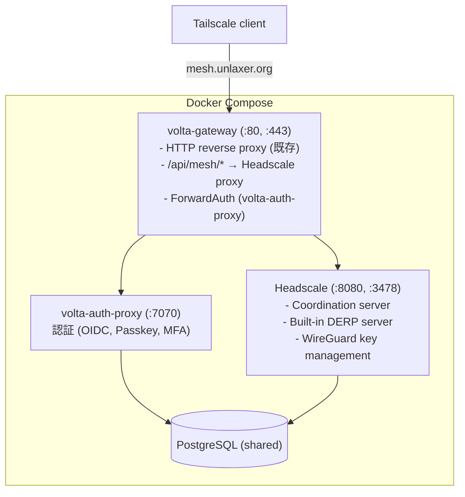

# volta-gateway Mesh VPN Spec

> Generated: 2026-04-10
> Source: DGE Session (5 rounds, 7 gaps)

## Overview

volta-gateway に P2P mesh VPN を統合。既存の volta-auth-proxy 認証でデバイスが mesh に参加し、WireGuard で P2P 通信。

## Killer Feature

```
従来: reverse proxy + VPN = 2 つの別ツール + 2 つの認証
volta-gateway: 1 つの config + 1 つの認証で HTTP proxy も VPN も
```

## Architecture (Phase 1: Headscale Sidecar)



## Authentication Flow

```
1. User logs into volta-console (volta-auth-proxy)
2. volta-console: POST /api/mesh/keys → generates pre-auth key via Headscale API
3. User copies key
4. tailscale up --login-server https://mesh.unlaxer.org --authkey <key>
5. Headscale registers device → assigns 100.64.x.x IP
6. WireGuard tunnel established → P2P mesh active
```

## Config

```yaml
# volta-gateway.yaml
mesh:
  enabled: true
  domain: mesh.unlaxer.org
  headscale:
    url: http://headscale:8080
    api_key: "${HEADSCALE_API_KEY}"
```

## Phase 1 Deliverables

1. Headscale Docker service in compose
2. volta-gateway mesh config section + /api/mesh/* proxy
3. volta-console mesh management UI (devices, keys)
4. mesh.unlaxer.org DNS + CF Tunnel route
5. Client setup documentation

## Phase 2 (Future): Rust Native

Replace Headscale sidecar with Rust implementation of Tailscale coordination protocol. Single binary.

## Design Decisions

- DD-MESH-001: Client = Tailscale client (no custom client)
- DD-MESH-002: Auth = pre-auth key (no OIDC provider needed)
- DD-MESH-003: DERP = Headscale built-in (Phase 1)
- DD-MESH-004: Phase 1 = sidecar, Phase 2 = native Rust
