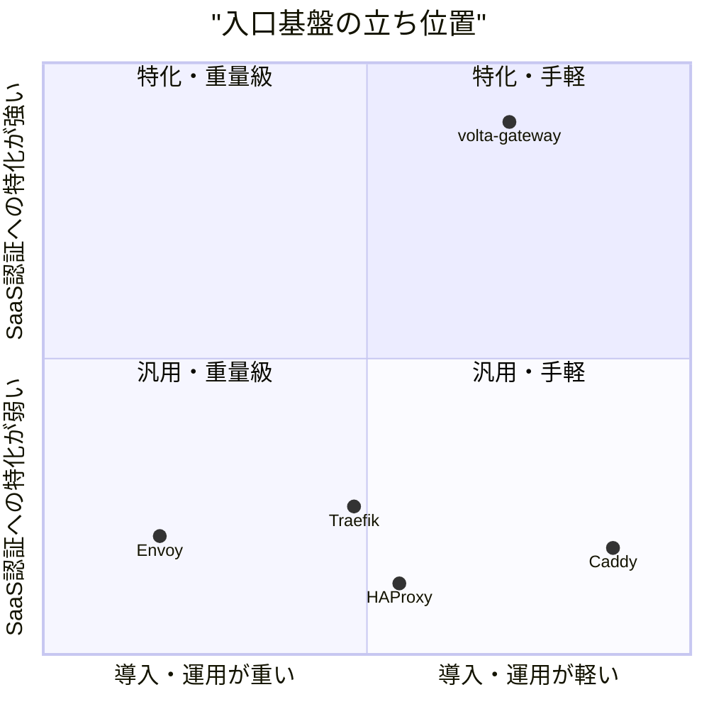
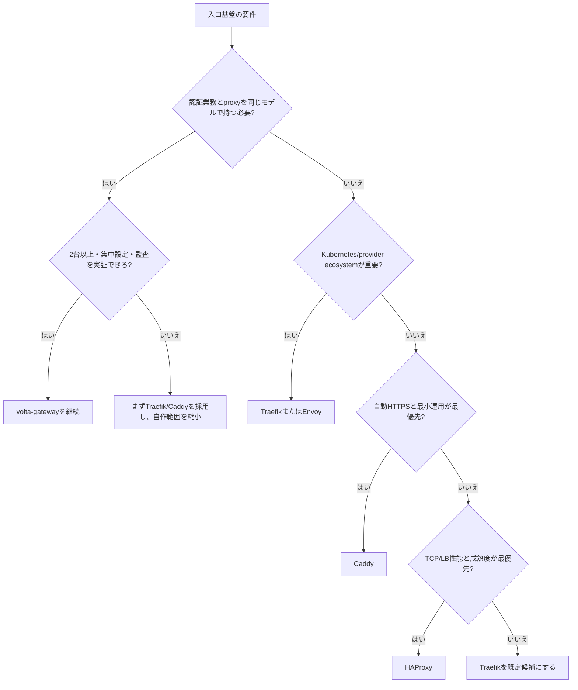

# 0. 要約

立ち位置: volta-auth-proxy/auth-coreと一体で、5〜20サービス規模のSaaS入口に認証・ルーティング・可観測性をまとめる自家用基盤である。

最大の弱点: 機能差ではなく、現状の単一VM依存、集中設定・監査・管理UIの不足であり、既製品の運用成熟度に負ける。

次の一手: gatewayを作り足す前に、healthcheckとdrainを使った無停止更新、2台構成、consoleを真実の源にする設定pullを順に実証する。

# 1. このrepoは何か

一言でいえば、認証チェックを組み込んだHTTP/TCPリバースプロキシと認証基盤のワークスペースである。`gateway`はhyper/tokio上で、YAML・services.json・Docker labels・HTTP pollingからルートを読み、認証、負荷分散、rate limit、circuit breaker、cache、mTLS、TLS/ACME、WebSocket、L4転送、Prometheus metrics、admin APIを提供する。`auth-core`はJWT、OIDC、MFA、Passkey、政策、セッションを持ち、`auth-server`はJava版`volta-auth-proxy`と約96エンドポイントの互換を目指す。`volta-bin`では認証をin-process化できる。

価値はgateway単体のHTTP転送ではない。実運用では、Cloudflareの前段、volta-gateway、volta-auth-proxyまたはauth-core、複数のSaaS backend、管理用consoleが組み合わさり、「認証を忘れず、どの段階で失敗したかを見えるように入口を運用する」手間を減らす。したがって比較単位はRustライブラリではなく、認証付きSaaS入口を置き換える構成全体とした。

想定利用者は、5〜20サービス程度を単一または少数VMで運用し、認証レイテンシと per-step の障害可視性を重視するチームである。50以上のサービス、Kubernetes、canary、豊富なprovider/middlewareを要する環境はREADME自身がTraefikを推奨している。

客観指標として、HEADは`2d15c67`、Rustファイル122、Rustコード約29,997行、テスト属性475件を確認した。`cargo test --workspace --no-fail-fast`では、単体テスト等は通過したが、sandboxがソケットbindを許可しないためJWKS HTTPテスト2件、gateway統合テスト8件が失敗した。実ネットワークでの稼働状況、公開利用者数、公開リリースの採用状況はこの調査では分からない。

# 1.5 調査の型

`target_type: internal`。これは市場で第三者に売る完成品の優劣を競う調査ではなく、「自作を続けるか、既製品へ置き換えるか」を判断する文書である。したがって4節は、既製品にある機能の数ではなく、この環境で自作しないと満たせない要件を中心に比較する。

比較対象のコードを全量読んだ比較ではない。internal型である自repoのコード・テスト・ドキュメントは確認した一方、既製品側は公式リポジトリと公式ドキュメント、リリース情報を確認した。よって採用状況と公開機能の確度は「中」とした。既製品の実際の性能・設定の難しさ・障害時挙動は、同一環境での検証なしには断定しない。

# 2. 比較対象と選定理由

| 製品 | 何ができるか | 採用状況 | ライセンス | うちとの決定的な違い | なぜ比較対象に選んだか |
|---|---|---|---|---|---|
| Traefik | reverse proxy、LB、TLS、Docker/Kubernetes等のprovider、middleware、ForwardAuth | ★63.3k / latest v3.7.9（2026-07-31確認） | MIT | providerとmiddlewareの広さ、Kubernetes/大規模運用が強い。SaaS認証の業務モデルは別途組む | READMEが直接の比較対象に挙げ、最も現実的な置換候補だから |
| Envoy | L4/L7 proxy、動的設定、ext_authz、豊富なfilter、xDS | ★28.3k / v1.38.0（2026-07-31確認） | Apache-2.0 | 高機能なデータプレーンとcontrol plane分離。導入・運用の重量が大きい | 認証認可をext_authzで外出しでき、SaaS入口の拡張候補になるから |
| Caddy | 自動HTTPS、HTTP/1.1・2・3、reverse proxy、API/JSON設定、plugin | ★74.5k / v2.11.4（2026-07-31確認） | Apache-2.0 | 単一バイナリとTLS/設定APIの手軽さが強い。認証・テナント業務は標準の中心ではない | 小規模VMで「作らずに済ませる」最有力候補だから |
| HAProxy | 高速なHTTP/TCP reverse proxy、HA、LB、Lua/SPOE拡張 | ★6.7k / release情報を2026-07-31確認 | GPL-2.0-or-later（headersはLGPL-2.1） | proxy/LBの成熟度と性能に集中。認証・YAML統合・業務APIは自前で補う | 性能と可用性を優先した置換先として比較すべきだから |

数字は参照日とセットであり、starはGitHub表示値である。各製品は同じカテゴリに見えても、Traefik/Envoyはcontrol planeやprovider、CaddyはHTTPS運用、HAProxyはproxyデータプレーンに重心がある。この地図では、volta-gatewayが「汎用proxyで勝つ」のは難しく、認証とこの環境の運用接続でのみ比較の土俵を作れる。

# 3. ポジショニング

横軸は公式の構成モデル・設定方式から読める導入負荷の相対比較、縦軸はauth-core/auth-serverとper-route認証を実装しているかという、このrepoのコードと公式機能との差である。厳密なベンチマーク値ではないため、図の座標は定量ランキングではなく比較の仮説である。

# 4. 機能比較

| 機能・要件 | 重み | volta-gateway | Traefik | Envoy | Caddy | HAProxy |
|---|---:|---:|---:|---:|---:|---:|
| 認証サーバーとのper-route連携 | ◎ | ○ | ○ ForwardAuth | ○ ext_authz | △ plugin/外部連携 | △ 外部連携 |
| auth-coreによるJWTのin-process検証 | ◎ | ○ | × | × | × | × |
| OIDC/MFA/Passkey/SAML/SCIMを入口基盤と同じworkspaceで追跡 | ◎ | ○ | × | × | × | × |
| YAML一枚でルート・middleware・backendを検証 | ◎ | ○ | △ provider/middlewareに分散し得る | × xDS中心 | △ Caddyfile/JSON/API | △ 静的設定中心 |
| 構成のstartup validation | ◎ | ○ | ○ | ○ | ○ | ○ |
| ルートごとの認証以降の状態・時間ログ | ◎ | ○ | △ access log中心 | △ filter/trace構成が必要 | △ | △ |
| weighted LB / health check / circuit breaker / mirror | ○ | ○ | ○ | ○ | ○ | ○ |
| Cloudflare・console・tenantモデルへの組込み | ◎ | ○ | △ | △ | △ | △ |
| Docker/Kubernetes/provider ecosystem | ○ | △ Docker/labelsは対応 | ○ | ○ | △ | △ |
| HTTP/3・高度な大規模control plane | △ | ×/要確認 | △/構成依存 | ○ | ○ | △ |
| 小〜中規模VMでの単一バイナリ運用 | ○ | ○ | ○ | × | ○ | ○ |
| MITでの組込み | ○ | ○ | × | × | × | × |

凡例: ○=ある / △=部分的・要設定 / ×=無い。重みは◎=このrepoの立ち位置で必須、○=効く、△=あればよい。

この表で痛い×は、汎用機能ではなくHA、集中設定、監査、管理UIである。既製品はproxy機能の多くで十分に○だが、auth-coreと業務フローを同じ変更単位で扱うことは代替しない。逆にTLS、LB、health check、HTTP/3のような○は差別化になりにくく、そこだけを増やしても既製品との差は縮まらない。README記載のTraefik比較ベンチマークはlocalhost mockかつ単一接続で、p50 0.252ms対1.673msだが、これは本番全体の優位性ではなく、条件付きの参考値として扱う。

# 4.5 自repoの実装・運用確認

| 観点 | 実際に確認した値 | 出典・意味 |
|---|---:|---|
| Workspace crate数 | 5 | `Cargo.toml`。gateway/auth-core/auth-server/volta-bin/converterの統合単位 |
| Rustファイル数 | 122 | `rg --files ... -g '*.rs'`。認証とproxyを同時に抱える大きさ |
| Rustコード行数 | 約29,997 | `rg ... | wc -l`。自家用基盤としては保守対象が軽くない |
| テスト属性数 | 475 | `rg '#[test]' ...`。単体・統合を含む概数 |
| workspace test | 単体等は通過、ネットワーク系10件失敗 | 2026-07-31に`cargo test --workspace --no-fail-fast`。失敗理由はsandboxのsocket bind権限で、実装欠陥とは切り分け不能 |
| gatewayの依存宣言 | hyper/tokio/tower/rustls/reqwest/bollard等 | `gateway/Cargo.toml`。Docker discovery、TLS、HTTP clientまで自前の責任範囲が広い |

自repoは「薄いproxy」ではなく、認証・設定ソース・暗号・TLS・運用APIまで含む基盤である。475件のテストは安全網だが、実ネットワーク統合をsandboxで実行できず、外部DBや複数インスタンスの検証結果はこの調査からは得られない。既製品との依存数・配布サイズの同一条件比較は実施していないため、数字を埋めず不明とした。

# 5.5 調査者の見立て

本当の勝負所は「6.6倍速いproxy」より、認証判定・ルーティング・失敗箇所を一つのモデルで追跡できることだと思う。TraefikやEnvoyにも認証連携はあるので、転送機能の差だけでは長期的に守れない。

数字に出ていない懸念は、Rust約3万行とRust/Java二重実装を少人数で継続する負担、単一VM SPOF、そして設定変更を誰が承認・監査したかがconsole側に閉じていないことである。機能表の○の多さは、この運用リスクを隠す。

私なら、認証機能をさらに増やす前に、2台のstateless gatewayをCloudflare LB配下で動かし、console/Postgresを設定のsource of truthにする。gatewayの差別化は認証と可視性に固定し、汎用proxy機能は必要最小限にする。

この見立てが外れる条件は、対象が5〜20サービスではなくKubernetes/50+サービスへ急拡大する場合、またはTraefik等が同じauth-core業務モデルとper-step可視性を標準提供する場合である。そのときは自作の運用コストが差別化効果を上回り、置換判断が合理的になる。

# 6. 提案（優先順）

| 順 | 提案 | 分類 | 根拠 | 最小の一手 | 効きそうな指標 |
|---:|---|---|---|---|---|
| 1 | healthz監視、drain、ローリング更新を本番手順として固定する | 埋める | 内部要件で単一プロセス更新時に瞬断が残る。既にhealthz/drain/lifecycle APIはある | 2プロセスを順に起動・drain・停止する再現手順と自動probeを作る | デプロイ中の5xx、drain完了時間、再起動復旧時間 |
| 2 | gatewayを2台以上で動かし、Cloudflare LB＋共有設定pullを実証する | 埋める | 最大の構造的弱点はVM SPOF。ファイルoverlayは複数台で乖離する | 開発用2ノードで同一設定revisionをpullし、片系停止を試験する | failover時間、設定revision乖離、可用性 |
| 3 | console/Postgresを設定のsource of truthにし、監査履歴・差分preview・rollbackを追加する | 伸ばす | YAML一枚の見通しとper-step可視性を、運用可能な制御面へつなぐ | read-only routes/backends/stats画面→revision付きPATCH→rollbackの順で作る | 変更の監査率、rollback時間、手作業の設定変更数 |
| 4 | 認証・tenant・degraded modeの契約を公開し、Traefik/Envoyからの移行境界を明確にする | 伸ばす | 自作継続の理由がauth-coreとの統合であることを、機能表ではなく契約で守る | ForwardAuth/JWT/in-processの責任分界、fail-open条件、SAML例外を1ページに固定する | 移行問い合わせ数、認証障害の切り分け時間 |
| 5 | HTTP/3、Wasm、汎用WAF、巨大なprovider ecosystemを主戦場にしない | やらない | Caddy/Traefik/Envoy/HAProxyが既に強く、実装すると差別化を薄める | backlogに「既製品を使う条件」を明記し、認証・可視性に直接効く要件だけ採用する | 新規proxy機能の割合、保守工数、既製品で代替できた機能数 |

選択の分岐は「proxy機能が足りないか」ではなく、「認証業務と運用可視性を同じ変更・障害モデルで持つ必要があるか」で決めるべきである。提案1〜3が実証できなければ、自作の機能優位より既製品の運用成熟度を選ぶ方が合理的になる。

# 7. 選択の分岐

# 8. 出典

| URL | 参照日 | 何の根拠に使ったか |
|---|---|---|
| [自repo README](https://github.com/opaopa6969/volta-gateway/blob/2d15c67/README.md) | 2026-07-31 | 目的、構成、機能、比較単位、Traefikとのベンチマーク |
| [自repo beyond-Traefik要件](https://github.com/opaopa6969/volta-gateway/blob/2d15c67/docs/beyond-traefik-requirements.md) | 2026-07-31 | SPOF、HA、制御プレーン、認証特化、未着手要件 |
| [自repo Cargo workspace](https://github.com/opaopa6969/volta-gateway/blob/2d15c67/Cargo.toml) | 2026-07-31 | crate構成。コード規模・テスト数はローカルcheckoutを実行して確認 |
| [Traefik repository](https://github.com/traefik/traefik) | 2026-07-31 | star、MIT、provider/ecosystem、最新リリース |
| [Traefik documentation](https://doc.traefik.io/traefik/) | 2026-07-31 | reverse proxy、middleware、providerの公開仕様 |
| [Envoy repository](https://github.com/envoyproxy/envoy) | 2026-07-31 | star、Apache-2.0、CNCF、最新リリース |
| [Envoy ext_authz documentation](https://www.envoyproxy.io/docs/envoy/latest/intro/arch_overview/security/ext_authz_filter) | 2026-07-31 | 外部認証連携の公開仕様 |
| [Caddy repository](https://github.com/caddyserver/caddy) | 2026-07-31 | star、Apache-2.0、HTTP/3、自動HTTPS、JSON API、最新リリース |
| [Caddy reverse proxy quick start](https://caddyserver.com/docs/quick-starts/reverse-proxy) | 2026-07-31 | reverse proxyの導入形態 |
| [HAProxy repository](https://github.com/haproxy/haproxy) | 2026-07-31 | star、GPL/LGPL、HTTP/TCP proxy、HA/LBの概要 |
| [HAProxy official site](https://www.haproxy.org/) | 2026-07-31 | 公式製品説明・ドキュメント導線 |

既製品の実性能、実際の障害復旧、商用サポート品質は同一環境で触っていないため分からない。star数は採用の代理指標に過ぎず、認証業務との適合性やこの環境のHA要件を直接証明しない。
