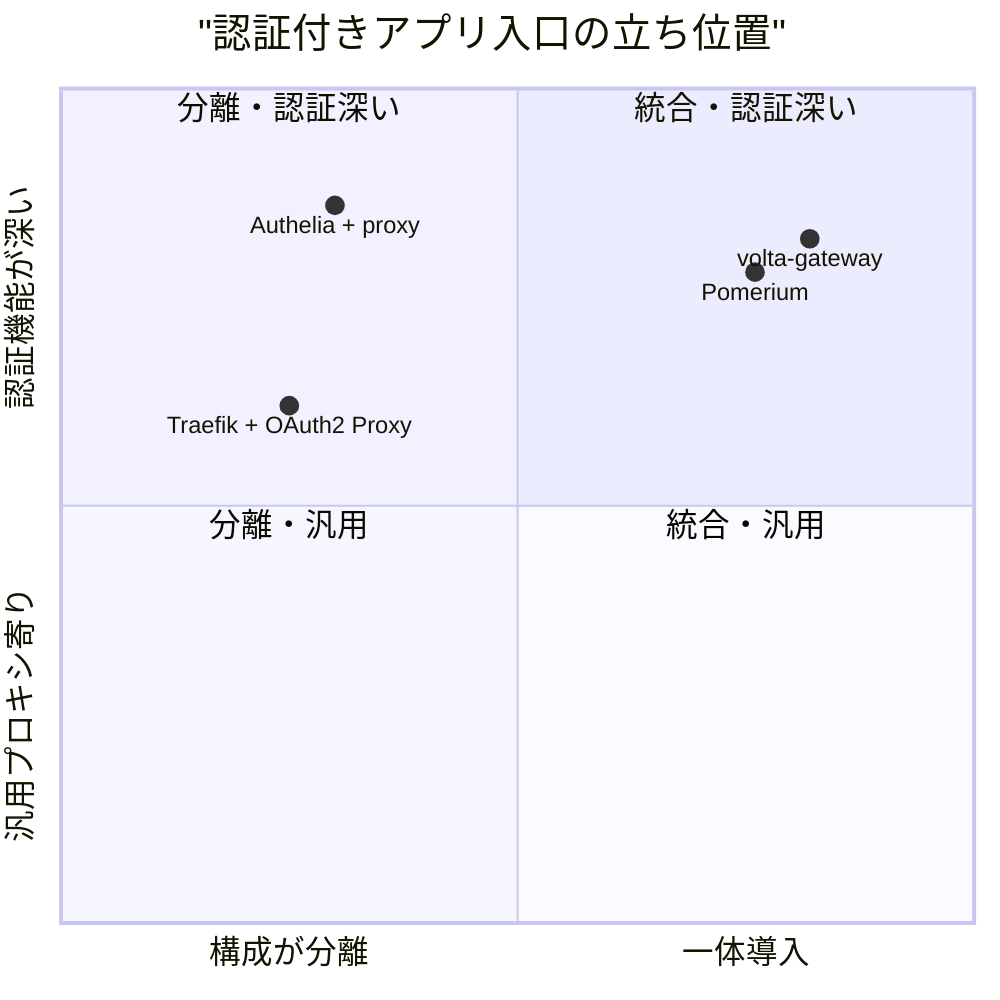
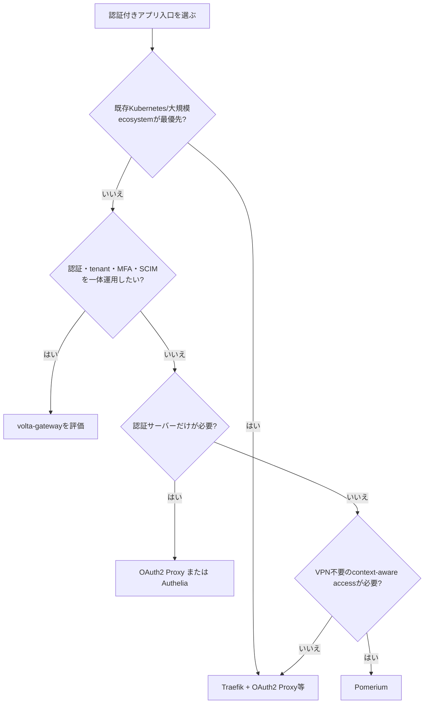

# volta-gateway 市場調査

## 0. 要約

立ち位置: 認証・ルーティング・運用 API を一つの Rust 構成にまとめる、小〜中規模 SaaS 向けの統合型基盤である。
最大の弱点: Traefik/OAuth2 Proxy/Authelia に比べて採用実績、ライセンス明示、リリース物、SAML の本番確度が弱い。
次の一手: 「5〜20サービスを単一YAMLで安全に運用する」導入体験と、SAMLを含む本番証拠を先に製品化する。

## 1. このrepoは何か

`volta-gateway` は HTTP/1.1・HTTP/2、TLS/ACME、ルーティング、ロードバランシング、WebSocket/L4転送、レート制限、キャッシュ、設定のホットリロード、管理API、Prometheusメトリクスを持つ認証付きリバースプロキシである。認証判定は `volta-auth-server`（Axum、OIDC/SAML/MFA/Passkey/SCIM等）または既存の Java `volta-auth-proxy` と組み合わせる。`volta-bin` では gateway と auth core を同一バイナリに組み込める。

従って比較単位は gateway crate 単体ではなく、「認証付きアプリ入口を、認証・転送・運用まで含めて構築する構成全体」とした。Traefik単体のような汎用プロキシだけを相手にせず、Traefik＋ForwardAuth、OAuth2 Proxy、Pomerium、Autheliaを比較する。

実装で確認した到達点は、Rustソース 33,283 LOC、Rustソースファイル142、テストファイル18、auth-server約96エンドポイント、workspace直下のHEAD `1c79310` である。`cargo test --workspace --all-targets` は142 pass / 2 fail（JWKSのHTTPテストがsandboxの `Operation not permitted`）で完走した。なお、リポジトリ直下にライセンスファイルは見当たらず、公開ライセンスは分からない。

READMEは「small-to-medium SaaS」「5〜20 services」「小規模では認証チェックが速い」と位置付ける。コードと設計文書からも、YAML + Docker labels + HTTP polling の設定源、auth-server、管理API、単一バイナリという統合志向は確認できる。[README](https://github.com/opaopa6969/volta-gateway/blob/1c79310d35997632f695ba4da17de535cdcb151e/README.md)、[architecture](https://github.com/opaopa6969/volta-gateway/blob/1c79310d35997632f695ba4da17de535cdcb151e/docs/architecture.md)

この表から、機能不足よりも「一つの導入物として信頼できるか」が現在のボトルネックだと読める。96ルートは広いが、利用者が最初に買うのは機能数ではなく、壊れにくい認証入口と更新可能な配布物である。

## 1.5 調査の型

`hybrid` とした。RustのOSSコード（gateway/auth-core/auth-server/volta-bin）と、Java sidecarとの互換構成の両方が価値を作るためである。比較軸は、認証付きプロキシとしての機能、統合時の構成数、設定・運用、認証方式、採用の安心材料、ライセンスである。性能の「5〜10倍速い」というREADME記載は、今回独立ベンチマークを再実行していないため比較表の事実として採用しない。

## 2. 比較対象と選定理由

| 製品 | 何ができるか | 採用状況（2026-07-31参照） | ライセンス | うちとの決定的な違い | なぜ比較対象に選んだか |
|---|---|---|---|---|---|
| Traefik | リバースプロキシ、LB、TLS、各種provider、ForwardAuth | ★63.3k / 最新 v3.7.1（2026-05-11） | MIT | 汎用プロキシとエコシステムが強い。認証基盤は外部連携が基本 | README自身が大規模用途の推奨先として挙げ、実際の置換候補だから |
| OAuth2 Proxy | OAuth/OIDC認証、セッション、認証専用プロキシ/ForwardAuth | ★14.4k / 最新 v7.15.2（2026-04-14） | MIT | 認証に集中。ルーティング、LB、ACME、管理APIは外部プロキシに任せる | `Traefik + OAuth2 Proxy` の認証部分を丸ごと比較できるため |
| Pomerium | identity/context-aware access proxy、VPN不要のアプリアクセス | ★4.8k / 最新 v0.32.7（2026-05-07） | Apache-2.0 | 認証と認可を統合し、ゼロトラスト寄り。管理面・Kubernetes寄り | 認証付き入口を一製品でまとめる直接の代替候補だから |
| Authelia | SSO/MFAポータル、ForwardAuth、OIDC、細粒度アクセス規則 | star数はGitHub画面で取得不能 / 更新継続中、最新リリース日は今回確認不能 | Apache-2.0 | 認証サーバーに集中し、Traefik/Caddy/nginx等と組み合わせる | 認証サーバーを自前で持つ場合の成熟した代替候補だから |

Traefikは明確な標準候補、OAuth2 ProxyとAutheliaは「既存プロキシ＋認証」の分離構成、Pomeriumは統合型の対抗馬という地図になる。つまりvolta-gatewayは機能の空白市場ではなく、成熟した部品を組み合わせる市場に対して「構成数と認証遅延を減らす」理由で入る必要がある。Autheliaのstar数や最新リリース日は取得できなかったため、採用状況の図は作らない。

## 3. ポジショニング

横軸は認証サーバーとプロキシを別製品にする必要、縦軸は認証・MFA・テナント運用までを入口製品が持つ度合いを表す。位置は機能構成の事実からの整理であり、性能や品質の順位ではない。

## 4. 機能比較

| 機能 | 重み | volta-gateway | Traefik + OAuth2 Proxy | Pomerium | Authelia + proxy |
|---|---|---|---|---|---|
| 認証付きreverse proxy | ◎必須 | ○ | ○ | ○ | ○ |
| OIDC / OAuth2 | ◎必須 | ○ | ○ | ○ | ○ |
| SAML | ◎必須（企業SaaS） | △ Rustは本番Java sidecar推奨 | △ 外部認証製品次第 | △ 構成/版次第 | ×/要外部IdP構成（今回確認範囲） |
| MFA / Passkey | ◎必須 | ○ | △ 外部IdP/認証製品次第 | ○ | ○ |
| SCIM / tenant / billing / GDPR API | ○効く | ○ | × | △ | × |
| LB / health check / circuit breaker | ◎必須 | ○ | ○ | △ | × |
| ACME/TLS自動化 | ○効く | ○ | × | △ | × |
| Docker labels等の設定source | ○効く | ○ | ○ | △ | × |
| hot reload / 管理API / drain | ○効く | ○ | △ | ○ | △ |
| WebSocket / L4 proxy | ○効く | ○ | △ | ○ | × |
| Kubernetes ecosystem | △あれば | △ | ○ | ○ | △ |
| 大規模コミュニティ | ○効く | × | ○ | △ | △ |

Traefik＋OAuth2 Proxyは、標準的な分離構成として汎用性と採用安心感が強い。一方で、SAML・テナント・SCIM・請求・GDPRを同じ製品境界で扱う必要があるなら、voltaの認証API面は明確な差になる。逆に、Kubernetes連携や長期の外部レビューが最優先なら、voltaの○の多さは採用上の弱点を打ち消さない。

## 4.5 コード・実装の比較

| 観点 | volta-gateway | OAuth2 Proxy | 出典 |
|---|---:|---:|---|
| 実装言語 | Rust | Go | 各リポジトリ |
| Rust/Goソース規模 | Rust 33,283 LOC（自repo実測） | 今回は未集計 | `find … \| wc -l`、[repo](https://github.com/oauth2-proxy/oauth2-proxy) |
| テストファイル | 18（自repo実測） | `*_test.go` を含む、件数は今回未集計 | 自repo、[tree](https://github.com/oauth2-proxy/oauth2-proxy) |
| 直接依存宣言 | 135（4 Cargo.tomlの行数集計、重複含む） | `go.mod`に多数、件数は今回未集計 | 自repo、[go.mod](https://github.com/oauth2-proxy/oauth2-proxy/blob/master/go.mod) |
| 認証API面 | 約96 route | `/auth`、`/userinfo`、login/callback等を実装 | [auth-server parity](https://github.com/opaopa6969/volta-gateway/blob/1c79310d35997632f695ba4da17de535cdcb151e/docs/parity.md)、[oauthproxy.go](https://raw.githubusercontent.com/oauth2-proxy/oauth2-proxy/master/oauthproxy.go) |
| 配布物 | リリース物は今回確認不能 | GitHub binaries / container | [OAuth2 Proxy README](https://github.com/oauth2-proxy/oauth2-proxy#releases) |

実装を読むと、OAuth2 Proxyは認証フロー、セッション、ヘッダー注入、upstreamを一つのHTTP handler chainに集約している。voltaはgatewayとauth-serverを分割しつつ、Rustの状態機械・設定source・運用APIまで抱えるため、初期導入の価値と引き換えにコード面積と責任範囲が大きい。比較対象の全コードを同じ条件でLOC・テスト・配布サイズまで集計するところまでは到達していないので、これらの数値で優劣は主張しない。

## 5.5 調査者の見立て

本当の勝負所は、96機能の網羅ではなく「認証とプロキシを一つの設定・一つの運用面で安全に更新できる」ことだと思う。Traefikのエコシステムには勝ちにくいため、単純なLB機能の比較ではなく、SaaSのテナント・MFA・Passkey・SCIM・監査を入口運用まで繋ぐことが差になる。

数字に出ていない懸念は、公開ライセンスが確認できないこと、Rust SAMLをなおJava sidecar推奨としていること、リリース済みバイナリや外部採用の証拠が薄いことである。これは機能表の○より大きな採用障壁になりうる。

私なら、まず配布・ライセンス・アップグレード手順を製品の一部として固め、次に5〜20サービスの実運用ケースを再現可能なベンチマークとE2E証拠にする。新機能を増やすより、選定理由を検証可能にする方が先である。

この見立てが外れる条件は、顧客がすでにTraefik等を標準化しており、統合よりも既存ecosystemのprovider/Kubernetes互換を必須にする場合である。その場合、voltaの統合優位は構成削減ではなく移行コストに負ける。

## 6. 提案（優先順）

| 順 | 提案 | 分類 | 根拠 | 最小の一手 | 効きそうな指標 |
|---:|---|---|---|---|---|
| 1 | 公開ライセンス、署名付きrelease、Docker/単一バイナリ、upgrade/rollback手順を整える | 埋める | 競合はMIT/Apache-2.0と公式releaseを明示。自repoはLICENSEと配布証拠を確認できない | 適切なLICENSEを選び、CIでLinux binary/containerを公開する | 初回起動から保護までの時間、再現可能なupgrade率 |
| 2 | 「5〜20サービス」のgolden pathを作る | 伸ばす | READMEの想定市場と、YAML・auth-server・admin APIの統合が一致 | OIDC+Passkey+LB+hot reload+drainを含むcompose/E2Eを1本固定する | 5サービス構成の設定行数、E2E成功率、auth p95 |
| 3 | SAMLをRust本番で使える証拠にするか、Java sidecar併用を正式な製品構成として文書化する | 埋める | parity docsがRust SAMLを⚠️、productionはJava推奨としている | 署名検証・logout・異常系のE2Eと、推奨トポロジーの運用runbookを公開する | SAML E2E pass率、sidecar構成の導入時間 |
| 4 | Traefik provider/ForwardAuth互換の移行資料を強化する | 伸ばす | Traefikの採用状況が大きく、READMEにも移行先として登場する | `traefik-to-volta`の変換対象・非対応・rollbackを表にする | 変換成功率、手修正行数、移行完了時間 |
| 5 | Traefikと同じKubernetes ecosystem全体を再実装することは当面やらない | やらない | 差別化が薄まり、既にTraefikのprovider/コミュニティ優位が大きい | 対応範囲をDocker/single-host/small SaaSに明記する | サポート対象外問い合わせ数、リリース周期 |

優先順位は、機能追加より採用リスクを下げる順に置いた。とくに1〜3がないまま機能を増やすと、voltaの強みが「大きいが任せにくい自作基盤」に見える。5は、汎用プロキシ市場でTraefikに勝とうとせず、認証統合の境界を守るための明確な不採用方針である。

## 7. 選択の分岐

## 8. 出典

| URL | 参照日 | 何の根拠に使ったか |
|---|---|---|
| https://github.com/opaopa6969/volta-gateway/blob/1c79310d35997632f695ba4da17de535cdcb151e/README.md | 2026-07-31 | 自repoの対象市場、機能、想定規模、Traefikとの使い分け |
| https://github.com/opaopa6969/volta-gateway/blob/1c79310d35997632f695ba4da17de535cdcb151e/docs/architecture.md | 2026-07-31 | workspace構成、約96 routes、設定source、state machine、plugin |
| https://github.com/opaopa6969/volta-gateway/blob/1c79310d35997632f695ba4da17de535cdcb151e/docs/parity.md | 2026-07-31 | Rust/Java parity、SAMLの注意、認証API分類 |
| https://github.com/traefik/traefik | 2026-07-31 | ★63.3k、MIT、最新v3.7.1（2026-05-11）、汎用proxy/ecosystem |
| https://doc.traefik.io/traefik/v2.10/middlewares/http/forwardauth/ | 2026-07-31 | ForwardAuthの認証連携仕様 |
| https://github.com/oauth2-proxy/oauth2-proxy | 2026-07-31 | ★14.4k、MIT、最新v7.15.2（2026-04-14）、認証proxyの機能 |
| https://github.com/oauth2-proxy/oauth2-proxy/releases/tag/v7.15.2 | 2026-07-31 | release日、セキュリティ修正の記録 |
| https://raw.githubusercontent.com/oauth2-proxy/oauth2-proxy/master/oauthproxy.go | 2026-07-31 | 実コード確認。route、session chain、provider、header injection、upstreamの構造 |
| https://github.com/pomerium/pomerium | 2026-07-31 | ★4.8k、Apache-2.0、最新v0.32.7（2026-05-07）、identity/context-aware proxy |
| https://github.com/authelia/authelia | 2026-07-31 | Apache-2.0、SSO/MFA/OIDC、ForwardAuth、対応proxy、star/releaseは取得不能 |
| https://github.com/opaopa6969/volta-gateway/tree/1c79310d35997632f695ba4da17de535cdcb151e/gateway | 2026-07-31 | 自repoコードの実測対象（Rust source、tests、Cargo dependencies） |
