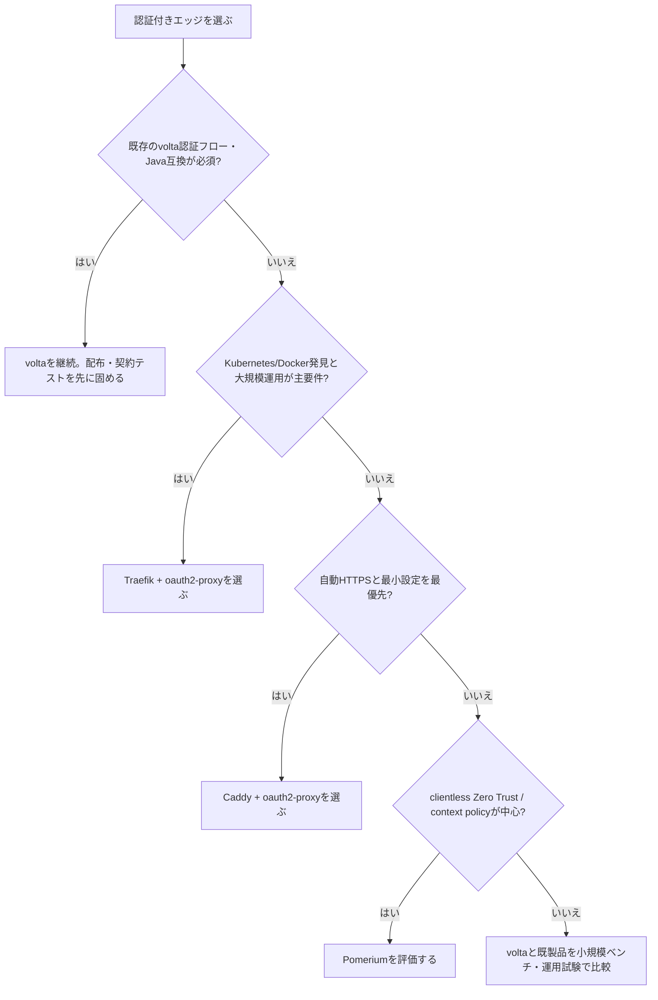

# 0. 要約

立ち位置: `volta-gateway` は、5〜20サービス規模のSaaSに、認証・プロキシ・認証フローを一つのRustワークスペース／構成で提供する自作基盤である。

最大の弱点: 既製品が持つKubernetes/Docker連携、公開運用実績、リリース・ライセンス・サポートの信頼資産が不足している。

次の一手: 新機能を増やす前に、認証境界の回帰テスト、再現可能な性能比較、配布・ライセンス・運用手順を製品として固める。

# 1. このrepoは何か

## 一言

認証チェックを組み込んだHTTP/TCP/UDPリバースプロキシと、Java `volta-auth-proxy` 互換を目指す認証サーバーを同じRust workspaceで運用する基盤である。

## 提供価値

利用時の単位はrepo単体ではない。典型的には、クライアント → `volta-gateway` → `volta-auth-server`（またはJava sidecar）→ バックエンド、という構成で、ルーティング・認証・ロードバランシング・可観測性を一つの構成管理にまとめる。`volta-bin` では認証コアを同一プロセスに組み込み、認証のHTTP往復を無くせる。[README](https://github.com/opaopa6969/volta-gateway/blob/1c79310d35997632f695ba4da17de535cdcb151e/README.md) と [getting started](https://github.com/opaopa6969/volta-gateway/blob/1c79310d35997632f695ba4da17de535cdcb151e/docs/getting-started.md) による。

## 想定利用者

READMEが明示する対象は、5〜20サービス程度で認証レイテンシーを重視する小〜中規模SaaSである。50以上のサービス、Kubernetes、Canary運用ではTraefik＋Java sidecarを推奨しており、巨大な汎用エッジ製品を正面から置き換える設計ではない。[README](https://github.com/opaopa6969/volta-gateway/blob/1c79310d35997632f695ba4da17de535cdcb151e/README.md) による。

## 到達点の客観指標

調査時点のHEADは `1c79310`。workspaceは5 crate、認証APIはREADMEとparity表で約96 route、Rustソースは約33,005行、テスト属性は462件、公開タグはv0.3.0である。gatewayの既存E2Eベンチでは、同一条件として記録されたTraefik + ForwardAuth比でp50 0.252ms対1.673ms、6.6倍と報告されている。ただし単一接続・Docker上のTraefik・mock authという条件なので、市場全体の性能優位とは扱わない。[ベンチ結果](https://github.com/opaopa6969/volta-gateway/blob/1c79310d35997632f695ba4da17de535cdcb151e/gateway/benches/e2e_results.md) による。

また、rootに一般的なLICENSEファイルは確認できず、`dge/LICENSE`のみが存在する。配布可能なOSS製品としてのライセンスは、調査時点では分からない。

# 1.5 調査の型

`internal` と判定する。公開OSSとの機能競争を目的にしたサービスではなく、現在の利用文脈では自社SaaSの認証・エッジ基盤を自作しているからである。したがって問いは「Traefikに機能数で勝てるか」ではなく、「この認証・運用要件を満たす既製品の組み合わせに置き換えられるか」である。

比較軸は、既製品にあって自repoにない機能の数ではなく、(1)自repo固有の認証フローと認証境界、(2)小規模SaaSでの導入・レイテンシー、(3)運用・配布・エコシステムの負担、の三つに置く。

# 2. 比較対象と選定理由

| 製品 | 何ができるか | 採用状況 | ライセンス | うちとの決定的な違い | なぜ比較対象に選んだか |
|---|---|---|---|---|---|
| Pomerium | identity/context-aware reverse proxy。VPNなしのclientless accessを提供 | GitHub ★4.8k / 最新v0.32.7 2026-05-07 | Apache-2.0 | 認証コンテキストとアクセスプロキシが主製品。独自のユーザー・認証フローを持つvoltaとは責務の境界が違う | 認証付きアクセスを単体製品で置き換える最も近い候補 |
| Traefik + oauth2-proxy | Traefikがプロキシ/LB/設定プロバイダ、oauth2-proxyがOIDC等の認証ゲート | Traefik ★64.2k / v3.7.1 2026-05-11、oauth2-proxy ★14.4k / v7.15.2 2026-04-14 | MIT / MIT | 二つのプロセスとForwardAuth連携。Kubernetes/Dockerの運用面が強く、voltaの一体型・低遅延とはトレードオフ | README自身が大規模運用の推奨構成として挙げる、最重要の置換候補 |
| Caddy + oauth2-proxy | Caddyが自動HTTPS付きWebサーバー/リバースプロキシ、oauth2-proxyが認証を担当 | Caddy ★74.5k / v2.11.3 2026-05-12、oauth2-proxy ★14.4k / v7.15.2 2026-04-14 | Apache-2.0 / MIT | Caddyは簡潔な設定と自動HTTPSが強いが、volta固有のJava互換認証API、tenant、MFA、passkeyは別途必要 | 小規模導入で「最小構成」を選ぶ場合の現実的な代替 |

比較地図は、単体の認証製品対単体のプロキシではない。`Pomerium`は一体型、`Traefik + oauth2-proxy`と`Caddy + oauth2-proxy`は組み合わせ型であり、voltaもgateway・auth-server・auth-coreを合わせて初めて価値を出す。このため、プロキシの機能数だけでvoltaを評価するのは誤りである。

採用状況は大きく既製品側に偏る。特にTraefik、Caddy、oauth2-proxyは長期運用と配布の信頼資産が大きい。一方、voltaの差はstar数でなく、既存Java APIとの互換、認証フローを含む単一コードベース、同一プロセス検証にあると読める。

# 4. 機能比較

| 機能 | 重み | うち | Pomerium | Traefik + oauth2-proxy | Caddy + oauth2-proxy |
|---|---|---|---|---|---|
| 認証付きリバースプロキシ | ◎必須 | ○ | ○ | ○ | ○ |
| OIDC/SAML/MFA/passkeyを含む認証フローを同一製品で持つ | ◎必須 | ○ | △ | △ | △ |
| Java `volta-auth-proxy`とのroute互換 | ◎必須 | ○ | × | × | × |
| 小〜中規模SaaS向けの単一YAML導入 | ◎必須 | ○ | △ | △ | ○ |
| 認証・転送を一つのプロセス／workspaceに統合 | ○効く | ○ | △ | × | × |
| Kubernetes/Docker/サービスディスカバリ | ○効く | △ | △ | ○ | △ |
| ロードバランシング、canary、health check | ○効く | ○ | △ | ○ | ○ |
| WebSocket / L4 TCP・UDP | ○効く | ○ | △ | ○ | △ |
| 設定ソース、hot reload、管理API | ○効く | ○ | △ | ○ | ○ |
| state machineによる遷移単位の可観測性 | ○効く | ○ | × | × | × |
| エコシステム、公開運用実績、商用サポート | ◎必須 | × | △ | ○ | △ |
| 配布ライセンスが明確 | ◎必須 | × | ○ | ○ | ○ |

この表で痛い×は、機能不足そのものより、ライセンスと運用実績の不明確さである。認証フローやJava互換はvoltaにしかないため、既存SaaSを移行する場合は単純な×ではなく置換コストを下げる資産になる。

反対に、TLS、LB、WebSocket、管理APIの○は、差別化としては弱い。TraefikやCaddyにも成熟した実装があり、そこに開発投資しても選択理由を大きく変えにくい。勝負所は「認証ドメインを含む既存システムをどれだけ安全に一体移行できるか」と「その運用を証明できるか」である。

# 5.5 調査者の見立て

本当の勝負所は、Rustで速いプロキシを作ることではなく、認証フロー・Java互換・gatewayのポリシーを一つの変更単位として安全に出荷できることだと思う。ベンチは魅力的だが、比較条件が限定的なので、それ単独では採用理由にならない。

数字に出ていない懸念は、rootライセンス不在、公開リリースの薄さ、READMEと実装の状態図のずれである。HEADのIP拒否403修正後もREADMEには旧来の400既知問題が残っており、運用者が正しい安全性を判断しにくい。

自分なら、認証固有要件がある既存SaaSでは自作を続けるが、境界を「認証製品」と「汎用エッジ」に分ける。前者に投資し、後者はTraefik/Caddyへ委譲できる移行経路を維持する。

この見立てが外れる条件は、実際の利用規模が50サービス以上へ急拡大するか、Kubernetes/Dockerの動的発見が主要要件になる場合である。その時点では、volta固有認証を残してもgateway自体を既製品へ寄せる方が総保守費で有利になる可能性が高い（推測）。

# 6. 提案（優先順）

| 順 | 提案 | 分類 | 根拠 | 最小の一手 | 効きそうな指標 |
|---|---|---|---|---|---|
| 1 | 配布契約を確定する。root LICENSE、対応バージョン、Dockerイメージ、設定・DB migration・upgrade手順を揃える | 埋める | 4節の「配布ライセンスが明確」が×。既製品との差は機能より採用リスクになる | LICENSEを決定し、最小構成のrelease artifactとupgrade手順をCIで生成 | 初回導入成功率、upgrade失敗率、license確認に要する時間 |
| 2 | 認証境界の契約テストを優先する。403/302/502/504、fail-closed、state diagramと実装の一致をroute単位で検証する | 伸ばす | 認証・状態遷移が固有の差別化。READMEには実装との不一致が残る | 現HEADのIP拒否403を含む回帰テストと、図から生成した期待ステータス表を追加 | 認証境界の回帰件数、主要routeの契約テスト網羅率 |
| 3 | 公平な性能比較を公開する。native Traefik + localhost ForwardAuth、同じauth処理、複数接続・p99で測る | 伸ばす | 現ベンチは有望だがsingle connection/mock/Docker条件で、広い主張には不足 | benchmark containerと設定を固定し、volta・Traefik・Caddyの同一シナリオをCIまたは再実行可能な手順にする | p50/p99、auth処理込みのRPS、再実行時の分散 |
| 4 | Traefik/Caddyからの段階移行を主導線にする。既存converterを入口に、authだけvoltaへ寄せられる構成を文書化する | 伸ばす | 既存の`traefik-to-volta`とREADMEの大規模運用方針が示す現実的な導入経路 | 代表的なDocker labels/ForwardAuth構成を変換するmigration cookbookを一つ作る | 移行時間、変換できる設定割合、rollback時間 |
| 5 | Kubernetes向け機能を自前で全面実装しない | やらない | Traefikのprovider/ecosystemと競争すると差別化が薄まり、対象規模の前提にも反する | 「50+ services/KubernetesはTraefik＋volta auth」のsupported topologyを明記 | 自前Kubernetesコード量、運用障害件数、移行成功率 |

優先順位は、まず採用を止める不確実性（ライセンス・アップグレード）を除き、次にvolta固有の認証安全性を証明し、その後に性能を比較可能にする順である。新しい認証方式をさらに足すより、既存の約96 routeを安全に配布・移行できることの方が、internal基盤としての自作継続判断に効く。

# 7. 選択の分岐

この分岐でvoltaを選ばない条件を明記することが重要である。汎用エッジの要件だけなら、既製品のエコシステムを再実装する理由は薄い。voltaを選ぶ根拠は、認証ドメインと既存互換が要件の中心にある場合に限る。

# 8. 出典

| URL | 参照日 | 何の根拠に使ったか |
|---|---|---|
| https://github.com/opaopa6969/volta-gateway/blob/1c79310d35997632f695ba4da17de535cdcb151e/README.md | 2026-07-31 | repoの目的、対象規模、機能、96 route、Traefikとの使い分け、既知の状態不一致 |
| https://github.com/opaopa6969/volta-gateway/blob/1c79310d35997632f695ba4da17de535cdcb151e/docs/architecture.md | 2026-07-31 | workspace構成、state machine、プロセッサ、認証と転送の構造 |
| https://github.com/opaopa6969/volta-gateway/blob/1c79310d35997632f695ba4da17de535cdcb151e/docs/parity.md | 2026-07-31 | Rust/Javaのroute互換表 |
| https://github.com/opaopa6969/volta-gateway/blob/1c79310d35997632f695ba4da17de535cdcb151e/gateway/benches/e2e_results.md | 2026-07-31 | voltaとTraefik + ForwardAuthの既存ベンチ条件・数値・限界 |
| https://github.com/opaopa6969/volta-gateway/blob/1c79310d35997632f695ba4da17de535cdcb151e/Cargo.toml | 2026-07-31 | 5 crate workspace |
| https://github.com/opaopa6969/volta-gateway/tree/1c79310d35997632f695ba4da17de535cdcb151e | 2026-07-31 | root LICENSE不在、配布状態の確認 |
| https://github.com/pomerium/pomerium | 2026-07-31 | identity-aware reverse proxy、Apache-2.0、約4.8k stars、v0.32.7 (2026-05-07) |
| https://github.com/traefik/traefik | 2026-07-31 | cloud-native proxy、supported backends、MIT、約64.2k stars、v3.7.1 (2026-05-11) |
| https://github.com/traefik/traefik/releases/tag/v3.7.1 | 2026-07-31 | Traefikの最新リリース日とバージョン |
| https://github.com/oauth2-proxy/oauth2-proxy | 2026-07-31 | OIDC等の認証リバースプロキシ、MIT、約14.4k stars、v7.15.2 (2026-04-14) |
| https://github.com/oauth2-proxy/oauth2-proxy/releases/tag/v7.15.2 | 2026-07-31 | oauth2-proxyの最新リリース日とバージョン |
| https://github.com/caddyserver/caddy | 2026-07-31 | 自動HTTPS付きWebサーバー/リバースプロキシ、Apache-2.0、約74.5k stars |
| https://github.com/caddyserver/caddy/releases/tag/v2.11.3 | 2026-07-31 | Caddyの最新リリース日とバージョン (2026-05-12) |

