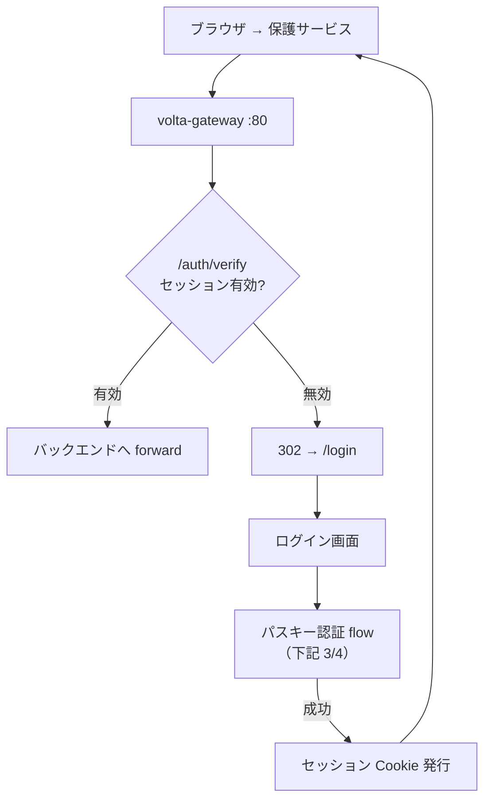
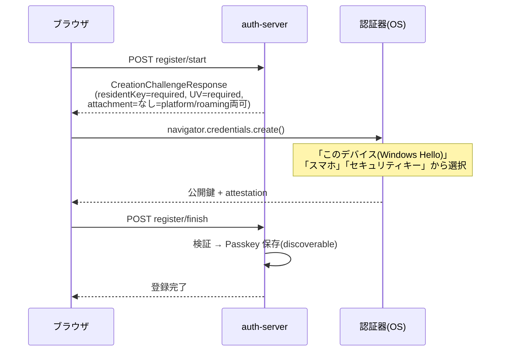
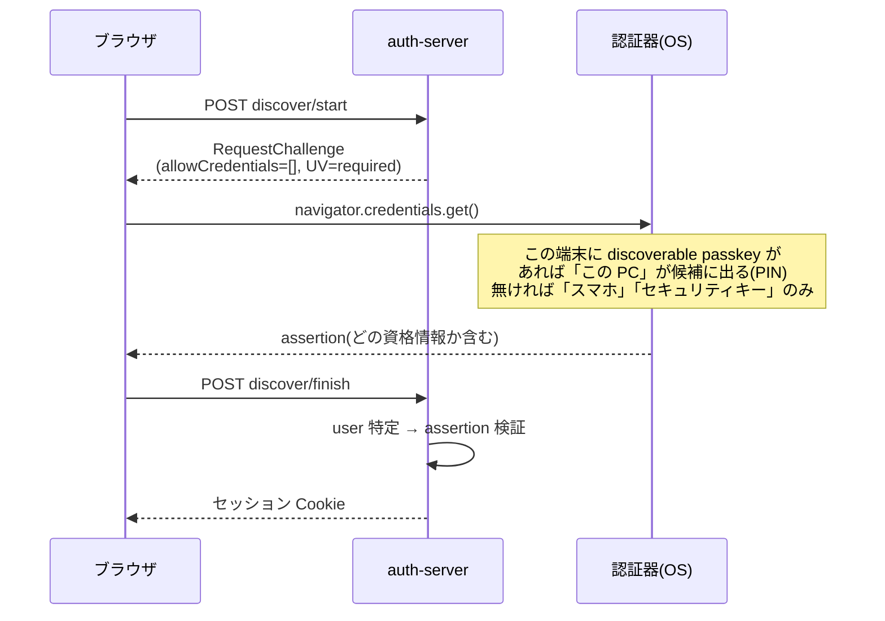
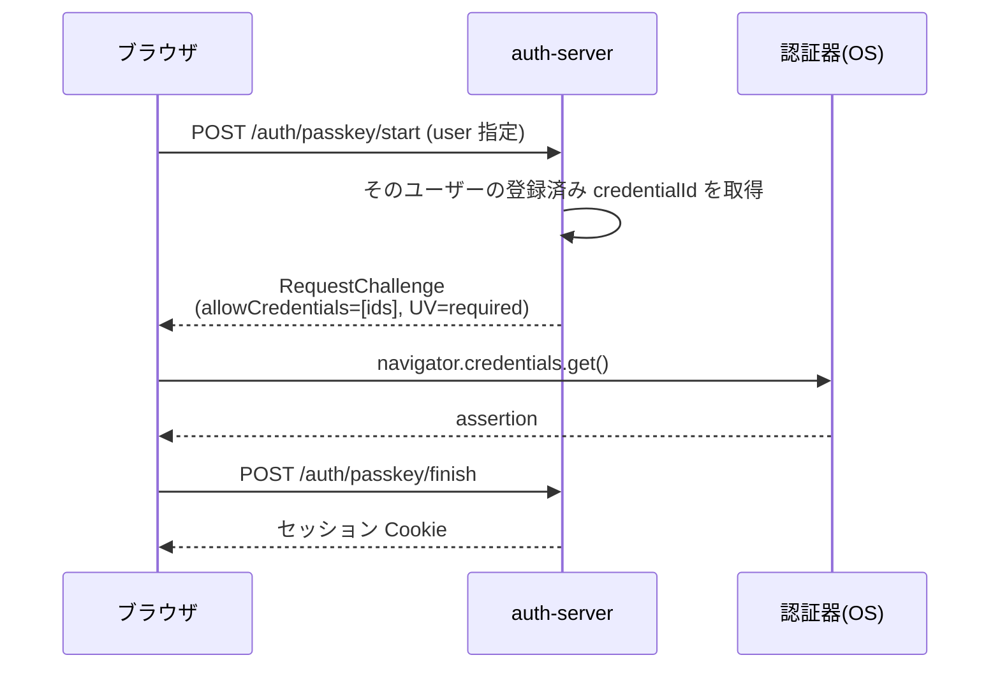
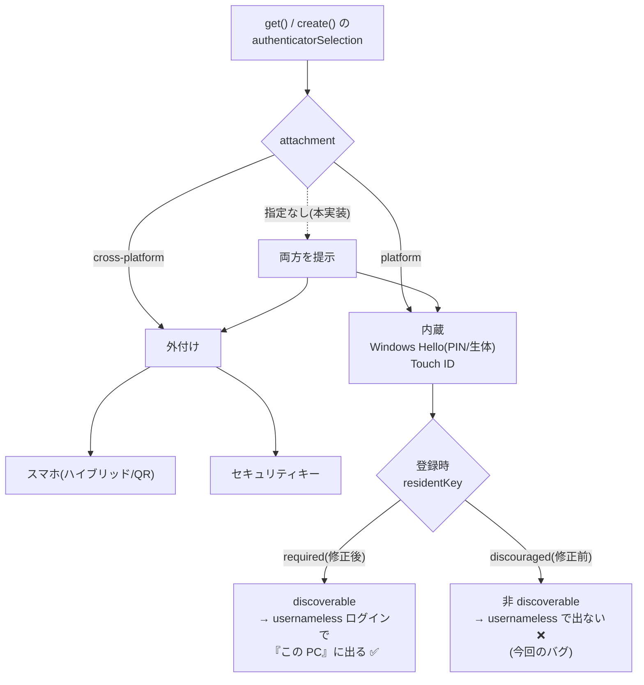

# Passkey フロー図（登録・ログイン・分岐）

auth-server (`auth-server/src/handlers/passkey_flow.rs`) と gateway の ForwardAuth を mermaid で図式化。
ルート定義は `auth-server/src/app.rs`。

> **関連:** UX 設計・原理・Google風設計との比較は [`passkey-ux-design.md`](./passkey-ux-design.md)。
> sign-counter のクローン検知（`signCount=0` は非対応として受理）や `/viz` フロー図の実態反映拡張は同書 / CHANGELOG 参照。

## 1. 全体像：gateway ForwardAuth とログイン state

これが既存の「ログイン state」。gateway は tramli ステートマシンで毎リクエストの認証可否だけを判定する。

## 2. パスキー登録（ログイン済みユーザーが追加）

`POST /api/v1/users/{userId}/passkeys/register/start` → `…/register/finish`

**今回の修正点**: `residentKey: required` を強制 → Windows Hello が **discoverable な passkey** を作るので、後述の usernameless ログインに「この PC」が出る。

## 3. ログイン：discoverable（ユーザー名なし＝「パスキーでログイン」）

`POST /auth/passkey/discover/start`（`allowCredentials=[]`） → `…/discover/finish`

## 4. ログイン：ユーザー名先行（allowCredentials 指定）

`POST /auth/passkey/start` → `…/finish`

## 5. 認証器の種類と分岐（なぜ「この PC/PIN」が出る/出ない）

## 補足：実装の所在（重要）

- 上記フローの**ロジック**は Rust の `auth-server` / `auth-core`（本リポジトリ）。`residentKey=required` 修正もここ。
- ただし **現在 auth.unlaxer.org の本番で稼働している auth backend は Java 版 `volta-auth-proxy`**（`192.168.1.8:7070`）。Rust 版 auth-server は未稼働。
- したがって本番にこの修正を効かせるには「Java 版にも同じ residentKey=required を入れる」か「Rust 版へ移行」のいずれかが必要（`docs/passkey-resident-key.md` 参照）。

## tramli での図示について

tramli (`tramli::MermaidGenerator`) は `FlowDefinition` から `stateDiagram-v2` を自動生成できる。gateway は **per-request の認証可否 SM**（図1の verify→forward/redirect）に tramli を使っており、これが既存の「ログイン state グラフィカル表示」。

パスキーの**多段セレモニー**（図2〜4）は gateway の per-request SM とは別物（auth-server 側の状態遷移）。よって既存 SM に混ぜず、auth-server に独立した `FlowDefinition`（例: `Idle → ChallengeIssued → AwaitingClient → Verifying → Authenticated/Failed`、register/discover/username で分岐）を定義し、同じ `MermaidGenerator` で描くのが筋。既存のログイン state 画面からは「未認証 →/login」エッジでこの新 SM へリンクする形が自然。
