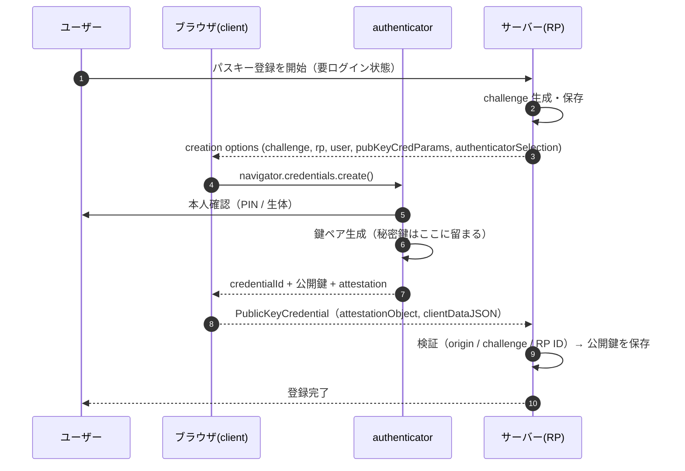
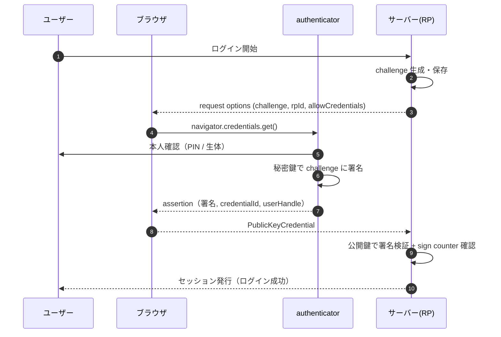
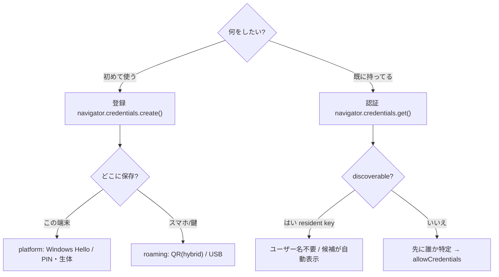
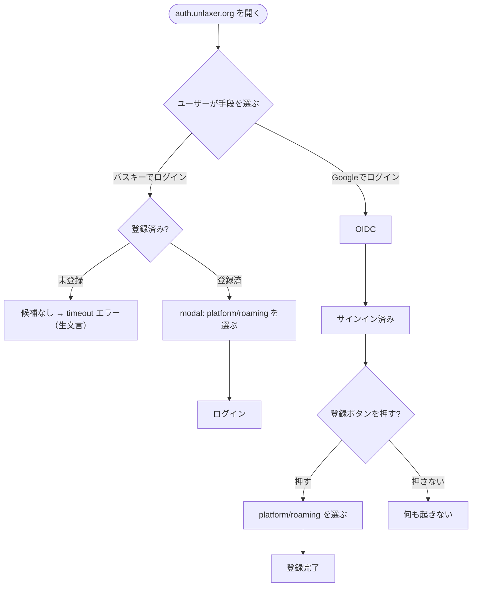
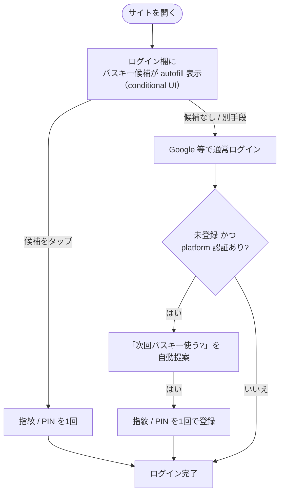
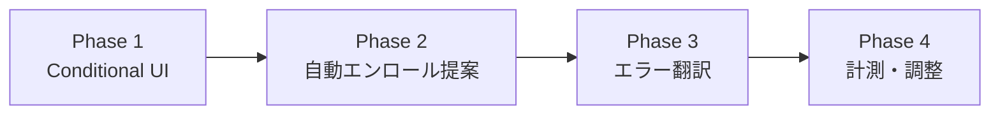

# パスキー設計 — 原理・現状の弱さ・あるべき姿

> 勉強会資料。WebAuthn/パスキーの**原理**、volta-auth-server の**現状設計とその弱さ**、
> Google/Apple が実践する**「複雑さを隠す」設計**との違いを、実際に踏んだバグを題材に整理する。
> 関連: [`passkey-flows.md`](./passkey-flows.md)（フロー定義）, [`passkey-resident-key.md`](./passkey-resident-key.md)（resident key）。

---

## 0. 問題提起 — なぜ「難しい」と感じたか

cutover 後の実機テストで、こういう詰まり方をした:

| 事象 | ユーザーの体感 | 実際の原因 |
|---|---|---|
| 「パスキーでログイン」を押したら失敗 | 壊れてる? | **まだ1個も登録していない**。ログインは「登録済みキー」を探すので、無ければ当然失敗 |
| PIN が出ず「モバイル/セキュリティキー」だけ | このPCで使えない? | ログイン側だったため。**platform 認証(Windows Hello/PIN)は登録時に出る** |
| QR をスマホで読んでも「キー無し」 | 意味不明 | スマホにもそのサイトのパスキーが無いから |
| `The operation either timed out or was not allowed` | ??? | キャンセル/タイムアウト/該当なし/ポリシー拒否を**全部同じ1文**で返す WebAuthn の仕様 |

**結論を先に**: この混乱はユーザーのせいではなく、**パスキーという仕組みが本質的に分岐が多く、かつ現状UIがその分岐をユーザーに丸投げしている**ことが原因。
正しい設計は「分岐をユーザーに見せない」こと。以下、原理から順に。

---

## 1. 原理 — WebAuthn の基礎

### 登場人物

| 役割 | 実体 |
|---|---|
| **ユーザー** | 人間 |
| **client** | ブラウザ（`navigator.credentials` API） |
| **authenticator** | 鍵を作り保持するもの。Windows Hello / Touch ID / Android / USBセキュリティキー / スマホ |
| **RP (Relying Party)** | 認証を求めるサーバー = volta-auth-server（RP ID = `auth.unlaxer.org`） |

### 核心は「公開鍵暗号 × challenge-response」

- **登録時**: authenticator が**鍵ペアを生成**。**秘密鍵は authenticator から出ない**。公開鍵だけをサーバーが保存する。
- **認証時**: サーバーが毎回ランダムな `challenge` を出し、authenticator が秘密鍵で署名。サーバーは保存済み公開鍵で検証。
- パスワードと違い、**サーバー側に秘密が無い**（流出しても署名を偽造できない）。フィッシング耐性も高い（origin/RP ID が署名対象に含まれる）。

### 登録 (attestation) セレモニー

### 認証 (assertion) セレモニー

---

## 2. 分岐の正体 — なぜ「多岐」に見えるか

パスキーには**直交する4つの軸**がある。掛け算で状態爆発するので「複雑」に見える。

| 軸 | 選択肢 | 何が変わるか |
|---|---|---|
| **目的** | 登録 (create) / 認証 (get) | API も前提も全く別。**取り違えると今日のように失敗** |
| **置き場所** | platform（端末内: Windows Hello/Touch ID） / roaming（スマホ hybrid・QR / USBキー） | ダイアログの選択肢・PIN の有無が変わる |
| **発見可能性** | discoverable（resident key, ユーザー名不要） / non-discoverable（要 allowCredentials） | discoverable なら「このデバイス」候補が出る。非対応だと出ない（[passkey-resident-key.md](./passkey-resident-key.md) で `required` に修正済） |
| **同期** | synced（iCloud / Google Password Manager で複数端末共有） / device-bound（その端末限り） | 機種変・他端末で使えるかが変わる |

**ポイント**: これら4軸は本来 **OS とブラウザが自動で解決できる**もの。ユーザーが意識する必要は無い。

---

## 3. 現状の設計（volta-auth-server）とその弱さ

### 今の作り

- `/login`: **「Google でログイン」** と **「パスキーでログイン」** の2ボタンを並べ、ユーザーに選ばせる。
- パスキーボタン → modal で `navigator.credentials.get()`（discoverable）。
- `/`（サインイン済み）: **「このデバイスにパスキーを登録」** ボタン。
- エラーは WebAuthn の生メッセージをそのまま表示。

### 弱さ（今日の事例と対応）

| 弱点 | 起きたこと | 本質 |
|---|---|---|
| **登録/ログインの選択をユーザーに丸投げ** | 未登録なのに「ログイン」を押して失敗 | 機械が判断できることを人間にやらせている |
| **conditional UI（autofill）が無い** | パスキーが「在るのに見えない」 | 候補を能動的に提示していない |
| **エラーの生出し** | `operation ... not allowed` をそのまま表示 | 4種の失敗が同一文言。次に何をすべきか分からない |
| **登録への動線が受け身** | 「登録ボタン」を自分で見つけて押す必要 | 成功体験への self-service 任せ |
| **（実装バグ）serde 形式の不一致** | 登録は通るがログインで `Bincode does not support deserialize_any` | webauthn-rs 型は自己記述形式(JSON)必須。bincode→serde_json に修正 |

> 実装上の教訓: webauthn-rs の `Passkey` / 登録 state は serde の `deserialize_any` を使う。
> **bincode のような非自己記述フォーマットでは「保存はできるが読み戻せない」**。challenge state も credential も serde_json で永続化すること。

---

## 4. あるべき姿 — Google/Apple 風「複雑さを隠す」設計

### 原則

> **ユーザーに見せていい複雑さは「指紋 / PIN を1回」だけ。残り（登録/認証, platform/roaming, discoverable, 同期）は全部 OS とブラウザに委譲して裏に隠す。**

### 具体的な手法

1. **Conditional UI（autofill）**: ログイン欄に `autocomplete="username webauthn"` を付け、ページ表示時に `navigator.credentials.get({ mediation: 'conditional' })` を裏で起動。**パスキーがあれば autofill 候補として静かに出る**。無ければ何も邪魔しない。「パスキーでログイン」ボタンを探す必要すら無い。
2. **登録は"後出しで自動提案"**: 初回ログイン（OIDC等）成功直後に、`isUserVerifyingPlatformAuthenticatorAvailable()` が true かつ未登録なら **「次回からパスワード無しでログインできます。設定する?」を1回だけ自動表示**。
3. **platform/roaming を選ばせない**: `authenticatorAttachment` を指定せず OS に委譲。「このデバイスに保存」だけ聞く。
4. **エラーを翻訳**: `NotAllowedError`（キャンセル/タイムアウト）→「中断されました。もう一度お試しください」、候補なし →「このデバイスにパスキーがありません。先に登録してください」など、**次の行動を示す**。
5. **常にフォールバック**: パスキーが使えない端末でも Google/OIDC で必ずログインできる。

### 現状 vs あるべき姿

| 観点 | 現状（volta） | Google/Apple 風 |
|---|---|---|
| 登録/ログインの判断 | **ユーザーがボタンで選ぶ** | 機械が判断（autofill / 自動提案） |
| パスキーの提示 | ボタンを押して modal | **autofill に静かに出る** |
| 登録の動線 | 自分で登録ボタンを探す | 初回成功後に自動提案 |
| platform/roaming | （未指定で両方出るが）modal で選ぶ | OS に委譲、意識させない |
| エラー | 生文言 | 翻訳 + 次の行動提示 |
| フォールバック | あり（Google） | あり（必須要件） |
| 体感 | 「分岐が多くて難しい」 | 「指紋かざすだけ」 |

---

## 5. volta-auth-server への適用案（段階的）

現状のバックエンド（`/auth/passkey/discover/*`, `/api/v1/users/{id}/passkeys/register/*`）は**そのまま使える**。変更は主にフロント（`/login` と `/` のHTML/JS）。

> **実装状況**: Phase 1（Conditional UI）・Phase 2（自動エンロール提案）・Phase 3（エラー翻訳）は `handlers/oidc.rs` に実装済み。Phase 4（計測）は未着手。

- **Phase 1 — Conditional UI**:
  - `/login` に隠し input `autocomplete="username webauthn"` を置く。
  - ページ load 時に `discover/start` → `navigator.credentials.get({ publicKey, mediation: 'conditional' })`。
  - 既存の「パスキーでログイン」ボタンは**明示フォールバック**として残す。
- **Phase 2 — 自動エンロール提案**:
  - OIDC ログイン成功後のランディング `/` で、`isUserVerifyingPlatformAuthenticatorAvailable()` && パスキー0件 なら登録カードを自動表示。
  - 「あとで」を選べる（しつこくしない）。
- **Phase 3 — エラー翻訳**:
  - `err.name`（`NotAllowedError` / `InvalidStateError` / `AbortError` …）で分岐し日本語の行動指示に変換。
  - サーバ側 `PASSKEY_FAILED` も「該当キー無し」「検証失敗」を区別して返す。
- **Phase 4 — 計測**:
  - 登録率・パスキーログイン成功率を audit_logs で観察し、提案頻度や文言を調整。

### 留意点

- **RP ID は `auth.unlaxer.org` 固定**。サブドメイン跨ぎ（console.unlaxer.org 等）で使うなら RP ID を `unlaxer.org` にする設計判断が要る（既存パスキーは作り直し）。
- conditional UI は対応ブラウザ（Chrome/Edge/Safari 近年版）が前提。非対応は自動でボタンフォールバック。
- 実機の WebAuthn セレモニーは**ヘッドレス検証不可**。変更ごとに実機確認が要る。

---

## 付録: 勉強会の論点

1. 「複雑な仕組み」と「複雑なUX」は別物。仕組みが複雑でも UX は単純にできる（= 抽象化の責務はどこか）。
2. エラーメッセージ設計: 1つの曖昧な文言 vs 状態を区別した行動指示。`NotAllowedError` 問題は良い反面教師。
3. シリアライズ形式の落とし穴: 自己記述（JSON）/ 非自己記述（bincode）と `deserialize_any`。「保存できたから安心」は罠。
4. 移行時のパリティ: Java→Rust cutover で `/` の 404・MFA 締め出し・パスキーUI欠落が一気に表面化した。**「機能がある」と「UIで到達できる」は別**。
5. **レート制限の粒度**: 「ページ表示で自動発火する処理 × 固定窓レート制限」は相性が悪い。実際 oidc(`/login` 表示で flow 生成) と passkey(Conditional UI が `discover/start` を毎ロード発火) で**2回**正規ユーザーを 429 ロックした。本質は **challenge 発行（安価・冪等寄り・副作用小）と検証試行（高コスト・ブルートフォース対象）を同じ窓で数えている**こと。あるべきは:
   - **発行系**(`/login` 描画, `discover/start`, `register/start`): ゆるい or 制限なし
   - **検証系**(`discover/finish`, `auth/finish`, MFA verify): 厳しく（試行回数=攻撃面）
   - 暫定対応は窓を 5→30/min に広げただけ。**limiter を発行/検証で分割**するのが正しい設計（未対応の follow-up）。
6. **モデルと実行の乖離(drift)**: パスキーは tramli flow 定義(`flow/passkey.rs`, /viz の図)が assertion の粗い5状態だけを描く一方、実ランタイム(`handlers/passkey_flow.rs`)は完全 imperative で flow を実行していない。今日のバグ(登録/認証取り違え・signCount=0 クローン誤検知・serde 形式)は**全部モデル外の imperative 層**で起きた。状態機械を「仕様の絵」として持つか「実行エンジン」として持つかで、バグの捕まえやすさが変わる。
