# volta-gateway — Specification

> **Version:** 0.2.0 (workspace) · `tramli = "3.8"` · `tramli-plugins = "3.6.1"`
> **Scope:** End-to-end specification for the `volta-gateway` Cargo workspace —
> covering the 5-crate layout, the dual Rust/Java posture, the per-request
> FlowEngine, the 96-route `auth-server` Axum router, the 5 rate-limited merge
> sub-routers, the 4 long-lived `auth-core` flows, the 23 PostgreSQL migrations,
> the plugin system, the config surface, the non-functional envelope, and the
> parity test strategy.
>
> **Companion docs (kept in sync):**
> - [`docs/architecture.md`](../docs/architecture.md) — "how the pieces fit together"
> - [`docs/parity.md`](../docs/parity.md) — 96-route Rust ↔ Java parity table
> - [`auth-server/docs/sync-from-java-2026-04-14.md`](../auth-server/docs/sync-from-java-2026-04-14.md) — Java commit → Rust landing trace
> - [`docs/feedback.md`](../docs/feedback.md) — tramli 3.2 → 3.8 upgrade trail
>
> This SPEC.md is the authoritative, implementation-grounded contract. When
> the code and SPEC disagree, the bug is either (a) in the code or (b) in this
> document; no third option exists.

---

## Table of Contents

1. [Overview](#1-overview)
2. [Functional Specification](#2-functional-specification)
3. [Data Persistence Layer](#3-data-persistence-layer)
4. [State Machines](#4-state-machines)
5. [Business Logic](#5-business-logic)
6. [API / External Boundary](#6-api--external-boundary)
7. [UI](#7-ui)
8. [Configuration](#8-configuration)
9. [Dependencies](#9-dependencies)
10. [Non-functional Requirements](#10-non-functional-requirements)
11. [Test Strategy](#11-test-strategy)
12. [Deployment & Operations](#12-deployment--operations)

---

## 1. Overview

### 1.1 Mission statement

`volta-gateway` is an **auth-aware HTTP reverse proxy for small-to-medium SaaS**
(5–20 services). It sits between Cloudflare/TLS termination and application
backends, and enforces authentication *on rails* — every request is driven by a
validated `tramli` state machine, so no code path can bypass validation,
routing, or auth. Invalid transitions cannot exist.

The workspace ships **two deployable artifacts**:

| Artifact              | Binary name     | Role                                                                 |
|-----------------------|-----------------|----------------------------------------------------------------------|
| `volta-gateway`       | `volta-gateway` | The proxy itself (HTTP/1.1 + HTTP/2 + WebSocket + L4 TCP/UDP).       |
| `volta-auth-server`   | `volta-auth-server` | 96-route Axum HTTP API — drop-in replacement for Java `volta-auth-proxy`. |
| `volta` (unified)     | `volta`         | `volta-bin` — gateway + auth-core linked in-process (no HTTP hop).   |

### 1.2 Dual implementation (Rust + Java)

The repository is explicitly a **dual implementation** of a deployed system.
The Java upstream — `volta-auth-proxy` (Spring Boot) — is the reference that
the Rust workspace targets 1:1 at the HTTP surface.

| Side   | Role                                                                              | Status           |
|--------|-----------------------------------------------------------------------------------|------------------|
| Rust   | Greenfield + performance-critical replacement (this workspace)                    | Primary          |
| Java   | Continues to own **SAML assertion verification** under DD-005, behind `path_prefix: /saml/` | Supported sidecar |

The dual posture is structural, not incidental:

1. Every route exposed by Rust `auth-server` is matched to a Java
   `volta-auth-proxy` route in [`docs/parity.md`](../docs/parity.md).
   The current count is ~96 endpoints, organized into 17 categories.
2. Every Java security patch from commit `abca91e` (P0 items #1 – #21) has
   been ported into Rust with traceability, logged in
   [`auth-server/docs/sync-from-java-2026-04-14.md`](../auth-server/docs/sync-from-java-2026-04-14.md).
   18/21 complete; 3 deferred (KeyCipher/PKCE — gated on Rust-side PKCE design).
3. The Rust FlowDefinitions in `auth-core/src/flow/{oidc,mfa,passkey,invite}.rs`
   are 1:1 structural ports of the Java `*FlowDef` classes, so state names,
   transitions, and branches match.

### 1.3 Workspace layout

```
volta-gateway/                          Cargo workspace root
├── Cargo.toml                          workspace manifest (5 members)
├── gateway/                            HTTP reverse proxy crate (volta-gateway bin)
│   ├── src/
│   │   ├── proxy.rs          (~1278 LoC) — ArcSwap RoutingTable, LB, forward
│   │   ├── flow.rs           (~276 LoC)  — per-request FlowEngine (tramli)
│   │   ├── plugin.rs         (~418 LoC)  — native plugin lifecycle SM
│   │   ├── config.rs         — YAML schema
│   │   ├── config_source.rs  — services.json / Docker labels / HTTP poll
│   │   ├── cache.rs          — per-route LRU response cache
│   │   ├── auth.rs           — VoltaAuthClient (HTTP to auth-server)
│   │   ├── tls.rs / dns01.rs — rustls-acme + instant-acme (HTTP-01/DNS-01)
│   │   ├── l4_proxy.rs       — TCP/UDP port forward (DD-002: no auth)
│   │   ├── websocket.rs      — WS upgrade tunnel (1024-conn cap)
│   │   ├── mtls.rs           — backend mTLS
│   │   ├── metrics.rs        — Prometheus histogram (8 buckets)
│   │   ├── middleware_ext.rs — tower layers (trace, compression, timeout)
│   │   └── state.rs          — ProxyState enum
│   ├── benches/              — criterion + oha + Traefik E2E
│   ├── tests/                — 5 integration test binaries (~2000 LoC)
│   └── examples/             — mock_backend, mock_auth
├── auth-core/                          Auth library crate (no HTTP server)
│   ├── src/
│   │   ├── flow/{oidc,mfa,passkey,invite,mermaid,validate}.rs
│   │   ├── jwt.rs / session.rs / token.rs  — JWT issuance, verification
│   │   ├── store/            — DAO traits + PgStore impl
│   │   ├── service.rs        — AuthService async orchestrator
│   │   ├── idp.rs            — OAuth2/OIDC client
│   │   ├── totp.rs           — TOTP MFA verify
│   │   ├── passkey.rs        — webauthn-rs adapter
│   │   ├── policy.rs         — RBAC engine
│   │   └── crypto.rs         — KeyCipher (AES-GCM + PBKDF2)
│   ├── migrations/           — 23 SQL files (001 → 023)
│   └── tests/                — pg_store_test (testcontainers)
├── auth-server/                        Axum HTTP API crate (96 routes)
│   ├── src/
│   │   ├── app.rs            — Router::build_router (96 routes + 5 merges)
│   │   ├── handlers/         — 17 handler modules
│   │   ├── rate_limit.rs     — per-endpoint IP limiter
│   │   ├── local_bypass.rs   — trusted-network bypass (ForwardAuth)
│   │   ├── auth_events.rs    — Redis pub/sub → SSE fan-out
│   │   ├── saml.rs + saml_dsig.rs + saml_sig.rs — SAML parser + signature
│   │   ├── security.rs       — NFC email, XXE reject, constant-time compare
│   │   ├── pagination.rs     — PageRequest / PageResponse
│   │   ├── outbox_worker.rs  — webhook delivery from outbox_events
│   │   └── state.rs          — AppState (stores + issuer + idp + redis)
│   ├── docs/
│   │   ├── sync-from-java-2026-04-14.md
│   │   ├── arch/             — per-handler arch notes
│   │   └── specs/            — per-feature specs
│   └── README.md
├── volta-bin/                          Unified binary (gateway + auth-core)
│   └── src/main.rs           — binary name: `volta`
└── tools/traefik-to-volta/             Config converter CLI (Traefik → YAML)
```

Shared pin:

```toml
# gateway/Cargo.toml & auth-core/Cargo.toml
tramli = "3.8"
tramli-plugins = "3.6.1"
```

This is not cosmetic. `gateway` uses tramli for the *per-request* FlowEngine,
and `auth-core` uses tramli for *long-lived* auth state (OIDC / MFA / Passkey /
Invite). A drift would break `FlowContext` compatibility at compile time.
Per DD-011, the per-request machine is the only place a `FlowInstance` is
created per HTTP request; everything in `auth-core` is lifecycle-scoped.

### 1.4 Delivery vs Traefik

| Scenario                                       | Recommendation |
|------------------------------------------------|----------------|
| Greenfield, single-language, auth latency-sensitive | **volta-gateway + volta-auth-server** (or `volta` unified) |
| Migrating from Java volta-auth-proxy           | keep Java sidecar at `path_prefix: /saml/`, route all other 96 routes to auth-server |
| Production SAML with `xmlsec`-class assurance   | keep Java sidecar for `/saml/*` indefinitely (per DD-005) |
| Large-scale (50+ services, Kubernetes canaries) | Traefik + volta-auth-proxy via ForwardAuth (Traefik's ecosystem wins) |

Benchmarked (localhost mock, oha `-n 500 -c 1`):

| Metric        | volta-gateway | Traefik + ForwardAuth | Ratio       |
|---------------|---------------|-----------------------|-------------|
| p50 latency   | 0.252 ms      | 1.673 ms              | **6.6× faster** |
| avg latency   | 0.395 ms      | 1.777 ms              | 4.5× faster |
| p99 latency   | 1.235 ms      | 2.373 ms              | 1.9× faster |
| SM overhead   | 1.69 µs       | —                     | ~1% of total |

---

## 2. Functional Specification

### 2.1 Request lifecycle (gateway)

Each inbound HTTP request drives exactly one `tramli::FlowInstance` against
the `ProxyState` enum defined in `gateway/src/state.rs`. The flow is built in
`gateway/src/flow.rs::build_proxy_flow_with_allowlist`:

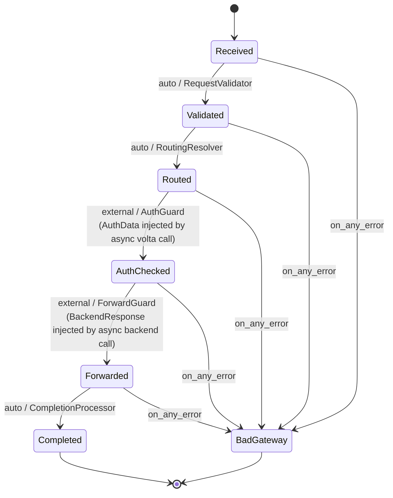

Terminal error states (declared via `on_any_error` + per-processor `FlowError`):

| State           | Cause (representative)                           | HTTP |
|-----------------|--------------------------------------------------|------|
| `BadRequest`    | headers > 8192B; body > 10 MB; missing Host;     | 400  |
|                 | path traversal (literal or URL-encoded %2e%2e,   |      |
|                 | double-encoded %252e%252e)                       |      |
| `Denied`        | IP not in `ip_allowlist` CIDR set                | 403  |
| `Redirect`      | Unauthenticated (volta returns 302)              | 302  |
| `BadGateway`    | volta-auth-server down, backend 5xx              | 502  |
| `GatewayTimeout`| backend timeout (`timeout_secs`)                 | 504  |

### 2.2 B-pattern (sync SM + async I/O)

The core discipline: **tramli processors are synchronous**; async I/O happens
outside the engine. The sequence (see `auth-core/src/service.rs` and
`gateway/src/proxy.rs`):

```rust
let flow_id = engine.start_flow(&def, &id, initial_data)?;  // ~1 µs (auto-chains through Validated + Routed)
let auth    = volta_client.check_auth(&req).await;           // async (~500 µs) — outside the SM
engine.resume_and_execute(&flow_id, auth_data)?;             // ~300 ns — one external resumption
let resp    = backend.forward(&req).await;                   // async (~1–50 ms) — outside the SM
engine.resume_and_execute(&flow_id, resp_data)?;             // ~300 ns — terminal
```

`Builder::build()` validates **8 structural invariants** at startup:

1. All declared states are reachable from the initial state.
2. At least one path to a terminal state exists.
3. Auto/Branch transitions form a DAG (no auto-cycles).
4. At most one External transition per state (no fan-out guards).
5. All branch target states are declared.
6. `requires()` / `produces()` type chain is satisfied end-to-end.
7. No transitions leave from terminal states.
8. The declared initial state exists in the state set.

If `build()` passes, the flow is structurally correct. Runtime state-machine
bugs are impossible by construction.

### 2.3 Processors and guards (gateway flow)

| Role        | Name                | `requires`          | `produces`        | Semantic |
|-------------|---------------------|---------------------|-------------------|----------|
| Processor   | `RequestValidator`  | `RequestData`       | —                 | Sync checks: header size, body size, host known, path traversal (literal + URL-decoded + double-decoded), IP allowlist. |
| Processor   | `RoutingResolver`   | `RequestData`       | `RouteTarget`     | Host lookup (exact + `*.domain` wildcard). Selects first backend (LB selection happens at forward time). |
| Guard       | `AuthGuard`         | —                   | `AuthData`        | Accepts when async `/auth/verify` has deposited an `AuthData`. Reject → redirect/deny. |
| Guard       | `ForwardGuard`      | `RouteTarget`       | `BackendResponse` | Accepts when backend has deposited a `BackendResponse`. |
| Processor   | `CompletionProcessor` | `BackendResponse` | —                 | Finalise metrics; emit transition log. |

### 2.4 96-route taxonomy (auth-server)

The Axum router in `auth-server/src/app.rs` mounts **~96 routes**, split
across 17 functional categories. Full table with Java-parity annotations is in
[`docs/parity.md`](../docs/parity.md). Summary:

| # | Category                     | Count | Representative path(s) |
|---|------------------------------|------:|------------------------|
| 1 | Auth lifecycle (verify/logout/refresh/switch) | 7 | `/auth/verify`, `/auth/refresh`, `/auth/switch-tenant`, `/select-tenant` |
| 2 | OIDC (rate-limited 10/min/IP)           | 3 | `/login`, `/callback`, `/auth/callback/complete` |
| 3 | SAML                                    | 2 | `/auth/saml/login`, `/auth/saml/callback` |
| 4 | MFA (TOTP + challenge)                  | 8 | `/api/v1/users/{userId}/mfa/totp/{setup,verify}`, `/mfa/challenge`, `/auth/mfa/verify` (5/min) |
| 5 | Magic Link (5/min/IP)                   | 2 | `/auth/magic-link/{send,verify}` |
| 6 | Passkey (WebAuthn, 5/min/IP for start/finish) | 6 | `/auth/passkey/{start,finish}`, `/api/v1/users/{id}/passkeys[/{pid}]`, register start/finish |
| 7 | Sessions (user + admin)                 | 7 | `/api/me/sessions`, `/admin/sessions`, `/auth/sessions/revoke-all` |
| 8 | User profile + admin user ops           | 5 | `/api/v1/users/me`, `/api/v1/users/me/tenants`, PATCH/DELETE users |
| 9 | Tenant / Member / Invitation (20/min/IP accept) | 11 | `/api/v1/tenants/…`, `/invite/{code}/accept` |
| 10| IdP / M2M / OAuth token                 | 5 | `/api/v1/tenants/{tid}/idp-configs`, `/oauth/token` |
| 11| Webhooks (Outbox pattern)               | 6 | `/api/v1/tenants/{tid}/webhooks[/{id}[/deliveries]]` |
| 12| Admin (data APIs + HTML stubs)          | 14| `/api/v1/admin/*`, `/admin/*` |
| 13| Billing / Policy / GDPR                 | 7 | `/api/v1/tenants/{tid}/billing`, `/policies`, `/users/me/data-export` |
| 14| SCIM 2.0                                | 8 | `/scim/v2/Users[/{id}]`, `/scim/v2/Groups` |
| 15| Signing keys                            | 3 | `/api/v1/admin/keys[/rotate|/{kid}/revoke]` |
| 16| Viz + SSE (tramli-viz integration)      | 3 | `/viz/flows`, `/viz/auth/stream`, `/api/v1/admin/flows/{id}/transitions` |
| 17| Health + JWKS                           | 2 | `/healthz`, `/.well-known/jwks.json` |
|   | **Total**                               | **~96** | |

The exact count of lines matching `\.route\(` in `auth-server/src/app.rs` is
the ground truth. Verify with:

```bash
rg -c '^\s+\.route\(' auth-server/src/app.rs   # → ~96
```

### 2.5 Five rate-limited merge sub-routers

`build_router()` composes the router as **one main router + 5 rate-limited
sub-routers**, merged at the end (`auth-server/src/app.rs:22-45,210-214`):

| Sub-router         | Limit      | Routes                                                   | Java equivalent |
|--------------------|------------|----------------------------------------------------------|-----------------|
| `oidc_routes`      | 10 / min / IP | `GET /login`, `GET /callback`, `POST /auth/callback/complete` | `@RateLimit(limit=10, window=60s)` |
| `mfa_routes`       | 5 / min / IP  | `POST /auth/mfa/verify`                                  | `@RateLimit(limit=5, window=60s)` |
| `passkey_routes`   | 5 / min / IP  | `POST /auth/passkey/start`, `POST /auth/passkey/finish`  | `@RateLimit(limit=5, window=60s)` |
| `invite_routes`    | 20 / min / IP | `POST /invite/{code}/accept`                             | `@RateLimit(limit=20, window=60s)` |
| `magic_routes`     | 5 / min / IP  | `POST /auth/magic-link/send`, `GET /auth/magic-link/verify` | `@RateLimit(limit=5, window=60s)` |

**Why this shape?** Axum's `route_layer()` only applies to routes declared
*inside* the sub-router. By colocating only the brute-forceable endpoints and
attaching the `RateLimiter` there, we avoid a global middleware that would
charge the other ~80 routes. It matches Java's per-endpoint
`@RateLimit(limit=N, window=60s)` annotations 1:1 without any global cost.

Each limiter is a `RateLimiter::new(name, limit, Duration::from_secs(60))`
instance, keyed by client IP via the `limit_by_ip` middleware. The fixed-
window implementation uses `count < limit` (not `<=`) to avoid the Java
off-by-one bug documented as Java issue #20.

### 2.6 Gateway features (summary)

| Feature                      | Details |
|------------------------------|---------|
| HTTP/1.1 + HTTP/2            | hyper 1.x auto-negotiation |
| WebSocket tunnel             | Bidirectional TCP tunnel, 1024-connection cap |
| TLS / Let's Encrypt          | rustls-acme; HTTP-01 default, DNS-01 via instant-acme + Cloudflare provider |
| Load balancing               | Round-robin + weighted (canary deploys) |
| Rate limiting                | Global RPS, per-IP RPS, per-user (plugin), per-endpoint (auth-server) |
| Circuit breaker              | 5 failures / 30 s recovery, idempotent retry, `Retry-After` |
| Auth cache                   | 5 s TTL cookie-based — skip redundant volta calls |
| Compression                  | gzip for text/JSON/XML/JS (1 MB threshold), brotli (tower-http) |
| CORS                         | Per-route origins, secure-by-default (DD-001: no implicit wildcard) |
| Custom error pages           | HTML directory with JSON fallback |
| Hot reload                   | SIGHUP + `POST /admin/reload` — zero-downtime `ArcSwap` |
| Public routes / bypass       | `public: true`; `auth_bypass_paths: [{prefix, backend?}]` |
| Path rewrite                 | `strip_prefix`, `add_prefix` |
| Header manipulation          | per-route add/remove on request and response |
| Traffic mirroring            | Shadow backend, fire-and-forget, `sample_rate: 0.0..1.0` |
| Geo access control           | `geo_allowlist` / `geo_denylist` via `CF-IPCountry` |
| Per-route timeout            | `timeout_secs` override of server.request_timeout_secs |
| W3C traceparent              | OpenTelemetry-compatible propagation |
| Response cache (LRU)         | Per-route LRU with TTL → `X-Volta-Cache: HIT/MISS` |
| Plugin system                | Native Rust plugins (api-key-auth, rate-limit-by-user, monetizer, header-injector) |
| Config sources               | YAML + services.json + Docker labels + HTTP polling (`ArcSwap` hot swap) |
| Backend health check         | Auto-detect dead backends; skip in LB |
| mTLS backend                 | Mutual TLS to upstream |
| Global backpressure          | `Semaphore` on concurrent in-flight requests |
| Admin API (localhost-only)   | `/admin/{routes,backends,stats,reload,drain}` |
| `--validate` flag            | Static config validation for CI/CD |
| L4 proxy (TCP/UDP)           | Port forward; DD-002: no auth enforcement (use `ip_allowlist`) |
| Metrics                      | Prometheus `/metrics`, 8-bucket latency histogram |
| Trusted proxies              | CF-Connecting-IP / X-Real-IP real-client-IP extraction |

---

## 3. Data Persistence Layer

### 3.1 Migrations (23 files)

All migrations live in `auth-core/migrations/` and are numbered `NNN_*.sql`.
They are applied in order; the current head is **023**. Each migration is
idempotent via `CREATE … IF NOT EXISTS` / `CREATE UNIQUE INDEX IF NOT EXISTS`.

| #   | File                                | Purpose                                                  |
|----:|-------------------------------------|----------------------------------------------------------|
| 001 | `001_create_users.sql`              | `users` — id (uuid), email (NFC-normalized), display_name, created_at, deleted_at (GDPR soft delete) |
| 002 | `002_create_tenants.sql`            | `tenants` — id, slug, name, mfa_required, mfa_grace_until, suspended_at |
| 003 | `003_create_memberships.sql`        | `memberships` — (user_id, tenant_id) PK, role (OWNER/ADMIN/MEMBER), created_at |
| 004 | `004_create_invitations.sql`        | `invitations` — code, tenant_id, invited_email, role, expires_at |
| 005 | `005_create_invitation_usages.sql`  | `invitation_usages` — audit of single-use acceptance (idempotent accept) |
| 006 | `006_create_auth_flows.sql`         | `auth_flows` — tramli FlowInstance persistence (flow_id, flow_name, current_state, data_json, version, ttl_expires_at). Optimistic lock via `version`. |
| 007 | `007_create_auth_flow_transitions.sql` | `auth_flow_transitions` — append-only transition log (from_state, to_state, duration_micros, data_types, timestamp). Feeds `/api/v1/admin/flows/{id}/transitions`. |
| 008 | `008_create_sessions.sql`           | `sessions` — id (JWT session_id claim), user_id, tenant_id, created_at, revoked_at, last_used_at, ip, user_agent, mfa_verified_at |
| 009 | `009_create_user_mfa.sql`           | `user_mfa` — user_id PK, totp_secret (KeyCipher-encrypted), enabled_at |
| 010 | `010_create_mfa_recovery_codes.sql` | `mfa_recovery_codes` — user_id, code_hash (SHA-256), used_at |
| 011 | `011_create_magic_links.sql`        | `magic_links` — token_hash, email, expires_at, consumed_at |
| 012 | `012_create_signing_keys.sql`       | `signing_keys` — kid, alg, public_jwk, private_jwk (KeyCipher), not_before, not_after, revoked_at |
| 013 | `013_create_idp_configs.sql`        | `idp_configs` — tenant_id, provider, client_id, client_secret (encrypted), issuer, scopes |
| 014 | `014_create_m2m_clients.sql`        | `m2m_clients` — client_id, client_secret_hash, tenant_id, scopes, disabled_at |
| 015 | `015_create_user_passkeys.sql`      | `user_passkeys` — credential_id (UNIQUE — Java #5), public_key, sign_count, transports, user_id |
| 016 | `016_create_webhooks.sql`           | `webhooks` — id, tenant_id, url (SSRF-validated), events[], secret; `outbox_events`; `webhook_deliveries` |
| 017 | `017_create_audit_logs.sql`         | `audit_logs` — event, actor_id, target_id, tenant_id, payload_json, created_at |
| 018 | `018_create_devices.sql`            | `known_devices` / `trusted_devices` — fingerprint, last_seen, trust_level |
| 019 | `019_create_billing.sql`            | `plans`, `subscriptions` (Stripe-compatible), `invoices` |
| 020 | `020_create_policies.sql`           | `tenant_security_policies` — policy_json (RBAC / time-of-day / geo) |
| 021 | `021_pagination_indexes.sql`        | Composite indexes for admin pagination (P2.1, Java `f31a2f2`) on `audit_logs`, `sessions`, `users`, `invitations`, `members` |
| 022 | `022_create_oidc_flows.sql`         | `oidc_flows` — state (HMAC-signed), nonce, pkce_verifier (KeyCipher), expires_at. Atomic consume per Java #3. |
| 023 | `023_create_passkey_challenges.sql` | `passkey_challenges` — user_id, challenge (serialised via `bincode`), expires_at |

**Extension set:** migrations assume PostgreSQL 13+ with `pgcrypto` and
`uuid-ossp` (or equivalent server-side UUID). `ON DELETE CASCADE` is used for
`memberships`, `invitations`, and `sessions` to honour tenant teardown.

### 3.2 DAO traits

`auth-core/src/store/` declares the trait surface. Each trait is async and
backend-agnostic:

| Trait               | Impl                  | Purpose |
|---------------------|-----------------------|---------|
| `UserStore`         | `store::pg::PgUserStore`      | CRUD + lookup by email (NFC-folded) |
| `TenantStore`       | `store::pg::PgTenantStore`    | CRUD, slug lookup, suspension |
| `MembershipStore`   | `store::pg::PgMembershipStore`| role mutation, transfer-ownership |
| `InvitationStore`   | `store::pg::PgInvitationStore`| single-use accept (via `invitation_usages`) |
| `SessionStore`      | `store::pg::PgSessionStore`   | list/revoke, `mfa_verified_at` update |
| `FlowStore`         | `store::pg::PgFlowStore`      | `FlowPersistence` with optimistic lock (auth_flows + transitions) |
| `PasskeyStore`      | `store::pg::PgPasskeyStore`   | atomic `UPDATE WHERE sign_count < ?` (Java #17) |
| `MfaStore`          | —                              | user_mfa + recovery_codes |
| `MagicLinkStore`    | —                              | hash-only storage + single consume |
| `SigningKeyStore`   | —                              | key lifecycle + encrypted private_jwk |
| `IdpConfigStore`    | —                              | multi-IdP per tenant |
| `M2mClientStore`    | —                              | client_credentials grant |
| `WebhookStore`      | —                              | subscription + `deliveries` list |
| `OutboxStore`       | —                              | outbox pattern (insert → worker flush), `delete_by_user` for GDPR |
| `AuditStore`        | —                              | append-only + pagination; `delete_flow_transitions_by_user` for GDPR |
| `BillingStore`      | —                              | plans, subscriptions |
| `PolicyStore`       | —                              | tenant policies |
| `OidcFlowStore`     | —                              | atomic state+pkce consume (Java #3) |
| `PasskeyChallengeStore` | —                          | WebAuthn challenge lifecycle |
| `DeviceStore`       | —                              | trusted-device list |

The PostgreSQL implementations live under `auth-core/src/store/pg/` and are
gated by `features = ["postgres"]`. Integration tests in
`auth-core/tests/pg_store_test.rs` run via `testcontainers` (Docker required).

### 3.3 Persistence model for tramli flows

`auth-core::FlowPersistence` binds tramli's `FlowStore` trait to the
`auth_flows` + `auth_flow_transitions` tables with **optimistic concurrency
control**:

- `UPDATE auth_flows SET current_state = $new, data_json = $data, version = version + 1 WHERE flow_id = $id AND version = $expected`
- If the `UPDATE` returns 0 rows, the caller must re-fetch and retry.
- Every successful transition inserts one row into `auth_flow_transitions`
  with `from_state`, `to_state`, `duration_micros` (tramli 3.3+), the set of
  `data_types` emitted, and a timestamp.

### 3.4 Cryptography at rest

| Data                          | Protection                                                               |
|-------------------------------|--------------------------------------------------------------------------|
| PKCE verifier (OIDC flow)     | AES-GCM with PBKDF2-derived key (`crypto::KeyCipher`, 100k iterations)    |
| Signing key private material  | Same `KeyCipher` applied to private JWK before INSERT                    |
| IdP client secret             | `KeyCipher` (rotating master-key envelope)                               |
| TOTP secret                   | `KeyCipher` — never logged                                               |
| Passkey public key / counters | Plain (public); `sign_count` UPDATE is atomic & idempotent (Java #17)    |
| Magic-link token              | Never stored plaintext — SHA-256 hash only                                |
| M2M client secret             | Argon2-like password hash (via `password-hash` crate equivalent) + `subtle::ConstantTimeEq` on compare (Java #21) |

---

## 4. State Machines

The workspace has **five tramli `FlowDefinition`s** in play: one per-request
in `gateway`, four long-lived in `auth-core`, plus a plugin-lifecycle SM
(native Rust, not tramli).

### 4.1 Proxy flow (per request)

Defined in `gateway/src/flow.rs::build_proxy_flow_with_allowlist`.

```
States:      Received, Validated, Routed, AuthChecked, Forwarded, Completed,
             BadRequest, Redirect, Denied, BadGateway, GatewayTimeout
Initial:     Received
Terminals:   Completed, BadRequest, Redirect, Denied, BadGateway, GatewayTimeout

Initially available: RequestData
Externally provided: AuthData, BackendResponse

TTL:         30 s
Mode:        strict_mode (tramli 3.6+) — reject undeclared data types
```

Transitions are:

| From         | Kind     | Processor / Guard   | To           |
|--------------|----------|---------------------|--------------|
| Received     | auto     | `RequestValidator`  | Validated    |
| Validated    | auto     | `RoutingResolver`   | Routed       |
| Routed       | external | `AuthGuard`         | AuthChecked  |
| AuthChecked  | external | `ForwardGuard`      | Forwarded    |
| Forwarded    | auto     | `CompletionProcessor` | Completed  |
| (any)        | error    | `on_any_error`      | BadGateway   |

The flow is linted at startup via `tramli_plugins::lint::default_policies`;
findings are emitted as `tracing::warn!` with a `plugin = "lint"` tag.

### 4.2 OIDC flow (auth-core)

Defined in `auth-core/src/flow/oidc.rs`. 1:1 port of Java `OidcFlowDef`.

```
States:      Init, Redirected, CallbackReceived, TokenExchanged, UserResolved,
             RiskChecked, Complete, CompleteMfaPending, Blocked, TerminalError
Initial:     Init
Terminals:   Complete, CompleteMfaPending, Blocked, TerminalError

Initially available: OidcInitData
Externally provided: OidcCallbackData

TTL:         600 s (10 min)
Mode:        strict_mode
```

Transitions:

| From            | Kind     | Element                     | To / branch  |
|-----------------|----------|-----------------------------|--------------|
| Init            | auto     | `OidcInitProcessor`         | Redirected   |
| Redirected      | external | `CallbackGuard`             | CallbackReceived |
| CallbackReceived| auto     | `TokenExchangeProcessor`    | TokenExchanged |
| TokenExchanged  | auto     | `UserResolveProcessor`      | UserResolved |
| UserResolved    | auto     | `RiskCheckProcessor`        | RiskChecked  |
| RiskChecked     | branch   | `RiskBranch` (`complete` / `mfa_pending` / `blocked`) | Complete / CompleteMfaPending / Blocked |
| (any error)     | error    | `on_any_error`              | TerminalError |

The `AuthService` orchestrator (`auth-core/src/service.rs`) wraps this flow
with real async I/O: IdP `exchange_code` + `userinfo`, user upsert, session
creation, JWT issuance. The SM's synchronous processors validate the data
that the async layer has deposited; they never perform I/O themselves.

### 4.3 MFA flow (auth-core)

Defined in `auth-core/src/flow/mfa.rs`. 1:1 port of Java `MfaFlowDef`.

```
States:      ChallengeShown, Verified, TerminalError, Expired
Initial:     ChallengeShown
Terminals:   Verified, TerminalError, Expired
TTL:         300 s (5 min)

Flow:        ChallengeShown --external[MfaCodeGuard]--> Verified
             Invalid code → guard rejects (stays in ChallengeShown), UI can retry
             TTL expiry → Expired
```

### 4.4 Passkey flow (auth-core)

Defined in `auth-core/src/flow/passkey.rs`. Covers both **register** and
**authenticate** paths via two builders sharing state types.

```
States:      Init, ChallengeIssued, AssertionReceived, UserResolved, Complete, TerminalError
Initial:     Init

Flow:        Init --auto[ChallengeProcessor]--> ChallengeIssued
             ChallengeIssued --external[AssertionGuard]--> AssertionReceived
             AssertionReceived --auto[UserResolveProcessor]--> UserResolved
             UserResolved --auto[CompleteProcessor]--> Complete

Challenge persistence: passkey_challenges table (bincode-serialized)
Origin check:          delegated to webauthn-rs (Java #6)
Sign-counter update:   atomic UPDATE WHERE sign_count < ? (Java #17)
```

### 4.5 Invite flow (auth-core)

Defined in `auth-core/src/flow/invite.rs`.

```
States:      ConsentShown, AccountSwitching, Accepted, Complete, TerminalError, Expired

Flow:        ConsentShown --branch[EmailMatchBranch]-->
                  ("match")  → Accepted --auto--> Complete
                  ("switch") → AccountSwitching --external[AcceptGuard]--> Accepted --auto--> Complete

Email comparison: NFC-normalized + case-folded (Java #14)
Rate limit:       20 / min / IP on POST /invite/{code}/accept (Java #10)
Idempotency:      invitation_usages row inserted under unique constraint
```

### 4.6 Plugin lifecycle SM (gateway, not tramli)

The gateway's plugin lifecycle in `gateway/src/plugin.rs` mirrors the tramli
SM shape but is implemented as a plain Rust `enum`:

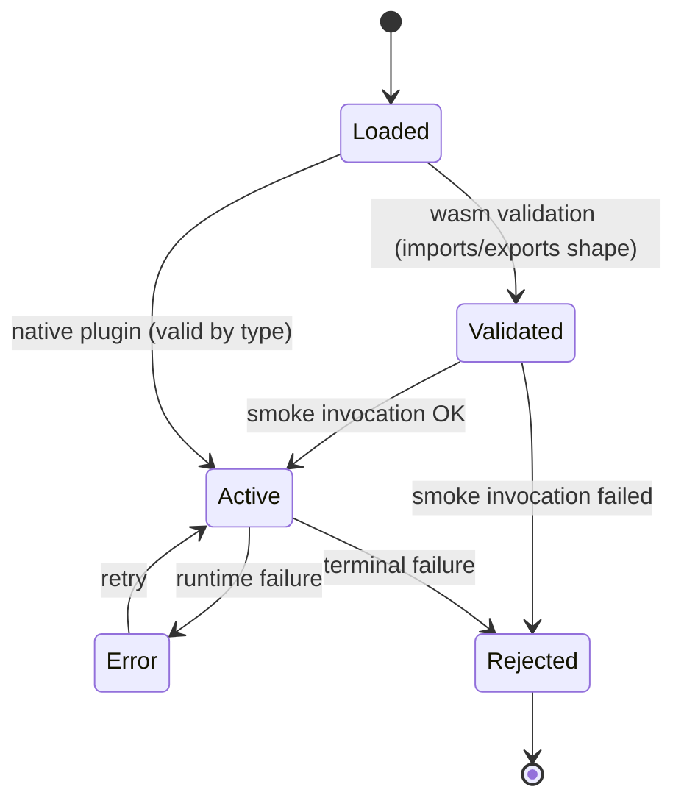

- Native plugins skip straight to `Active` after construction (they are valid
  by type).
- Wasm plugins (future) will enter `Loaded`, run wasmtime-time validation
  (imports/exports shape), transition to `Validated`, and become `Active`
  once a smoke invocation returns cleanly.
- `Error` is recoverable (plugin can be retried); `Rejected` is terminal.

---

## 5. Business Logic

### 5.1 Routing

`gateway/src/proxy.rs` (≈1278 LoC) holds the canonical `RoutingTable =
HashMap<String, RouteInfo>` wrapped in an `arc_swap::ArcSwap`. Host keys are
lower-cased. Wildcard patterns are stored as `"*.example.com"` and matched by
stripping the first host label.

Per-route knobs honoured by `ProxyService::forward`:

- `backend` / `backends: Vec<WeightedBackend>` (weighted LB, default weight 1;
  health-aware skip on circuit breaker open).
- `path_prefix` — mount point; used e.g. to route `/saml/*` to the Java
  sidecar under DD-005.
- `public: bool` — bypass auth entirely.
- `auth_bypass_paths: Vec<{prefix, backend?}>` — per-path bypass with an
  optional backend override (e.g. Slack webhooks).
- `cors_origins: Vec<String>` — secure-by-default (DD-001): empty = no CORS
  headers; explicit `"*"` required to permit any origin.
- `timeout_secs` — override of `server.request_timeout_secs`; LLM backends
  typically set 120 s.
- `geo_allowlist` / `geo_denylist` — `CF-IPCountry` header.
- `ip_allowlist: Vec<String>` — CIDRs via `ipnet`.
- `strip_prefix` / `add_prefix` — path rewrite.
- `request_headers.add|remove` / `response_headers.add|remove`.
- `mirror: {backend, sample_rate: 0.0..1.0}` — shadow fire-and-forget.
- `cache: CacheConfig` — per-route LRU with TTL.
- `backend_tls: BackendTlsConfig` — mTLS (client cert + root CA).

### 5.2 Load balancing

Round-robin (default) and **weighted** round-robin (e.g. canary
`{url, weight: 90}` + `{url, weight: 10}`), implemented inline in `proxy.rs`.
The selector is health-aware: a backend with an open circuit breaker is
skipped and the next one is tried.

### 5.3 Rate limiting (three layers)

1. **Gateway global.** `tower::limit::RateLimitLayer` + a global
   `tokio::sync::Semaphore` for concurrent-request backpressure. This protects
   the process from connection floods at the TCP accept boundary.
2. **Gateway per-route / per-user.** `RateLimitByUser` plugin, keyed by
   `X-Volta-User-Id` (set by auth-server on verify). Per-user cap resets on a
   sliding window.
3. **auth-server per-endpoint.** The 5 `route_layer` limiters described in
   §2.5, keyed by client IP. Matches Java's per-endpoint `@RateLimit`.

A request to `/login` is therefore subject to (1) + (3). A request to `/api/…`
on a monetized route is subject to (1) + (2).

### 5.4 Plugin system

Four built-in plugins (all native Rust, Phase 1):

| Plugin              | Phase(s) | Purpose |
|---------------------|----------|---------|
| `ApiKeyAuth`        | request  | Header/query/cookie key compare against a configured valid-keys list. Rejects `401` if missing, `403` if invalid. |
| `RateLimitByUser`   | request  | Per-user fixed-window limiter keyed by a configurable header (default `x-volta-user-id`). Emits `Retry-After`. |
| `Monetizer`         | request  | Calls monetizer `/verify` service, caches response in an in-memory TTL cache, injects `X-Monetizer-{Plan,Status,Features,Show-Ads,Trial-End}` request headers. LRU safety valve at **10 000 entries** (DD-016): on overflow, the cache is cleared and repopulates in `cache_ttl_secs` (default 5 s). Unauthenticated users get `free` defaults. |
| `HeaderInjector`    | request, response | Add/set headers on each side, keyed by `req.*` / `resp.*` config prefixes. |

Plugin config is per-route:

```yaml
routing:
  - host: api.example.com
    backend: http://localhost:3000
    plugins:
      - name: rate-limit-by-user
        phase: request
        config:
          max_requests: "60"
          window_secs: "60"
          user_header: "x-volta-user-id"
      - name: monetizer
        phase: request
        config:
          verify_url: "http://monetizer:3001/__monetizer/verify"
          config_id: "<uuid>"
          cache_ttl_secs: "5"
```

Phase 2 (deferred): Wasm plugins via wasmtime. `plugin_type: wasm` + `path:`
point to a `.wasm` file; the lifecycle SM gains `Loaded → Validated` by
running a smoke-test invocation.

### 5.5 AUTH-010 verify order (auth-server)

`handlers/auth::verify` (the `GET /auth/verify` ForwardAuth endpoint) must
resolve these checks in a specific order, independently of the Java side:

1. **Local-network bypass** — if `local_bypass::LocalNetworkBypass` matches
   the client IP *and* there is no session cookie, return 200 early
   (per `5f23f88` + `4006ee7` Java commits; the no-session guard prevents the
   MFA-loop regression).
2. **Session lookup** — cookie decrypt → JWT verify → session DB check
   (`revoked_at IS NULL`).
3. **MFA-pending** — if the session requires MFA and `mfa_verified_at IS NULL`,
   redirect to `/mfa/challenge` (302).
4. **Tenant suspension** — if the user's current tenant has
   `suspended_at IS NOT NULL`, return 403.
5. **Success** — emit `X-Volta-{User-Id, Tenant-Id, Roles, Scopes}` headers.

### 5.6 Outbox-pattern webhooks

`auth-server/src/outbox_worker.rs` polls `outbox_events`, dispatches via
`reqwest`, and writes results into `webhook_deliveries` with retry metadata.
SSRF protection (Java #1) rejects HTTPS-absent URLs and private-IP hostnames
before insert (see `security::validate_webhook_url`).

### 5.7 SSE auth-event stream

`auth-server/src/auth_events.rs` exposes an `AuthEventBus` backed by Redis
pub/sub (`redis = "0.27"` with `tokio-comp`). `handlers/viz::auth_stream`
upgrades to SSE and fans out events across instances. This is the P1.2
feature that ships the AUTH-010 verify order; events include login,
MFA verify, logout, tenant switch.

### 5.8 Circuit breaker

Each backend has a `CircuitBreaker` state machine living alongside the
`RouteInfo`:

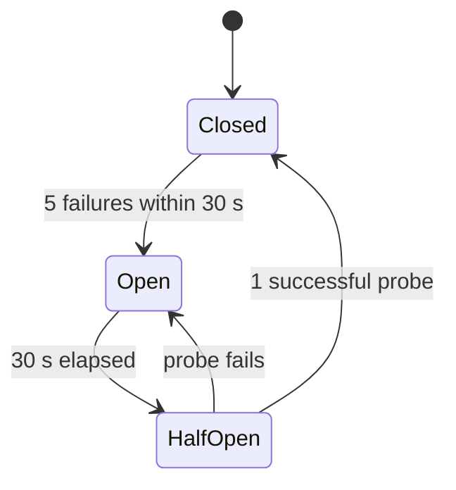

- `Closed`: requests pass through, failure counter increments on 5xx or
  timeout, decrements on 2xx/3xx/4xx (non-5xx counts as success).
- `Open`: requests to this backend are short-circuited with 503; response
  includes `Retry-After: 30`. LB selector skips this backend entirely.
- `HalfOpen`: after the 30 s cooldown, exactly one probe request is allowed.
  Success → transition to `Closed`. Failure → back to `Open`.

Idempotency of retries: when the LB has more than one backend, an
idempotent method (GET, HEAD, PUT, DELETE, OPTIONS) is retried on the next
healthy backend; POST / PATCH are not retried (caller must handle).

### 5.9 Response cache

Per-route LRU response cache (`gateway/src/cache.rs`), keyed by `(host,
path, query, vary-headers)`. Config:

```yaml
cache:
  max_entries: 10000          # LRU cap per route
  ttl_secs: 60                # Cache lifetime
  vary: [authorization, accept-language]
  cacheable_methods: [GET, HEAD]
  cacheable_statuses: [200, 301, 404]
```

Behavior:

- HIT: response served from LRU; header `X-Volta-Cache: HIT` added.
- MISS: upstream forward; successful response inserted into LRU; header
  `X-Volta-Cache: MISS` added.
- STALE-ON-ERROR: if the upstream returns 5xx within a configured grace
  window, the stale entry is served with `X-Volta-Cache: STALE`.
- Purge endpoint: `POST /admin/cache/purge?host=…&path=…` (localhost-only).

### 5.10 Security posture

| Layer                                | Threat mitigated |
|--------------------------------------|------------------|
| `hyper` HTTP parser                   | request smuggling, header injection, HTTP/2 frame abuse |
| `ProxyState::Validated`               | host header poisoning; path traversal literal + URL-encoded + double-encoded |
| `AuthGuard`                           | unauthenticated access; fail-closed when volta-auth-server is down → 502 |
| `auth_public_url` suffix match        | OIDC open-redirect (commit `ad2a0a1`) |
| Response `X-Volta-*` header strip     | backend forging identity headers |
| Rate limiters (three layers)          | OIDC / MFA / Passkey brute force, invite spam |
| `subtle::ConstantTimeEq` on HMAC / client-secret compare | timing attacks (Java #21) |
| `security::reject_xml_doctype`        | XXE in SAML assertions (Java #19) |
| `security::normalize_email` (NFC)     | Unicode homoglyph abuse on invite/signup (Java #14) |
| `KeyCipher` (AES-GCM + PBKDF2 100k)   | PKCE verifier + key material at rest (Java #4/#15/#16) |
| Passkey sign-counter atomic UPDATE    | replay detection (Java #17) |
| SSRF guard (HTTPS only + private-IP reject) | webhook exfiltration (Java #1) |

---

## 6. API / External Boundary

### 6.1 Gateway ports

| Purpose       | Default port | Config key                   |
|---------------|-------------:|------------------------------|
| HTTP          | 8080         | `server.port`                |
| HTTPS         | 443          | `tls.port`                   |
| Prometheus    | (same as HTTP) | `/metrics`                  |
| Admin API     | localhost-only (same as HTTP), `/admin/*` | — |
| L4 listener   | per-entry    | `l4_proxy[*].listen_port`    |

### 6.2 Gateway HTTP surface (non-proxy)

| Method | Path                | Purpose                                                         |
|--------|---------------------|-----------------------------------------------------------------|
| GET    | `/healthz`          | Gateway health (not auth-server's healthz)                      |
| GET    | `/metrics`          | Prometheus text format, latency histogram, active routes count  |
| GET    | `/admin/routes`     | Current routing table (localhost-only)                          |
| GET    | `/admin/backends`   | Backend health + circuit-breaker state                          |
| GET    | `/admin/stats`      | Per-route RPS, errors, p50/p95/p99 latency                      |
| POST   | `/admin/reload`     | Trigger config reload (`ArcSwap` swap)                          |
| POST   | `/admin/drain`      | Begin graceful shutdown (stop accepting new, finish in-flight)  |

### 6.3 auth-server HTTP surface (96 routes)

The complete route-by-route table with Java parity annotations is in
[`docs/parity.md`](../docs/parity.md). The router is built in
`auth-server/src/app.rs::build_router`; each route has an explicit Axum
`method(handler)` call. Response shapes match Java `volta-auth-proxy` verbatim
so that clients, mobile apps, and partner webhooks do not see a difference
across the switchover.

Representative requests:

```http
GET  /auth/verify                Host: app.example.com        # ForwardAuth
POST /auth/refresh               Cookie: __volta_session=…
GET  /login?provider=google&return_to=/dashboard
POST /auth/callback/complete     {"code":"…","state":"…"}
POST /auth/mfa/verify            {"code":"123456"}
POST /auth/passkey/start         {"email":"alice@example.com"}
POST /invite/{code}/accept       {"email":"alice@example.com"}
GET  /api/v1/users/me
GET  /api/me/sessions
POST /oauth/token                grant_type=client_credentials&client_id=…&client_secret=…
GET  /scim/v2/Users?filter=…
GET  /.well-known/jwks.json
```

### 6.4 Sync-from-Java mapping

The Java → Rust parity trail is captured formally in
[`auth-server/docs/sync-from-java-2026-04-14.md`](../auth-server/docs/sync-from-java-2026-04-14.md).
Summary:

| Java commit | Date  | Type | Landed in Rust at |
|-------------|-------|------|-------------------|
| `99a2769`   | 04-11 | feat | AUTH-010 unified handler → `handlers/auth.rs::verify`, `handlers/mfa.rs::mfa_challenge` |
| `f31a2f2`   | 04-11 | feat | admin pagination + search + sort → `pagination.rs` + 5 endpoints + `migrations/021` |
| `abca91e`   | 04-11 | sec  | Security bundle #1 – #21 → 18 done, 3 deferred (KeyCipher/PKCE shipped in 0.3.0) |
| `6315cc0`   | 04-11 | feat | tramli-viz realtime → `handlers/viz::{list_flows, flow_transitions}` |
| `9b4fe2c`   | 04-12 | feat | SAAS-016 SSE → `auth_events::AuthEventBus` + `handlers/viz::auth_stream` |
| `5f23f88`   | 04-12 | feat | local-network bypass for ForwardAuth → `local_bypass.rs` |
| `4006ee7`   | 04-13 | fix  | local bypass: only when no session (MFA-loop fix) → `handlers/auth::verify` |

The test suite under `auth-server/src/*` has **44 passing unit tests** — 16
security, 4 rate_limit, 7 local_bypass, 8 pagination, 2 auth_events, 5 saml,
and the remainder scattered across handlers.

### 6.5 External dependencies (outbound)

| Target                                          | Protocol | Purpose                                     |
|-------------------------------------------------|----------|---------------------------------------------|
| IdPs (Google, GitHub, Microsoft, LinkedIn, Apple) | HTTPS/OAuth2/OIDC | authorization_url, exchange, userinfo |
| Redis (optional)                                | RESP3    | SSE pub/sub fan-out across instances        |
| PostgreSQL 13+                                  | wire     | All DAO traits                              |
| Backends                                        | HTTP/HTTPS + optional mTLS | Proxy destinations           |
| Monetizer service                               | HTTP     | Plugin `Monetizer` verify                   |
| Webhook sinks (customer-owned)                  | HTTPS    | Outbox delivery (SSRF-guarded)              |
| Let's Encrypt + Cloudflare DNS API              | HTTPS    | ACME HTTP-01 + DNS-01                       |
| Monitor / tramli-viz                            | HTTP/SSE | `/viz/*`, Mermaid diagrams                  |
| Docker engine (optional)                        | unix sock | Labels config source (bollard)             |

---

## 7. UI

**Not applicable — this workspace ships no browser UI of its own.**

The `auth-server` does expose a handful of **HTML stubs** under `/admin/*`
and `/settings/*` (members, invitations, webhooks, idp, tenants, users,
audit, security, sessions) that return minimal placeholder pages so that the
Java route table is matched 1:1 and clients that hit these URLs get a 200
rather than a 404. These stubs are marked 🚧 in
[`docs/parity.md`](../docs/parity.md) and will be filled in once the admin
UI stabilises (backlog P5-6).

Visualisation is delegated to a separate `monitor` integration:

- `GET /viz/flows` — static list of tramli flow definitions.
- `GET /api/v1/admin/flows/{flowId}/transitions` — the append-only
  transition log for a given flow instance, consumed by tramli-viz to render
  Mermaid diagrams.
- `GET /viz/auth/stream` — Server-Sent Events auth event stream (Redis-backed).

The Mermaid renderer in `auth-core/src/flow/mermaid.rs` is invoked by external
tooling; it is not mounted on any HTTP route by auth-server itself.

---

## 8. Configuration

### 8.1 Config files

Three canonical files live at the repo root:

| File                            | Audience                                              |
|---------------------------------|-------------------------------------------------------|
| `volta-gateway.minimal.yaml`    | Smallest viable config for a 2-route SaaS             |
| `volta-gateway.full.yaml`       | Full reference — every key + its default + a comment  |
| `volta-gateway.yaml`            | Active workspace config (gitignored in production)    |

### 8.2 Minimal schema

```yaml
server:
  port: 8080

auth:
  volta_url: http://localhost:7070    # volta-auth-server (or Java sidecar)

routing:
  - host: app.example.com
    backend: http://localhost:3000
    app_id: my-app

  - host: api.example.com
    backend: http://localhost:4000
    cors_origins:
      - https://app.example.com
```

### 8.3 Full schema (top-level keys)

| Key                | Type        | Purpose |
|--------------------|-------------|---------|
| `server`           | object      | Port, timeouts, `force_https`, `trusted_proxies` |
| `auth`             | object      | `volta_url`, `verify_path`, `timeout_ms`, `pool_max_idle`, `jwt_secret` (in-process), `cookie_name`, `auth_public_url` |
| `routing`          | array       | `host`, `backend`/`backends`, `app_id`, `public`, `auth_bypass_paths`, `cors_origins`, `ip_allowlist`, `path_prefix`, `strip_prefix`, `add_prefix`, `request_headers`, `response_headers`, `geo_allowlist`, `geo_denylist`, `timeout_secs`, `mirror`, `cache`, `backend_tls`, `plugins` |
| `rate_limit`       | object      | `requests_per_second`, `per_ip_rps` |
| `backend_pool`     | object      | `max_idle_per_host`, `idle_timeout_secs` |
| `healthcheck`      | object      | `interval_secs`, `path` |
| `logging`          | object      | `level`, `format` |
| `error_pages_dir`  | string      | HTML directory for custom error pages |
| `tls`              | object      | `domains`, `contact_email`, `port`, `cache_dir`, `staging`, `challenge` (`http-01`/`dns-01`), `dns_provider`, `dns_api_token`, `dns_zone_id` |
| `l4_proxy`         | array       | `listen_port`, `protocol` (tcp/udp), `backend` |
| `plugins`          | array       | Global plugin list (per-route overrides supported) |
| `config_sources`   | array       | `services.json`, `docker-labels`, `http` polling with URL + interval |
| `access_log`       | object      | `enabled`, `path`, `format` (json/combined) |
| `tenancy`          | object      | Config-schema v3, Layer 2 |
| `access`           | object      | Config-schema v3, Layer 3 |
| `binding`          | object      | Config-schema v3, Layer 4 |

### 8.4 SAML sidecar routing

Per DD-005 the Java `volta-auth-proxy` remains the production SAML path:

```yaml
routing:
  - host: auth.example.com
    path_prefix: /saml/
    backend: http://localhost:7070   # Java volta-auth-proxy
    public: true
    app_id: saml-sidecar
  - host: auth.example.com
    path_prefix: /auth/saml/
    backend: http://localhost:7070
    public: true
    app_id: saml-sidecar
```

The Rust `auth-server` *does* ship `/auth/saml/login` and `/auth/saml/callback`
handlers (with a simplified XML-DSig verifier), but production-grade `xmlsec`
assurance is deferred — the Rust side is marked ⚠️ in
[`docs/parity.md`](../docs/parity.md).

### 8.5 Traefik → volta

The `tools/traefik-to-volta` CLI converts a Traefik static + dynamic config
into a minimal `volta-gateway.yaml`. This is the migration on-ramp described
in `docs/migration-from-traefik.md`.

### 8.6 volta-bin build modes

The `volta-bin` crate exposes a single binary named `volta` that links
`volta-gateway` + `volta-auth-core` *in process*. There is no HTTP round-trip
from the proxy to auth-core — session verification costs ~1 µs instead of
~250 µs. Build:

```bash
cargo build --release -p volta
./target/release/volta config.yaml
```

`volta-bin/src/main.rs` asserts all SM flows (`oidc`, `mfa`, `passkey`,
`invite`, `token`) build at startup so that malformed definitions fail before
the listener binds.

---

## 9. Dependencies

### 9.1 Shared pins

```toml
tramli = "3.8"
tramli-plugins = "3.6.1"
```

Adopted during the feedback loop with the upstream tramli maintainer; the
full trail is in [`docs/feedback.md`](../docs/feedback.md).

| tramli | Date       | What shipped with it here |
|--------|------------|---------------------------|
| 3.2    | 2026-04-07 | Plugin SPI, lint + diagram + observability hooks |
| 3.3    | 2026-04-07 | Per-transition `duration_micros` in the logger |
| 3.4    | 2026-04-07 | API polish for the 96-route refactor |
| 3.5    | 2026-04-07 | Chain mode + richer telemetry fields |
| 3.6    | 2026-04-07 | `FlowStore` trait + `Builder::strict_mode()` |
| 3.6.1  | 2026-04-07 | `NoopTelemetrySink` (removes benchmark noise) |
| 3.8    | 2026-04-17 | `GuardOutput::accept_with` + `guard_data!` macro |

### 9.2 Per-crate dependencies

**`gateway/Cargo.toml`** (selected):

- `hyper = "1"`, `hyper-util`, `http-body-util`, `tokio`, `tower`, `tower-http`
  (trace, timeout, compression-gzip, compression-br)
- `tramli = "3.8"`, `tramli-plugins = "3.6.1"`
- `arc-swap` (hot reload), `ipnet` (CIDR)
- `tokio-rustls`, `rustls`, `rustls-acme` (HTTP-01), `instant-acme` (DNS-01), `rcgen`
- `async-compression`, `flate2`
- `hyper-rustls` + `rustls-pemfile` (backend mTLS)
- `volta-auth-core = { path = "../auth-core" }`
- `bollard` (Docker labels config source), `reqwest` (DNS-01 + HTTP polling)

**`auth-core/Cargo.toml`** (selected):

- `jsonwebtoken = "9"`, `ring = "0.17"`, `aes-gcm`, `pbkdf2`, `sha2`
- `openidconnect = "4"`, `totp-lite = "2"`
- `tramli = "3.8"`, `tramli-plugins = "3.6.1"`
- optional `sqlx` feature `postgres`, optional `webauthn-rs` feature `webauthn`
- `testcontainers` + `testcontainers-modules` (`postgres`) as dev-deps

**`auth-server/Cargo.toml`** (selected):

- `axum = "0.8"` (with `macros`), `axum-extra = "0.10"` (with `cookie`)
- `tower`, `tower-http` (trace, cors)
- `sqlx = "0.8"` runtime-tokio-rustls + postgres/uuid/chrono
- `bincode = "1"` (WebAuthn ceremony serialisation — P1 #5)
- `webauthn-rs = "0.6.0-dev"` with `danger-allow-state-serialisation`
- `hmac`, `sha2`, `hex`, `ring`, `subtle` (constant-time compare)
- `unicode-normalization` (NFC email — Java #14)
- `ipnet` (local-bypass CIDR), `redis` (SSE pub/sub)
- SAML stack: `xmlparser`, `quick-xml`, `x509-cert`, `der`, `rsa`, `signature`

**`volta-bin/Cargo.toml`**:

- `volta-gateway = { path = "../gateway" }`
- `volta-auth-core = { path = "../auth-core" }`
- `tramli = "3.8"`, `tokio`, `tracing`

### 9.3 Runtime dependencies (not in Cargo)

- PostgreSQL 13+ (for auth-core `postgres` feature).
- Docker (for `testcontainers` integration tests, and for `bollard` Docker
  labels config source).
- Redis (optional; required only when SSE fan-out across instances is enabled).
- Monetizer service (optional; required only when the `Monetizer` plugin is
  configured).
- Java `volta-auth-proxy` (optional; required only when `/saml/*` is routed
  to the Java sidecar per DD-005).

---

## 10. Non-functional Requirements

### 10.1 Latency and throughput

| Metric                                        | Target            | Measured (localhost oha `-n 500 -c 1`) |
|-----------------------------------------------|-------------------|---------------------------------------|
| Proxy overhead (direct → gateway)             | < 100 µs p50      | 40 µs p50 ✅ |
| End-to-end with mock auth                     | < 0.5 ms p50      | 0.252 ms p50 ✅ |
| End-to-end with real auth-server              | < 1 ms p50        | 0.395 ms avg ✅ |
| tramli SM overhead                            | < 5 µs per request | 1.69 µs ✅ |
| Throughput target                             | **100 000 req/sec** per core (HTTP/1.1 keep-alive) | TBD under load generator; limiting factor becomes backend |

Baseline: p50 6.6× faster than Traefik + ForwardAuth on the same hardware
with the same mock auth (see [`docs/benchmark-article.md`](../docs/benchmark-article.md)).

### 10.2 Memory footprint

- Response cache: per-route LRU, bounded by `max_entries` × `max_body_size`.
  Default cap **10 000** entries per cache (same LRU safety valve as Monetizer).
- Monetizer plugin cache: hard cap **10 000** entries; on overflow the map is
  cleared and repopulates over `cache_ttl_secs` (DD-016).
- Rate-limiter buckets: bounded by per-key window; caller calls `gc()`
  periodically (cheap per-request for small deployments).
- tramli `InMemoryFlowStore` for per-request flows: dropped at flow
  completion; persisted flows in `auth-core` use the Postgres-backed
  `FlowPersistence`.

### 10.3 Availability & fail-closed semantics

- If `volta-auth-server` is unreachable (`timeout_ms` elapsed), the gateway
  returns `502 Bad Gateway` — **fail-closed**. Never fall open.
- If a backend fails, the circuit breaker opens after 5 consecutive errors
  and stays open for 30 s. The LB skips open backends. A `Retry-After`
  header signals cooldown to clients.
- Hot reload via `SIGHUP` or `POST /admin/reload` is zero-downtime
  (`ArcSwap::store`).
- Graceful drain on `POST /admin/drain` or `SIGTERM`: stop accepting new
  requests; let in-flight complete up to `request_timeout_secs`.

### 10.4 Observability

- Every state transition is timestamped with `duration_micros` (tramli 3.3+).
- Prometheus `/metrics` exposes a latency histogram with 8 buckets.
- `/admin/routes`, `/admin/backends`, `/admin/stats` provide ops
  introspection (localhost-only).
- SSE auth-event stream on `/viz/auth/stream` fans out login, MFA, logout,
  tenant-switch events across instances via Redis pub/sub.
- `/viz/flows` + `/api/v1/admin/flows/{flowId}/transitions` feed tramli-viz
  Mermaid rendering.
- W3C `traceparent` is propagated from inbound to backend for OpenTelemetry
  compatibility.
- Access log: JSON (default) or `combined` (Apache-style) — `access_log`
  config stanza.

### 10.5 Security (summary — details in §5.10)

- Fail-closed on auth-server unreachable.
- Path-traversal defense in depth: literal `..`, URL-decoded `%2e%2e`, and
  double-decoded `%252e%252e` all rejected in `ProxyState::Validated`.
- CORS default-deny (DD-001).
- L4 TCP/UDP proxy is intentionally *not* auth-gated (DD-002): use
  `ip_allowlist` instead.
- Backend `X-Volta-*` response headers are stripped before forwarding to
  prevent identity forgery.
- Trusted-proxy list narrows X-Forwarded-For / CF-Connecting-IP acceptance.

### 10.6 Localisation

User-facing error pages and the auth-server HTML stubs are English-only
today. Full `en` + `ja` docs exist for README, architecture, parity, getting
started, migration (paired files under `README*.md` and `docs/*-ja.md`).

---

## 11. Test Strategy

### 11.1 Unit tests

- `auth-server` unit tests live under `auth-server/src/*`
  (`#[cfg(test)] mod tests`). Current pass count: **44 tests** (16 security,
  4 rate_limit, 7 local_bypass, 8 pagination, 2 auth_events, 5 saml, + scattered).
- `auth-core` unit tests (per module) cover flow builders, JWT issue/verify,
  session cookie parsing, policy evaluation, crypto KeyCipher round-trip.

```bash
cargo test --workspace
cargo test -p volta-auth-server --bins         # 44 unit tests
cargo test -p volta-auth-core                  # flow + jwt + policy units
```

### 11.2 Integration tests

- `auth-core/tests/pg_store_test.rs` — testcontainers-Postgres (`--ignored`).
  Tests DAO traits against real schema.
- `gateway/tests/proxy_test.rs` (541 LoC) — proxy forwarding with mocks.
- `gateway/tests/flow_test.rs` (236 LoC) — tramli FlowEngine invariants
  (8 validations in `build()`).
- `gateway/tests/config_source_test.rs` (257 LoC) — YAML + services.json +
  Docker labels + HTTP polling merge semantics.
- `gateway/tests/cache_plugin_test.rs` (385 LoC) — response cache TTL + LRU
  behaviour.
- `gateway/tests/integration_test.rs` (620 LoC) — end-to-end: TLS, routing,
  LB, rate limit, auth fail-closed.

```bash
cargo test -p volta-auth-core --features postgres -- --ignored
cargo test -p volta-gateway --tests
```

### 11.3 Parity tests (96 routes)

The Java ↔ Rust route parity is enforced by:

1. A **route-count sanity check** in CI — `rg -c '^\s+\.route\(' auth-server/src/app.rs`
   must be approximately 96 (drift raises a review signal).
2. A **handler-level assertion matrix** in `auth-server/docs/specs/` and
   `auth-server/docs/arch/` documents the Java equivalent for each route.
3. The **commit-level sync doc** (`auth-server/docs/sync-from-java-2026-04-14.md`)
   traces every Java commit from `abca91e` through `4006ee7` to its Rust
   landing spot. New Java commits must either be ported or explicitly
   deferred with a tracked reason.
4. **Pagination parity** — the `pagination::{PageRequest, PageResponse}`
   types mirror Java's `?page=&size=&sort=&q=&from=&to=&event=` contract;
   8 dedicated unit tests pin the (de)serialization shape.
5. **Security-bundle parity** — 18 of the 21 `abca91e` fixes are ported with
   per-fix test coverage; 3 deferred (KeyCipher/PKCE) are tracked in the
   implementation-status matrix.

### 11.4 Benchmark suite

- `gateway/benches/proxy_bench.rs` — Criterion microbench on the SM
  hot path (transition + guard + processor).
- `gateway/benches/traefik/` — end-to-end Traefik comparison using `oha`,
  a mock backend, and a mock auth. Results in `benches/e2e_results.md`.
- Baseline numbers (localhost) are in `docs/benchmark-article.md` and the
  README's "vs Traefik" table. A regression budget of **20%** on p50 is
  enforced manually on release.

### 11.5 Fuzz / property tests

Not in CI yet; documented here as a deferred-but-tracked expectation so the
SPEC records intent:

- Path-traversal canonicalisation: a property test that any input containing
  `..` segments (arbitrarily deep, any mix of literal / `%2e` / `%252e` /
  Unicode overlong) is rejected by `ProxyState::Validated` with `BAD_REQUEST`.
- Rate-limiter fairness: a property test that with N keys and K requests per
  key per window, exactly `min(K, limit)` requests succeed per key and none
  bleed into neighbouring keys.
- tramli build invariants: given any Builder input that violates an invariant,
  `build()` must return a descriptive `Err`, never `Ok` (this is covered by
  tramli's own test suite, but we pin it for the workspace compositions).

### 11.6 Regression budget

Each release asserts these thresholds manually before tagging:

| Metric                             | Budget         |
|------------------------------------|----------------|
| p50 latency vs previous release    | ≤ +20 %        |
| Route count in `auth-server/src/app.rs` | ±1 (any larger drift → review) |
| Failing unit tests                 | 0              |
| Failing integration tests          | 0              |
| Lint warnings (`cargo clippy -D warnings`) | 0      |
| Security patches not ported from Java | 0 (or tracked deferral in sync doc) |

### 11.7 Deep parity test matrix

Category-by-category, the test strategy ensures Rust matches Java semantics:

| Category                   | What's tested                                      | Test location |
|----------------------------|----------------------------------------------------|---------------|
| Auth verify order          | local-bypass → session → MFA-pending → tenant-suspend → 200 | `auth-server/src/handlers/auth.rs::tests` + `local_bypass::tests` |
| OIDC state replay          | Atomic DELETE RETURNING must return ≤ 1 row        | `auth-core/tests/pg_store_test.rs` |
| Rate limit off-by-one      | `limit = 3` → 3 successes then 429 on the 4th      | `rate_limit::tests::at_limit_rejects` |
| SSRF webhook guard         | `http://…` rejected; `https://127.0.0.1/` rejected | `auth-server::security::tests::validate_webhook_url_rejects_*` |
| XXE SAML                   | `<!DOCTYPE … SYSTEM …>` rejected                   | `auth-server::security::tests::reject_xml_doctype` |
| NFC email                  | `admin@UnlaXer.ORG` == `admin@unlaxer.org` == `ADMIN@unlaxer.org` | `auth-server::security::tests::normalize_email` |
| Passkey sign-counter       | Replay with equal `sign_count` rejected            | `auth-core::passkey::tests::replay_rejected` |
| Constant-time compare      | `subtle::ConstantTimeEq` used for HMAC + M2M secret | `auth-server::security::tests::constant_time_*` |
| Admin scope                | Unauthenticated → 401; wrong role → 403; ADMIN/OWNER → 200 | `auth-server::helpers::tests::require_admin_*` |
| Pagination contract        | `?page=…&size=…&sort=…&q=…` echoes `PageResponse` shape | `auth-server::pagination::tests` (8 tests) |
| Local network bypass       | Bypass matches only when CIDR match AND no session cookie | `auth-server::local_bypass::tests` (7 tests) |
| AuthEventBus               | Redis pub/sub fan-out preserves event order        | `auth-server::auth_events::tests` (2 tests) |
| SAML parser                | Valid assertion parses; manipulated signature fails | `auth-server::saml::tests` (5 tests) |
| Path traversal (gateway)   | `..`, `%2e%2e`, `%252e%252e` all rejected          | `gateway/tests/proxy_test.rs::path_traversal_*` |
| Host header poisoning      | Unknown host → 400                                  | `gateway/tests/proxy_test.rs::unknown_host` |
| IP allowlist               | Non-matching CIDR → 403                             | `gateway/tests/proxy_test.rs::ip_allowlist_*` |
| Hot reload                 | Pointer swap preserves in-flight requests          | `gateway/tests/integration_test.rs::hot_reload_*` |
| Circuit breaker            | 5 consecutive failures → open; 30 s → half-open    | `gateway/tests/integration_test.rs::cb_*` |

### 11.8 `--validate` flag

`volta-gateway --validate config.yaml` parses the YAML against the full
schema, runs `build()` on the proxy flow, checks all backend URLs parse,
and exits non-zero on any failure. This is intended for CI/CD config
linting before deploy.

Exit codes:

| Code | Meaning                                                      |
|-----:|--------------------------------------------------------------|
| 0    | Config is valid; proxy flow builds; all backend URLs parse   |
| 1    | YAML parse error or schema violation                         |
| 2    | Proxy flow `build()` failed (tramli invariant violation)     |
| 3    | Backend URL unparsable                                       |
| 4    | Unknown plugin name in `plugins` array                       |
| 5    | TLS challenge requested but required credentials missing      |

Sample usage in CI:

```yaml
# .github/workflows/validate.yml
- name: Validate config
  run: cargo run --release -p volta-gateway -- --validate deploy/volta-gateway.yaml
```

---

## 12. Deployment & Operations

### 12.1 Build modes

| Profile         | Command                                        | Notes |
|-----------------|------------------------------------------------|-------|
| Dev (workspace) | `cargo build --workspace`                      | All 5 crates |
| Release         | `cargo build --workspace --release`            | LTO disabled for compile-time; opt-level 3 |
| auth-core (postgres) | `cargo build -p volta-auth-core --features postgres` | Enables `sqlx` + PgStore impls |
| auth-core (webauthn) | `cargo build -p volta-auth-core --features webauthn` | Enables `webauthn-rs` + PasskeyService |
| auth-server     | `cargo build -p volta-auth-server --release`   | Always pulls auth-core with `postgres,webauthn` |
| volta-bin       | `cargo build -p volta --release`               | Single unified binary |

### 12.2 Runtime profiles

**Profile A — Rust-only (greenfield):**

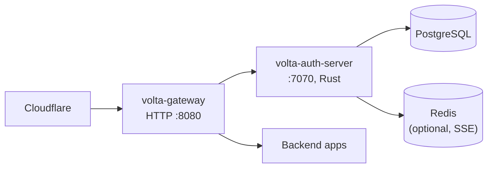

**Profile B — Migrating from Java (DD-005 transition):**

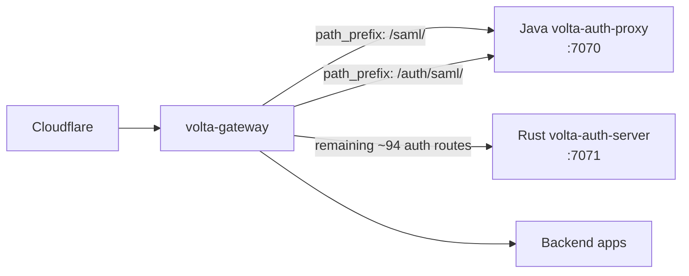

**Profile C — Unified binary (embedded auth):**

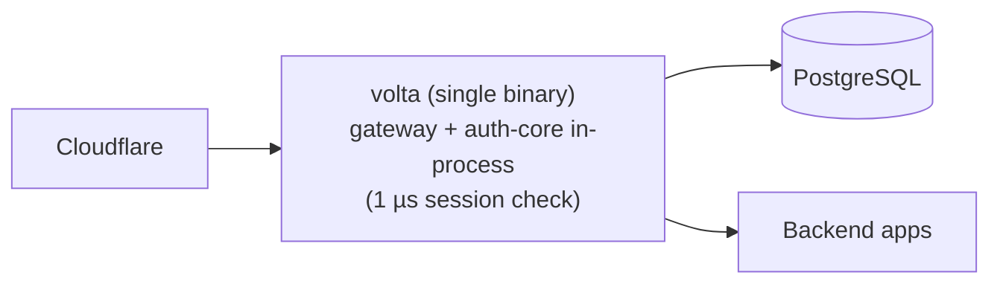

### 12.3 Configuration delivery

- YAML on disk (canonical).
- `services.json` drop-in (watchable via inotify).
- Docker labels via `bollard` (polled every N seconds).
- HTTP polling of a remote config source (`config_sources` entry).
- All sources are merged by `ConfigMerger` into the `RoutingTable` and
  hot-swapped via `ArcSwap` — no process restart.

### 12.4 Signals

| Signal       | Effect                                                  |
|--------------|---------------------------------------------------------|
| `SIGHUP`     | Re-parse YAML + config sources; hot-swap RoutingTable. |
| `SIGTERM`    | Begin graceful drain (no new requests; finish in-flight up to `request_timeout_secs`; then exit). |
| `SIGINT`     | Same as `SIGTERM`.                                      |
| `POST /admin/reload` | Same as `SIGHUP` (HTTP-triggered).             |
| `POST /admin/drain`  | Same as `SIGTERM` (HTTP-triggered).            |

### 12.5 Metrics & alerting

Prometheus scrape of `/metrics`. Recommended alerting rules:

- `volta_gateway_requests_total{status=~"5.."}` rate > 1% for 5 min → page.
- `volta_gateway_auth_verify_duration_seconds{quantile="0.99"}` > 2 s → warn
  (volta-auth-server saturating).
- `volta_gateway_backend_circuit_open{backend="…"}` == 1 → page.
- `volta_gateway_active_connections` > 90% of configured Semaphore cap →
  scale horizontally.

### 12.6 TLS / ACME

- HTTP-01 (default): `tls.domains` + `tls.contact_email` + `tls.cache_dir`.
  Certificates renewed automatically via `rustls-acme`.
- DNS-01 (wildcards): `tls.challenge: dns-01` + `tls.dns_provider: cloudflare`
  + `dns_api_token` (env `CF_DNS_API_TOKEN`) + `dns_zone_id`
  (env `CF_ZONE_ID`). `instant-acme` drives the challenge.
- Staging: `tls.staging: true` points at Let's Encrypt staging CA for tests.

### 12.7 Mesh VPN integration

Headscale sidecar integration is documented in `docs/MESH-VPN-SPEC.md`
(out of scope for this SPEC; referenced here for completeness).

### 12.8 CI/CD

- `cargo fmt --check` + `cargo clippy --workspace --all-targets -D warnings`.
- `cargo test --workspace` (unit + unignored integration).
- `cargo test -p volta-auth-core --features postgres -- --ignored`
  (Docker required).
- `volta-gateway --validate volta-gateway.yaml` (config lint).
- Route-count check: `rg -c '^\s+\.route\(' auth-server/src/app.rs` should
  remain near 96; drift is a review signal.

### 12.9 volta-bin embedding

The unified `volta` binary embeds both the proxy and auth-core. It is the
recommended shape for **single-node deployments** where one binary wants to
cover ingress, authn/authz, and routing with no HTTP hops. Drawbacks: a
single process boundary, so an auth-core panic takes the proxy with it. Use
the separate binaries when process isolation is required.

### 12.10 Upgrade discipline

- tramli pin drifts (`gateway` vs `auth-core`) are caught at compile time.
- Schema migrations are append-only (`NNN_*.sql`); never edit a released
  migration.
- Security patches from Java upstream are tracked issue-by-issue in
  [`auth-server/docs/sync-from-java-2026-04-14.md`](../auth-server/docs/sync-from-java-2026-04-14.md);
  new Java commits MUST be reviewed, ported, or explicitly deferred with a
  reason.
- Any change that alters the route count in `auth-server/src/app.rs` MUST
  update [`docs/parity.md`](../docs/parity.md) in the same commit.
- Changes to `ProxyState`, `OidcState`, `MfaState`, `PasskeyState`, or
  `InviteState` MUST update §4 and re-run the Mermaid renderer in
  `auth-core/src/flow/mermaid.rs`.

---

---

## Appendix C — Route-by-route handler mapping

Every route in `auth-server/src/app.rs` resolves to a function in one of
17 handler modules under `auth-server/src/handlers/`. This table is the
definitive mapping used by parity tests and code-review checklists. A route
is "live" only if (a) it is mounted in `app.rs`, (b) its handler compiles,
and (c) its Java equivalent appears in `docs/parity.md`.

### C.1 Auth lifecycle (`handlers/auth.rs`)

| Method | Path                     | Handler fn                 | DB tables touched                         |
|--------|--------------------------|----------------------------|-------------------------------------------|
| GET    | `/auth/verify`           | `verify`                   | `sessions`, `users`, `memberships`, `tenants` (read only) |
| GET    | `/auth/logout`           | `logout_get`               | `sessions` (UPDATE revoked_at)            |
| POST   | `/auth/logout`           | `logout_post`              | `sessions` (UPDATE revoked_at)            |
| POST   | `/auth/refresh`          | `refresh`                  | `sessions` (INSERT rotated; UPDATE old revoked_at) |
| POST   | `/auth/switch-tenant`    | `switch_tenant`            | `sessions` (UPDATE tenant_id, mfa_verified_at := NULL) |

### C.2 OIDC (`handlers/oidc.rs`, rate-limited 10 / min / IP)

| Method | Path                         | Handler fn              | DB tables touched                      |
|--------|------------------------------|-------------------------|----------------------------------------|
| GET    | `/login`                     | `login`                 | `oidc_flows` (INSERT)                  |
| GET    | `/callback`                  | `callback`              | `oidc_flows` (atomic DELETE), `users` (UPSERT), `sessions` (INSERT) |
| POST   | `/auth/callback/complete`    | `callback_complete`     | `sessions` (finalize post-MFA)         |

### C.3 SAML (`handlers/saml.rs`)

| Method | Path                       | Handler fn        | Notes |
|--------|----------------------------|-------------------|-------|
| GET    | `/auth/saml/login`         | `saml_login`      | Redirect to IdP with `SAMLRequest` |
| POST   | `/auth/saml/callback`      | `saml_callback`   | XML parse via `quick-xml` + `xmlparser`, XXE guard (`security::reject_xml_doctype`), signature verify via `saml_dsig` + `saml_sig` (RSA-SHA256). Rust side is simplified — production SAML routes `/saml/*` to the Java sidecar (DD-005). |

### C.4 MFA (`handlers/mfa.rs`)

| Method | Path                                                            | Handler fn                 | Rate limit | Tables touched |
|--------|-----------------------------------------------------------------|----------------------------|------------|----------------|
| POST   | `/api/v1/users/{userId}/mfa/totp/setup`                         | `totp_setup`               | —          | `user_mfa` (INSERT `totp_secret` encrypted) |
| POST   | `/api/v1/users/{userId}/mfa/totp/verify`                        | `totp_verify_setup`        | —          | `user_mfa` (UPDATE `enabled_at`), `mfa_recovery_codes` (INSERT batch) |
| DELETE | `/api/v1/users/{userId}/mfa/totp`                               | `totp_disable`             | —          | `user_mfa` (DELETE), `mfa_recovery_codes` (DELETE) |
| GET    | `/api/v1/users/me/mfa`                                          | `mfa_status`               | —          | `user_mfa` (SELECT)                         |
| POST   | `/api/v1/users/{userId}/mfa/recovery-codes/regenerate`          | `regenerate_recovery_codes`| —          | `mfa_recovery_codes` (DELETE + INSERT batch)|
| GET    | `/mfa/challenge`                                                | `mfa_challenge`            | —          | HTML page (AUTH-010 flow)                   |
| POST   | `/auth/mfa/verify`                                              | `mfa_verify_login`         | 5 / min / IP | `sessions` (UPDATE `mfa_verified_at`), `user_mfa` (validate TOTP) |

### C.5 Magic Link (`handlers/magic_link.rs`, 5 / min / IP)

| Method | Path                            | Handler fn | Tables touched |
|--------|---------------------------------|------------|----------------|
| POST   | `/auth/magic-link/send`         | `send`     | `magic_links` (INSERT hashed token) |
| GET    | `/auth/magic-link/verify`       | `verify`   | `magic_links` (atomic consume via `consumed_at IS NULL` check + UPDATE), `sessions` (INSERT) |

### C.6 Passkey (`handlers/passkey_flow.rs`, 5 / min / IP on start/finish)

| Method | Path                                                     | Handler fn         | Tables touched |
|--------|----------------------------------------------------------|--------------------|----------------|
| POST   | `/auth/passkey/start`                                    | `auth_start`       | `passkey_challenges` (INSERT bincode-serialized state) |
| POST   | `/auth/passkey/finish`                                   | `auth_finish`      | `passkey_challenges` (DELETE), `user_passkeys` (UPDATE `sign_count` atomically — Java #17), `sessions` (INSERT) |
| POST   | `/api/v1/users/{userId}/passkeys/register/start`         | `register_start`   | `passkey_challenges` (INSERT)                 |
| POST   | `/api/v1/users/{userId}/passkeys/register/finish`        | `register_finish`  | `passkey_challenges` (DELETE), `user_passkeys` (INSERT, `credential_id UNIQUE`) |
| GET    | `/api/v1/users/{userId}/passkeys`                        | `list_passkeys` (in `manage.rs`) | `user_passkeys` (SELECT) |
| DELETE | `/api/v1/users/{userId}/passkeys/{passkeyId}`            | `delete_passkey` (in `manage.rs`) | `user_passkeys` (DELETE)   |

### C.7 Sessions (`handlers/session.rs` + `handlers/extra.rs`)

| Method | Path                               | Handler fn                      | Admin-scoped |
|--------|------------------------------------|---------------------------------|--------------|
| GET    | `/api/me/sessions`                 | `session::list_sessions`        | no           |
| DELETE | `/api/me/sessions`                 | `session::revoke_all_sessions`  | no           |
| DELETE | `/api/me/sessions/{id}`            | `session::revoke_session`       | no           |
| DELETE | `/auth/sessions/{id}`              | `extra::revoke_session_by_id`   | no           |
| POST   | `/auth/sessions/revoke-all`        | `extra::revoke_all_sessions`    | no           |
| GET    | `/admin/sessions`                  | `extra::admin_list_sessions`    | yes          |
| DELETE | `/admin/sessions/{id}`             | `extra::admin_revoke_session`   | yes          |

### C.8 User profile & admin users (`handlers/user.rs`, `handlers/manage.rs`)

| Method | Path                                     | Handler fn                  |
|--------|------------------------------------------|-----------------------------|
| GET    | `/api/v1/users/me`                       | `user::me`                  |
| GET    | `/api/v1/users/me/tenants`               | `user::me_tenants`          |
| PATCH  | `/api/v1/users/{userId}`                 | `manage::patch_user`        |
| DELETE | `/api/v1/users/me`                       | `manage::delete_user`       |
| POST   | `/api/v1/users/{userId}/export`          | `extra::admin_export_user`  |

### C.9 Tenant / Member / Invitation (`handlers/manage.rs`, `handlers/extra.rs`)

| Method | Path                                                       | Handler fn                          | Rate limit |
|--------|------------------------------------------------------------|-------------------------------------|------------|
| POST   | `/api/v1/tenants`                                          | `manage::create_tenant`             | —          |
| GET    | `/api/v1/tenants/{tenantId}`                               | `manage::get_tenant`                | —          |
| PATCH  | `/api/v1/tenants/{tenantId}`                               | `manage::patch_tenant`              | —          |
| POST   | `/api/v1/tenants/{tenantId}/transfer-ownership`            | `extra::transfer_ownership`         | —          |
| GET    | `/api/v1/tenants/{tenantId}/members`                       | `manage::list_members`              | —          |
| PATCH  | `/api/v1/tenants/{tenantId}/members/{memberId}`            | `manage::patch_member`              | —          |
| DELETE | `/api/v1/tenants/{tenantId}/members/{memberId}`            | `manage::delete_member`             | —          |
| POST   | `/api/v1/tenants/{tenantId}/invitations`                   | `manage::create_invitation`         | —          |
| GET    | `/api/v1/tenants/{tenantId}/invitations`                   | `manage::list_invitations`          | —          |
| DELETE | `/api/v1/tenants/{tenantId}/invitations/{invitationId}`    | `manage::cancel_invitation`         | —          |
| POST   | `/invite/{code}/accept`                                    | `manage::accept_invite`             | 20 / min / IP |

### C.10 IdP / M2M / OAuth2 token (`handlers/manage.rs`)

| Method | Path                                                | Handler fn                     |
|--------|-----------------------------------------------------|--------------------------------|
| GET    | `/api/v1/tenants/{tenantId}/idp-configs`            | `list_idp_configs`             |
| POST   | `/api/v1/tenants/{tenantId}/idp-configs`            | `upsert_idp_config`            |
| GET    | `/api/v1/tenants/{tenantId}/m2m-clients`            | `list_m2m_clients`             |
| POST   | `/api/v1/tenants/{tenantId}/m2m-clients`            | `create_m2m_client`            |
| POST   | `/oauth/token`                                      | `oauth_token` (client_credentials only; `subtle::ConstantTimeEq` on secret) |

### C.11 Webhooks (`handlers/webhook.rs`, Outbox pattern)

| Method | Path                                                                    | Handler fn           |
|--------|-------------------------------------------------------------------------|----------------------|
| POST   | `/api/v1/tenants/{tenantId}/webhooks`                                   | `create_webhook` (SSRF guard: HTTPS only + private-IP reject, Java #1) |
| GET    | `/api/v1/tenants/{tenantId}/webhooks`                                   | `list_webhooks`      |
| GET    | `/api/v1/tenants/{tenantId}/webhooks/{webhookId}`                       | `get_webhook`        |
| PATCH  | `/api/v1/tenants/{tenantId}/webhooks/{webhookId}`                       | `patch_webhook`      |
| DELETE | `/api/v1/tenants/{tenantId}/webhooks/{webhookId}`                       | `delete_webhook`     |
| GET    | `/api/v1/tenants/{tenantId}/webhooks/{webhookId}/deliveries`            | `webhook_deliveries` |

Out-of-band: the `outbox_worker` background task (`auth-server/src/outbox_worker.rs`)
polls `outbox_events`, delivers via `reqwest`, retries on 5xx with exponential
backoff, and writes each attempt into `webhook_deliveries`.

### C.12 Admin (`handlers/admin.rs`, `handlers/extra.rs`)

| Method | Path                                                | Handler fn                   | Note |
|--------|-----------------------------------------------------|------------------------------|------|
| GET    | `/api/v1/admin/audit`                               | `admin::list_audit`          | Paginated `?page=&size=&from=&to=&event=` |
| GET    | `/api/v1/admin/tenants`                             | `admin::admin_list_tenants`  | — |
| GET    | `/api/v1/admin/users`                               | `admin::admin_list_users`    | Paginated |
| GET    | `/api/v1/admin/sessions`                            | `extra::admin_list_sessions` | Paginated (P2.1, Java `f31a2f2`) |
| POST   | `/api/v1/admin/outbox/flush`                        | `admin::outbox_flush`        | Manual outbox drain |
| GET    | `/admin/members`                                    | `extra::admin_members_page`  | HTML stub (🚧) |
| GET    | `/admin/invitations`                                | `extra::admin_invitations_page` | HTML stub |
| GET    | `/admin/webhooks`                                   | `extra::admin_webhooks_page` | HTML stub |
| GET    | `/admin/idp`                                        | `extra::admin_idp_page`      | HTML stub |
| GET    | `/admin/tenants`                                    | `extra::admin_tenants_page`  | HTML stub |
| GET    | `/admin/users`                                      | `extra::admin_users_page`    | HTML stub |
| GET    | `/admin/audit`                                      | `extra::admin_audit_page`    | HTML stub |
| GET    | `/settings/security`                                | `extra::admin_members_page`  | HTML stub (aliased) |
| GET    | `/settings/sessions`                                | `extra::admin_sessions_page` | HTML stub |

Admin data-API scope enforcement uses `helpers::require_admin` — session
cookie must carry an `ADMIN` or `OWNER` role claim. Bearer-token M2M scope
enforcement on admin HTML pages is P3 backlog.

### C.13 Devices / Billing / Policy / GDPR (`handlers/admin.rs`)

| Method | Path                                                       | Handler fn                  |
|--------|------------------------------------------------------------|-----------------------------|
| GET    | `/api/v1/users/me/devices`                                 | `admin::list_devices`       |
| DELETE | `/api/v1/users/me/devices/{deviceId}`                      | `admin::delete_device`      |
| DELETE | `/api/v1/users/me/devices`                                 | `admin::delete_all_devices` |
| GET    | `/api/v1/tenants/{tenantId}/billing`                       | `admin::get_billing`        |
| POST   | `/api/v1/tenants/{tenantId}/billing/subscription`          | `admin::upsert_subscription`|
| GET    | `/api/v1/tenants/{tenantId}/policies`                      | `admin::list_policies`      |
| POST   | `/api/v1/tenants/{tenantId}/policies`                      | `admin::create_policy`      |
| POST   | `/api/v1/tenants/{tenantId}/policies/evaluate`             | `admin::evaluate_policy`    |
| POST   | `/api/v1/users/me/data-export`                             | `admin::data_export`        |
| DELETE | `/api/v1/users/{userId}/data`                              | `admin::hard_delete_user` (Java #18: extends delete to `outbox_events` + `auth_flow_transitions`) |

### C.14 SCIM 2.0 (`handlers/scim.rs`)

| Method | Path                          | Handler fn        |
|--------|-------------------------------|-------------------|
| GET    | `/scim/v2/Users`              | `list_users`      |
| POST   | `/scim/v2/Users`              | `create_user`     |
| GET    | `/scim/v2/Users/{id}`         | `get_user`        |
| PUT    | `/scim/v2/Users/{id}`         | `replace_user`    |
| PATCH  | `/scim/v2/Users/{id}`         | `patch_user`      |
| DELETE | `/scim/v2/Users/{id}`         | `delete_user`     |
| GET    | `/scim/v2/Groups`             | `list_groups`     |
| POST   | `/scim/v2/Groups`             | `create_group`    |

### C.15 Signing keys (`handlers/signing_key.rs`)

| Method | Path                                       | Handler fn    |
|--------|--------------------------------------------|---------------|
| GET    | `/api/v1/admin/keys`                       | `list_keys`   |
| POST   | `/api/v1/admin/keys/rotate`                | `rotate_key`  |
| POST   | `/api/v1/admin/keys/{kid}/revoke`          | `revoke_key`  |

### C.16 Viz + SSE (`handlers/viz.rs`)

| Method | Path                                                | Handler fn         |
|--------|-----------------------------------------------------|--------------------|
| GET    | `/viz/auth/stream`                                  | `auth_stream` (SSE over Redis pub/sub) |
| GET    | `/viz/flows`                                        | `list_flows` (static list) |
| GET    | `/api/v1/admin/flows/{flowId}/transitions`          | `flow_transitions` |

### C.17 Health + JWKS (`handlers/health.rs`)

| Method | Path                             | Handler fn | Notes                                 |
|--------|----------------------------------|------------|---------------------------------------|
| GET    | `/healthz`                       | `healthz`  | DB ping, Redis ping (if configured)  |
| GET    | `/.well-known/jwks.json`         | `jwks`     | Signing-key rotation aware; emits all non-revoked keys within `not_before` / `not_after` |

### C.18 Switch-account / select-tenant (`handlers/extra.rs`)

| Method | Path                         | Handler fn            |
|--------|------------------------------|-----------------------|
| POST   | `/auth/switch-account`       | `switch_account`      |
| GET    | `/select-tenant`             | `select_tenant`       |

---

## Appendix D — Migration schema details

Every migration is idempotent (`IF NOT EXISTS`). Columns reproduced verbatim
from `auth-core/migrations/*.sql` to anchor the spec against the code.

### D.1 Flow persistence (migration 006)

```sql
CREATE TABLE IF NOT EXISTS auth_flows (
    id                   UUID PRIMARY KEY DEFAULT gen_random_uuid(),
    session_id           VARCHAR(255) NOT NULL,
    flow_type            VARCHAR(30) NOT NULL,
    current_state        VARCHAR(50) NOT NULL,
    guard_failure_count  INT NOT NULL DEFAULT 0,
    version              INT NOT NULL DEFAULT 0,
    created_at           TIMESTAMPTZ NOT NULL DEFAULT now(),
    updated_at           TIMESTAMPTZ NOT NULL DEFAULT now(),
    expires_at           TIMESTAMPTZ NOT NULL,
    completed_at         TIMESTAMPTZ,
    exit_state           VARCHAR(50),
    summary              JSONB
);

CREATE INDEX idx_auth_flows_session ON auth_flows (session_id);
CREATE INDEX idx_auth_flows_expires ON auth_flows (expires_at)
    WHERE completed_at IS NULL;
```

Optimistic locking uses the `version` column. The Rust `FlowPersistence`
implementation tracks `guard_failure_count` so the SM can terminate after N
consecutive guard rejections (prevents infinite retry on invalid MFA codes).
The partial index on `expires_at WHERE completed_at IS NULL` keeps the
janitor sweep cheap even when the historical row count grows.

### D.2 Sessions (migration 008)

```sql
CREATE TABLE IF NOT EXISTS sessions (
    id              VARCHAR(255) PRIMARY KEY,
    user_id         VARCHAR(255) NOT NULL,
    tenant_id       VARCHAR(255) NOT NULL,
    return_to       VARCHAR(2048),
    created_at      BIGINT NOT NULL,
    last_active_at  BIGINT NOT NULL,
    expires_at      BIGINT NOT NULL,
    invalidated_at  BIGINT,
    mfa_verified_at BIGINT,
    ip_address      VARCHAR(45),
    user_agent      TEXT,
    csrf_token      VARCHAR(128),
    email           VARCHAR(255),
    tenant_slug     VARCHAR(50),
    roles           TEXT,
    display_name    VARCHAR(100)
);

CREATE INDEX idx_sessions_user ON sessions (user_id);
```

Timestamps are `BIGINT` (Unix milliseconds) to match the Java storage
format. `mfa_verified_at` is cleared (`NULL`) on `switch-tenant` per Java #12.

### D.3 Passkey credential store (migration 015)

```sql
CREATE TABLE IF NOT EXISTS user_passkeys (
    id              UUID PRIMARY KEY DEFAULT gen_random_uuid(),
    user_id         UUID NOT NULL REFERENCES users(id),
    credential_id   BYTEA NOT NULL UNIQUE,   -- Java #5: UNIQUE constraint
    public_key      BYTEA NOT NULL,
    sign_count      BIGINT NOT NULL DEFAULT 0,
    transports      TEXT,
    name            VARCHAR(64),
    aaguid          UUID,
    backup_eligible BOOLEAN NOT NULL DEFAULT false,
    backup_state    BOOLEAN NOT NULL DEFAULT false,
    created_at      TIMESTAMPTZ NOT NULL DEFAULT now(),
    last_used_at    TIMESTAMPTZ
);
```

The `sign_count` update runs as `UPDATE … WHERE sign_count < $1` in a single
statement (Java #17) so that a concurrent replay cannot race past the
counter.

### D.4 OIDC flow state (migration 022)

```sql
CREATE TABLE IF NOT EXISTS oidc_flows (
    id                       UUID PRIMARY KEY,
    state                    VARCHAR(255) NOT NULL UNIQUE,
    nonce                    VARCHAR(255) NOT NULL,
    code_verifier_encrypted  TEXT NOT NULL,    -- KeyCipher AES-GCM + PBKDF2
    return_to                TEXT,
    invite_code              VARCHAR(64),
    tenant_id                UUID,
    created_at               TIMESTAMPTZ NOT NULL DEFAULT now(),
    expires_at               TIMESTAMPTZ NOT NULL
);

CREATE INDEX idx_oidc_flows_state   ON oidc_flows(state);
CREATE INDEX idx_oidc_flows_expires ON oidc_flows(expires_at);
```

`state` is globally UNIQUE; callback consumption uses
`DELETE FROM oidc_flows WHERE state = $1 RETURNING …` inside a single
statement so the row is observably consumed exactly once (Java #3).
`code_verifier_encrypted` is `nonce || ciphertext || tag`, base64-encoded;
decryption uses the rotating master key via `KeyCipher`.

### D.5 Admin pagination indexes (migration 021)

The P2.1 pagination work required composite indexes on each list endpoint:

- `audit_logs (tenant_id, created_at DESC)` — for `?tenantId=…&from=&to=` scans.
- `sessions (user_id, created_at DESC)` — user session history.
- `users (tenant_id, email)` — admin user list (filter + sort).
- `invitations (tenant_id, created_at DESC)` — invitation list.
- `memberships (tenant_id, created_at DESC)` — member list.

All five endpoints share the `pagination::{PageRequest, PageResponse}` shape,
which is tested by 8 dedicated unit tests pinning the Java on-the-wire
contract (`page`, `size`, `total`, `items`, `sort`, `q`, `from`, `to`, `event`).

---

## Appendix E — Config examples

### E.1 Minimal deployment (2 services, HTTP only)

```yaml
server:
  port: 8080

auth:
  volta_url: http://localhost:7070

routing:
  - host: app.example.com
    backend: http://localhost:3000
    app_id: my-app

  - host: api.example.com
    backend: http://localhost:4000
    cors_origins:
      - https://app.example.com
```

### E.2 Migration from Java sidecar (DD-005)

```yaml
server:
  port: 8080

auth:
  volta_url: http://localhost:7071   # Rust auth-server
  auth_public_url: https://auth.example.com

routing:
  - host: auth.example.com
    path_prefix: /saml/
    backend: http://localhost:7070   # Java volta-auth-proxy
    public: true
    app_id: saml-sidecar

  - host: auth.example.com
    path_prefix: /auth/saml/
    backend: http://localhost:7070
    public: true
    app_id: saml-sidecar

  - host: auth.example.com
    backend: http://localhost:7071    # Rust for everything else
    public: true
    app_id: auth-rust

  - host: app.example.com
    backend: http://localhost:3000
    app_id: app
    cors_origins:
      - https://app.example.com
```

### E.3 Full feature set (rate limit, cache, mirror, plugins, TLS DNS-01)

```yaml
server:
  port: 8080
  trusted_proxies:
    - 173.245.48.0/20        # Cloudflare
    - 103.21.244.0/22

auth:
  volta_url: http://localhost:7070
  timeout_ms: 500
  jwt_secret: "${VOLTA_JWT_SECRET}"
  auth_public_url: https://auth.example.com

routing:
  - host: api.example.com
    backend: http://localhost:3000
    cors_origins:
      - https://app.example.com
    timeout_secs: 30
    cache:
      max_entries: 10000
      ttl_secs: 60
    mirror:
      backend: http://localhost:3001
      sample_rate: 0.05
    plugins:
      - name: rate-limit-by-user
        phase: request
        config:
          max_requests: "60"
          window_secs: "60"
      - name: monetizer
        phase: request
        config:
          verify_url: http://monetizer:3001/__monetizer/verify
          config_id: "${MONETIZER_CONFIG_ID}"
          cache_ttl_secs: "5"

  - host: "*.example.com"
    backends:
      - { url: "http://green:3000", weight: 90 }
      - { url: "http://canary:3000", weight: 10 }

rate_limit:
  requests_per_second: 1000
  per_ip_rps: 100

tls:
  domains:
    - "*.example.com"
    - example.com
  contact_email: admin@example.com
  challenge: dns-01
  dns_provider: cloudflare
  dns_api_token: "${CF_DNS_API_TOKEN}"
  dns_zone_id: "${CF_ZONE_ID}"

access_log:
  enabled: true
  path: /var/log/volta-gateway/access.log
  format: json

l4_proxy:
  - listen_port: 5433
    protocol: tcp
    backend: 10.0.0.5:5432       # PostgreSQL bastion
```

### E.4 Unified `volta` binary (in-process auth)

```yaml
server:
  port: 8080

auth:
  # No volta_url needed — auth-core is linked in-process.
  jwt_secret: "${VOLTA_JWT_SECRET}"

routing:
  - host: app.example.com
    backend: http://localhost:3000

  - host: api.example.com
    backend: http://localhost:4000
```

---

## Appendix F — Mermaid Diagrams

### F.1 System Architecture — Rust/Java dual implementation + 5 rate-limited merge routers

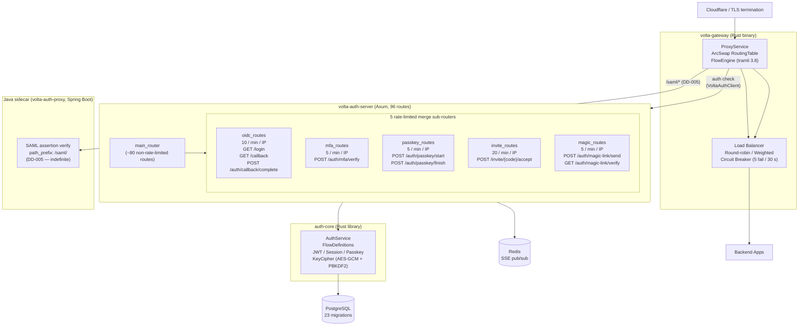

### F.2 Per-request tramli State Machine — sequenceDiagram

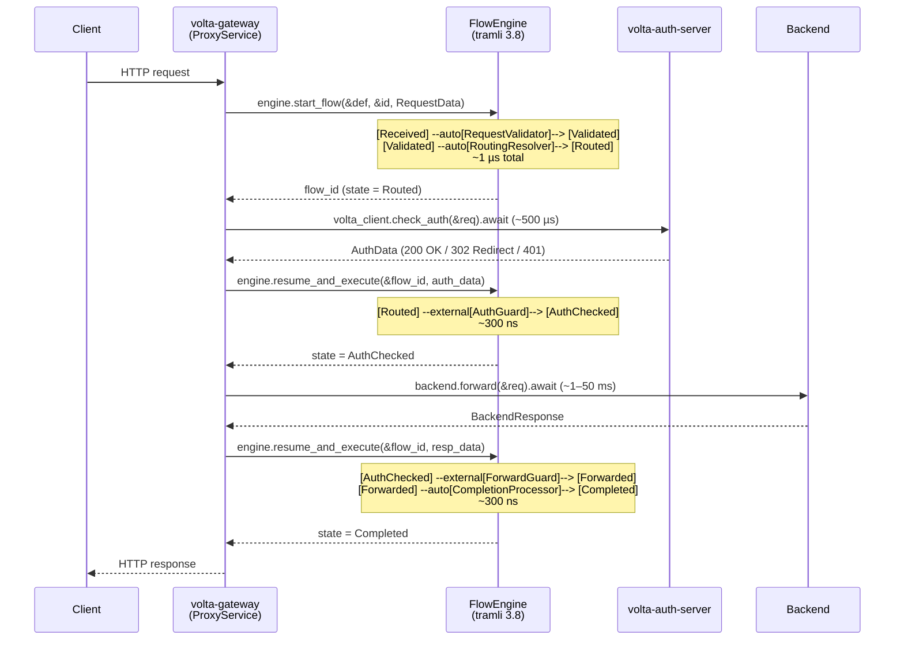

### F.3 ER Diagram — auth_flows / sessions / user_passkeys / oidc_flows

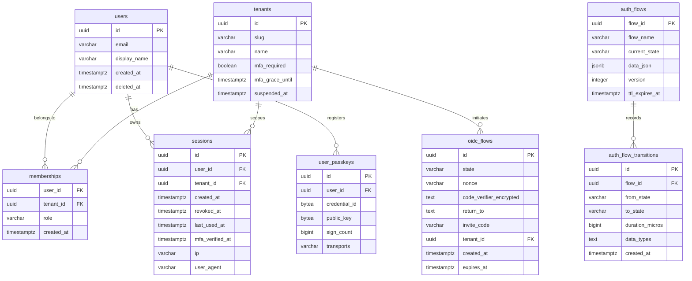

### F.4 FlowEngine State Machine — stateDiagram

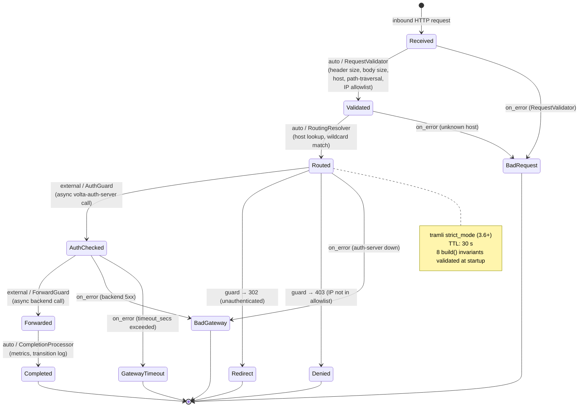

Invoked as `volta config.yaml`. Session verification costs ~1 µs (JWT
HS256 verify + cache hit) instead of the ~250 µs round-trip to a separate
auth-server process.

---

## Appendix F — Operational runbooks

### F.1 Reloading configuration without downtime

```bash
# Signal-based
kill -HUP $(pgrep volta-gateway)

# HTTP-based (localhost only)
curl -X POST http://127.0.0.1:8080/admin/reload
```

Both paths trigger:
1. Re-parse `volta-gateway.yaml` + all configured `config_sources`.
2. Build a new `RoutingTable`.
3. `arc_swap::ArcSwap::store(new)` — atomic pointer swap.
4. Old `Arc<RoutingTable>` is dropped once all in-flight requests release
   their reference.

If the new config is invalid (unknown host, malformed YAML, unreachable
backend URL parse), the reload is rejected and the old table stays live.

### F.2 Graceful drain

```bash
kill -TERM $(pgrep volta-gateway)     # or
curl -X POST http://127.0.0.1:8080/admin/drain
```

1. Listener stops accepting new connections.
2. In-flight requests continue up to `server.request_timeout_secs`.
3. Process exits once all flows reach a terminal state.

### F.3 Health probes

- HTTP-only liveness: `GET /healthz` on the gateway (cheap; no DB ping).
- HTTP readiness: `GET /healthz` on `auth-server` (pings DB + Redis).
- Prometheus readiness signal: `volta_gateway_ready` gauge transitions to 1
  after first successful config load.

### F.4 Rotating signing keys

```bash
curl -X POST -H "Cookie: __volta_session=…" \
     https://auth.example.com/api/v1/admin/keys/rotate
```

1. New `signing_keys` row inserted with fresh keypair and `not_before = now`.
2. Old key remains signable until its `not_after` (default: 24 h).
3. `GET /.well-known/jwks.json` returns both old and new during the overlap
   window so existing JWTs continue to verify.
4. Revoke the old key explicitly:
   ```bash
   curl -X POST https://auth.example.com/api/v1/admin/keys/<kid>/revoke
   ```

### F.5 Debugging a slow request

Every request carries a flow id; enable `RUST_LOG=tracing=debug` to see
per-transition timing:

```json
{"level":"trace","request_id":"…","flow":"proxy","duration_us":1,"msg":"SM transition: Received→Validated"}
{"level":"trace","request_id":"…","flow":"proxy","duration_us":2,"msg":"SM transition: Validated→Routed"}
{"level":"trace","request_id":"…","flow":"proxy","duration_us":850,"msg":"SM transition: Routed→AuthChecked"}
{"level":"trace","request_id":"…","flow":"proxy","duration_us":12500,"msg":"SM transition: AuthChecked→Forwarded"}
```

The 96 % delta between SM steps (2 µs) and external transitions (850 µs,
12500 µs) is the real answer to "where did the time go?": the SM itself is
negligible; backend + auth latency dominate.

### F.6 Hard-deleting a user (GDPR)

```bash
curl -X DELETE -H "Cookie: __volta_session=…" \
     https://auth.example.com/api/v1/users/<uuid>/data
```

The handler (`admin::hard_delete_user`) issues a single transaction covering:
- `users` (DELETE)
- `memberships` (DELETE by user_id, cascades)
- `sessions` (DELETE by user_id)
- `user_mfa` + `mfa_recovery_codes` (DELETE)
- `user_passkeys` (DELETE)
- `audit_logs` (anonymize: actor_id set to NULL, payload scrubbed)
- `outbox_events` (DELETE by user_id, Java #18)
- `auth_flow_transitions` (DELETE by flow → user, Java #18)

### F.7 Monetizer cache safety valve (DD-016)

The `Monetizer` plugin keeps an in-memory `HashMap<user_id, (billing, ts)>`.
When `cache.len() >= 10_000` and a new entry arrives, the map is cleared
entirely. Within `cache_ttl_secs` (default 5 s) the cache repopulates from
`/verify` calls. This bounds memory to O(10 000 × sizeof(MonetizerBilling))
with no LRU bookkeeping overhead, at the cost of a 5-second cold window
under pathological hit distributions.

---

## Appendix A — System architecture

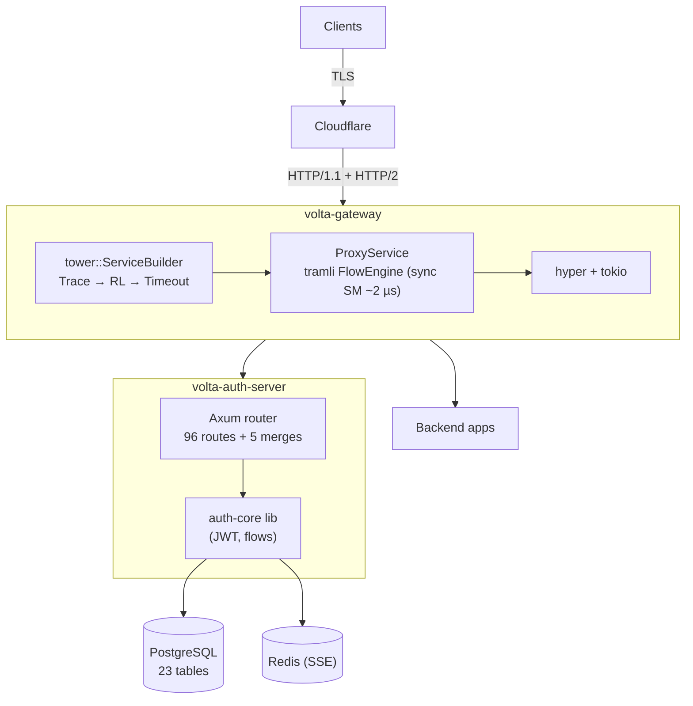

## Appendix B — Traceability index

| Topic                        | Primary source                                                                   |
|------------------------------|----------------------------------------------------------------------------------|
| Workspace layout             | repo root `Cargo.toml`; this SPEC §1.3                                           |
| Per-request SM               | `gateway/src/flow.rs` + §4.1                                                     |
| Long-lived SMs               | `auth-core/src/flow/{oidc,mfa,passkey,invite}.rs` + §4.2–§4.5                    |
| 96-route table               | `auth-server/src/app.rs` + [`docs/parity.md`](../docs/parity.md) + §2.4          |
| 5 rate-limited sub-routers   | `auth-server/src/app.rs:22-45,210-214` + §2.5 + §5.3                             |
| Plugin system                | `gateway/src/plugin.rs` + §5.4 + DD-016                                          |
| 23 migrations                | `auth-core/migrations/*.sql` + §3.1                                              |
| Java sync trail              | `auth-server/docs/sync-from-java-2026-04-14.md` + §6.4                           |
| Security ledger              | §5.10 + Java `abca91e` commit (#1 – #21) + `security::*`                          |
| tramli upgrade               | `docs/feedback.md` + §9.1                                                        |
| Benchmarks                   | `docs/benchmark-article.md` + §10.1                                              |
| Design decisions             | `dge/decisions/DD-001` (CORS), `DD-002` (L4 no-auth), `DD-005` (Java→Rust), `DD-006` (workspace), `DD-011` (per-request vs long-lived SM), `DD-016` (Monetizer LRU safety valve) |
| TLS / ACME                   | `gateway/src/tls.rs`, `gateway/src/dns01.rs` + §12.6                             |
| Mesh VPN                     | `docs/MESH-VPN-SPEC.md`                                                          |
